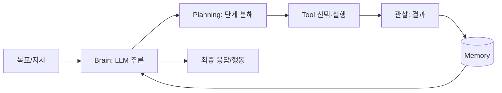

# AI Agent란

> 한 줄 정의
> AI Agent는 LLM을 추론 엔진으로 삼아, 목표를 달성하기 위해 환경을 관찰하고(perceive) 스스로 판단하여(decide) 도구를 호출하거나 행동을 취하는(act) 자율 시스템이다. 단발성 질의응답과 달리, 다단계 추론과 외부 세계와의 상호작용을 반복하며 작업을 끝까지 수행한다.

## 핵심 개념

AI Agent는 전통적인 "프롬프트 → 응답" 모델을 넘어선다. 핵심 차별점은 다음과 같다.

- **자율성(Autonomy)**: 매 단계 사람이 지시하지 않아도 다음에 할 일을 스스로 결정한다.
- **목표 지향(Goal-driven)**: 단일 답변이 아니라 주어진 목표를 완수할 때까지 루프를 돈다.
- **도구 사용(Tool use)**: 검색, 코드 실행, API 호출, DB 조회 등 외부 능력을 활용해 LLM의 한계를 보완한다.
- **상태 유지(Statefulness)**: 이전 단계의 관찰과 결과를 기억하고 다음 판단에 반영한다.

## 구성 요소



- **Brain (LLM)**: 추론·판단의 중심. 어떤 도구를 어떤 순서로 쓸지 결정한다.
- **Planning**: 복잡한 목표를 실행 가능한 하위 작업으로 분해한다.
- **Tools**: 외부 세계와의 인터페이스. 검색·계산·API·코드 실행 등.
- **Memory**: 단기(대화 컨텍스트)와 장기(과거 경험·지식) 기억.
- **Orchestration Loop**: 관찰→사고→행동을 반복하는 제어 흐름.

## 동작 방식

대표적인 동작 패러다임은 **ReAct** (Reasoning + Acting)로, 다음을 반복한다.

```
Thought:  목표 달성을 위해 지금 무엇이 필요한가?
Action:   도구 호출 (예: web_search("최신 환율"))
Observation: 도구가 반환한 결과
... (목표 달성까지 반복) ...
Answer:   최종 결과 산출
```

루프는 종료 조건(목표 달성, 최대 스텝 도달, 에러)을 만날 때까지 진행된다.

## 챗봇/워크플로우와의 차이

| 구분 | 단순 챗봇 | 고정 워크플로우 | AI Agent |
|------|----------|----------------|----------|
| 경로 결정 | 없음 | 사람이 사전 정의 | LLM이 런타임에 동적 결정 |
| 도구 사용 | 없음/제한적 | 정해진 순서 | 상황에 맞게 선택 |
| 적응성 | 낮음 | 낮음 | 높음 |

워크플로우는 경로가 코드로 고정되고, Agent는 LLM이 경로를 스스로 정한다는 점이 핵심 분기점이다.

## 장단점

- **장점**: 비정형·다단계 문제에 유연하게 대응, 외부 도구로 능력 확장, 사람 개입 최소화.
- **단점**: 비결정성으로 인한 예측 어려움, 토큰·비용 증가, 환각·무한루프 위험, 디버깅·평가 난이도 상승.

## 관련 노트

- [[Agentic AI]]
- [[Agent 설계 원칙]]
- [[Agent Architecture]]
- [[ReAct]]
- [[Tool Calling]]
- [[Memory Architecture]]
- [[Agent]]
