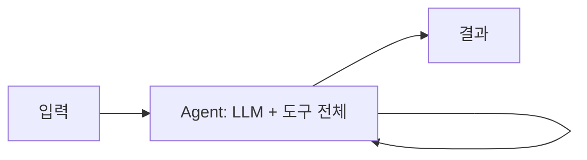
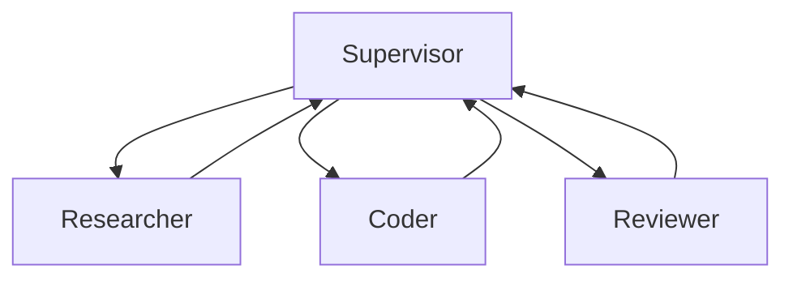

# Single Agent vs Multi Agent

> 한 줄 정의
> 하나의 에이전트가 모든 도구와 책임을 갖고 루프를 도는 Single Agent와, 역할이 분리된 여러 에이전트가 협업·위임하는 Multi-Agent의 트레이드오프를 다룬다. 결론적으로 단일 에이전트로 충분하면 단일을, 병렬성·관심사 분리·컨텍스트 격리가 필요할 때 멀티로 확장한다.

## 핵심 개념

- **Single Agent**: 하나의 LLM 루프가 모든 도구·메모리·판단을 담당한다. 구조가 단순하고 추적이 쉽다.
- **Multi-Agent**: 작업을 역할별 에이전트로 나누고, 조정자(Supervisor)나 핸드오프로 협업한다. 복잡한 문제를 분할 정복한다.

## Single Agent

- **장점**: 단순함, 적은 컨텍스트 오버헤드, 디버깅 용이, 낮은 비용.
- **단점**: 도구가 많아지면 선택 혼동, 단일 컨텍스트에 모든 것이 쌓여 과부하, 병렬화 불가.
- **적합**: 도구 수가 적고(대략 ~10개 내외), 작업이 한 줄기로 진행될 때.

## Multi-Agent

대표 구성 패턴:

- **Supervisor / Orchestrator-Worker**: 조정자가 작업을 분배하고 워커 결과를 종합. → [[Supervisor Pattern]]
- **Network / Handoff**: 에이전트들이 서로 제어권을 넘기며 협업. → [[Agent Handoff]]
- **Hierarchical**: 조정자 위에 또 조정자를 두는 계층 구조.

- **장점**: 관심사·컨텍스트 분리, 역할별 전문 프롬프트/도구, 하위작업 병렬 실행, 확장성.
- **단점**: 조정·통신 오버헤드, 토큰·비용 급증, 오류·환각 전파, 디버깅·평가 난이도 상승.
- **적합**: 명확히 분리되는 하위작업, 병렬 처리 이득이 큰 작업(예: 폭넓은 리서치), 컨텍스트 격리가 필요한 작업.

## 비교

| 기준 | Single Agent | Multi-Agent |
|------|-------------|-------------|
| 복잡도 | 낮음 | 높음 |
| 비용/토큰 | 낮음 | 높음 (수 배 이상) |
| 병렬성 | 없음 | 있음 |
| 컨텍스트 관리 | 한 윈도우에 집중·과부하 위험 | 역할별 격리 |
| 디버깅/관측 | 쉬움 | 어려움 |
| 적응·확장 | 제한적 | 유연 |

## 선택 가이드

1. 먼저 **Single Agent**로 시작한다. 대부분의 작업은 충분하다.
2. 다음 신호가 보이면 **Multi-Agent**를 고려한다.
   - 도구·역할이 너무 많아 단일 프롬프트가 비대해짐.
   - 독립적으로 병렬 처리 가능한 하위작업이 명확함.
   - 서로 다른 컨텍스트/권한 경계가 필요함.
3. 멀티로 가더라도 가능한 한 평면적(flat)이고 단순한 토폴로지를 유지한다.

> 비용 주의: 멀티에이전트는 토큰 사용이 단일 대비 크게 증가한다. 병렬화로 얻는 가치가 비용을 정당화할 때만 도입한다.

## 관련 노트

- [[AI Agent란]]
- [[Agentic AI]]
- [[Multi Agent Architecture]]
- [[Supervisor Pattern]]
- [[Agent Handoff]]
- [[Context Engineering]]
- [[Agent 설계 원칙]]
