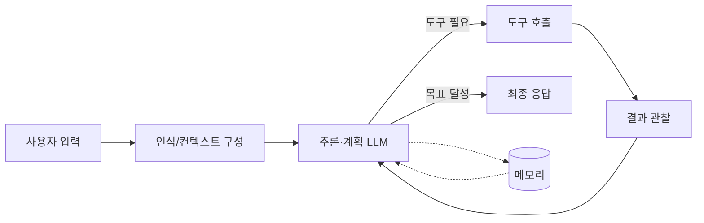

# Agent Architecture

> LLM을 추론 엔진으로 삼아 인식(Perception) → 추론·계획(Reasoning) → 행동(Action)의 루프를 반복하며 목표를 달성하는 시스템의 구조.

## 핵심 개념

전통적인 LLM 호출은 단발성 입력→출력이지만, **에이전트 아키텍처**는 모델이 도구를 호출하고 그 결과를 다시 컨텍스트에 받아 다음 행동을 결정하는 **상태를 가진 반복 루프**다. 핵심은 모델 자체가 아니라, 모델 주위를 감싸는 **제어 루프(control loop)·도구·메모리·가드레일**의 조합이다.

## 구성 요소

| 구성 요소 | 역할 |
|-----------|------|
| **모델(LLM)** | 추론·계획·도구 선택의 두뇌 |
| **도구(Tools)** | 외부 세계와의 상호작용 (API, DB, 검색, 코드 실행) |
| **메모리(Memory)** | 단기(대화 컨텍스트)·장기(영속 지식) 상태 보관 |
| **오케스트레이션** | 실행 순서·분기·종료 조건을 제어하는 런타임 루프 |
| **가드레일** | 입출력 검증, 권한 제어, 비용·횟수 한도 |
| **옵저버빌리티** | 로깅·트레이싱·비용 모니터링 |

## 동작 방식

루프는 다음 중 하나로 종료된다.
- 모델이 더 이상 도구를 호출하지 않고 최종 답을 생성
- 최대 반복(step) 한도 도달
- 가드레일이 중단 조건 발동
- 사용자 승인 대기(Human-in-the-loop)

## 아키텍처 유형

- **단일 에이전트**: 하나의 루프가 모든 도구를 다룬다. 단순하고 디버깅이 쉬움.
- **멀티 에이전트**: 역할별 전문 에이전트를 분리하고 오케스트레이터가 조율. 복잡한 작업에 적합하나 비용·지연 증가.
- **워크플로우형**: 고정된 그래프/파이프라인 위에서 LLM 노드를 배치. 결정성이 높고 통제가 쉬움.

## 설계 고려사항

- 자율성(autonomy)과 통제(control)의 트레이드오프
- 컨텍스트 윈도우 관리와 토큰 비용
- 도구 실패·환각에 대한 복원력
- 관측 가능성과 재현성

## 관련 노트

- [[AI Agent란]]
- [[Agent 설계 원칙]]
- [[Single Agent vs Multi Agent]]
- [[Multi Agent Architecture]]
- [[ReAct]]
- [[Memory Architecture]]
- [[Tool Calling]]
- [[프로덕션 대화형 에이전트 요청 생명주기]]
