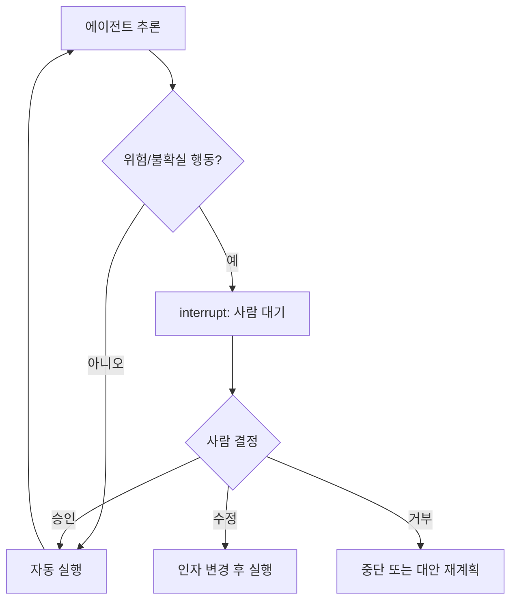

# Human In the Loop

> 에이전트가 중요하거나 위험한 결정을 자율적으로 실행하기 전에, 사람의 승인·수정·개입을 받도록 루프 안에 인간을 배치하는 설계.

## 핵심 개념

완전 자율 에이전트는 환각·잘못된 도구 호출이 곧 비가역적 부작용(결제, 메일 발송, 데이터 삭제)으로 이어질 수 있다. **Human-in-the-Loop(HITL)** 는 에이전트 실행 흐름에 **체크포인트**를 두어, 사람이 행동을 검토하고 승인/거부/수정한 뒤에만 진행하도록 하여 안전성과 신뢰를 확보한다. 가드레일의 한 형태이자, 자율성-통제 트레이드오프를 조정하는 핵심 메커니즘이다.

## 개입 유형

| 유형 | 설명 |
|------|------|
| **승인(Approval)** | 위험 행동 직전 실행을 멈추고 사람의 OK를 대기 |
| **편집(Edit)** | 에이전트가 제안한 도구 인자·출력을 사람이 수정 |
| **입력 요청(Input)** | 모호하거나 정보 부족 시 사람에게 질의 |
| **검토·재개(Review & Resume)** | 중단 지점의 상태를 검토 후 흐름을 재개 |

## 동작 방식

구현상 핵심은 **상태 영속화**다. 에이전트는 중단(interrupt) 지점에서 실행 상태를 저장(체크포인트)하고, 사람의 입력이 도착하면 그 지점부터 재개한다. LangGraph의 `interrupt` / checkpointer가 대표 구현이다.

## 적용 기준

다음과 같은 행동에 HITL 체크포인트를 두는 것이 좋다.
- 비가역적·고비용 작업 (결제, 외부 발송, 삭제, 배포)
- 신뢰도(confidence)가 임계값 미만인 결정
- 규제·컴플라이언스가 요구하는 승인
- 모호한 요구사항의 해석 확인

## 장단점

**장점**: 안전성·신뢰성 향상, 책임 소재 명확, 점진적 자율화 가능
**단점**: 사람 대기로 처리 지연·확장성 제약, 과도한 개입은 자동화 가치를 잠식

## 관련 노트

- [[Agent 설계 원칙]]
- [[State Management]]
- [[LangGraph]]
- [[Confidence Score]]
- [[Agent Architecture]]
- [[Supervisor Pattern]]
