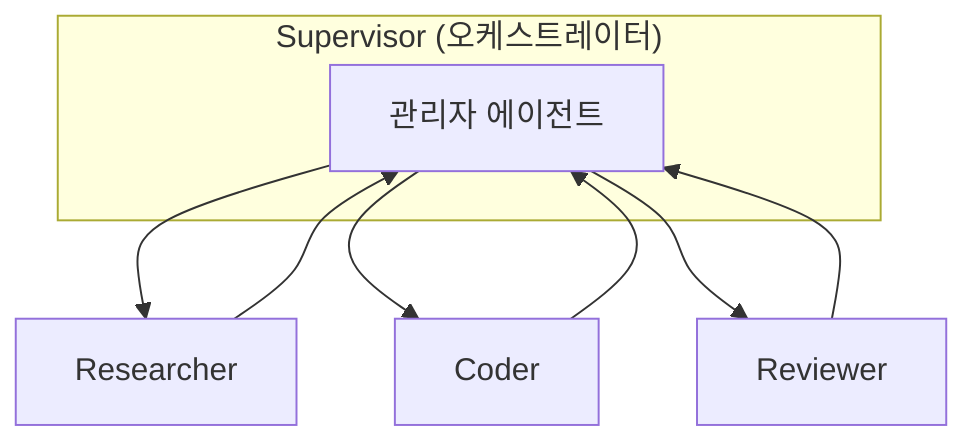

# Multi Agent Architecture

> 단일 에이전트가 모든 책임을 지는 대신, 역할이 분리된 여러 전문 에이전트가 협력하여 복잡한 목표를 분담·해결하는 구조.

## 핵심 개념

하나의 거대한 프롬프트와 도구 묶음을 가진 단일 에이전트는 작업이 복잡해질수록 컨텍스트가 오염되고 도구 선택 정확도가 떨어진다. **멀티 에이전트 아키텍처**는 각 에이전트에게 **좁은 책임·전용 도구·독립 컨텍스트**를 부여해 이 문제를 완화한다. 핵심 설계 변수는 **누가 무엇을 결정하고, 어떻게 메시지를 주고받는가**(토폴로지)다.

## 토폴로지 유형

- **Supervisor / Orchestrator**: 중앙 관리자가 하위 워커에게 작업을 위임하고 결과를 통합. 통제와 추적이 쉬움.
- **Network / Peer-to-peer**: 에이전트들이 서로 직접 핸드오프. 유연하지만 루프·교착 위험.
- **Hierarchical(계층형)**: 관리자 아래 다시 하위 팀을 두는 다단계 구조. 대규모 작업 분할에 적합.
- **Sequential pipeline**: 출력이 다음 에이전트의 입력이 되는 직렬 흐름.

## 구성 요소

| 요소 | 설명 |
|------|------|
| **역할 분리** | 각 에이전트의 책임·시스템 프롬프트·도구를 명확히 한정 |
| **핸드오프(Handoff)** | 제어권·컨텍스트를 다른 에이전트로 넘기는 메커니즘 |
| **공유 상태(State)** | 에이전트 간 공유되는 메모리·중간 산출물 |
| **종료 조건** | 합의·관리자 승인·최대 라운드 등으로 무한 루프 방지 |

## 장단점

**장점**
- 책임 분리로 각 에이전트의 정확도·디버깅성 향상
- 병렬 처리로 복잡한 작업 분할 가능
- 전문화된 프롬프트·모델(역할별 model routing) 적용

**단점**
- 호출 횟수 증가 → 비용·지연 증가
- 에이전트 간 통신 오류·맥락 손실 위험
- 오케스트레이션 복잡도 상승

## 설계 원칙

- 에이전트를 늘리기 전에 **단일 에이전트로 충분한지** 먼저 검토한다.
- 핸드오프 시 전달 컨텍스트를 최소·명시적으로 유지한다.
- 종료 조건과 최대 라운드 한도를 반드시 설정한다.

## 관련 노트

- [[Single Agent vs Multi Agent]]
- [[Supervisor Pattern]]
- [[Agent Handoff]]
- [[Agent Architecture]]
- [[LangGraph]]
- [[State Management]]
- [[Workflow Design]]
