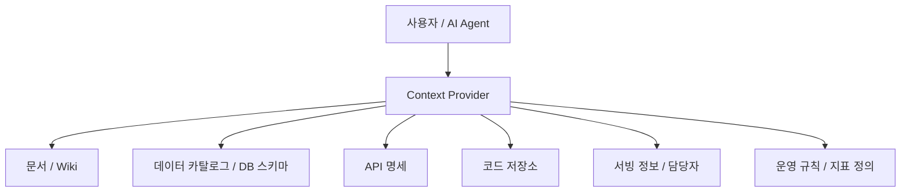
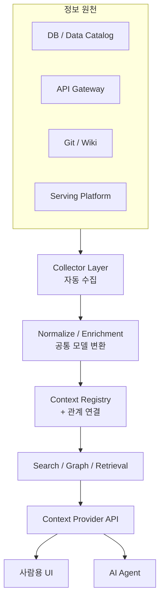
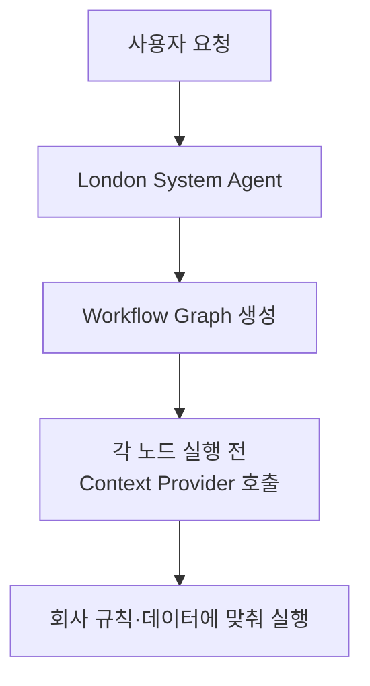

# 통합 Context Provider — 사람과 AI Agent가 함께 쓰는 조직 컨텍스트 계층

> [!NOTE] TL;DR
> NAVER D2 발표 「사람과 AI Agent를 위한 통합 Context Provider 구축」의 핵심:
> **에이전트 성능은 모델·프롬프트가 아니라 "조직의 업무 맥락을 얼마나 정확히 공급받는가"가 좌우한다.**
> 회사에 흩어진 데이터·API·문서·운영지식을 **자동 수집 → 표준화 → 관계연결 → 권한·최신성 관리 → 검색·출처 제공**하는 공통 인프라를 만들고, 그 위에 사람용 UI와 AI Agent를 함께 얹는다.
> 좋은 에이전트 = 모든 걸 아는 에이전트가 아니라, **필요한 순간 정확한 조직 정보를 공급받는 에이전트.**

---

## 1. 왜 AI 에이전트가 엉뚱한 답을 하는가

회사 업무를 수행하려면 보통 이런 배경이 필요하다.

- 어떤 데이터가 어느 테이블에 있는가
- 특정 지표가 정확히 무엇을 의미하는가
- 어떤 API를 써야 하고, 요청 형식·반환값은 무엇인가
- 그 시스템 담당자는 누구이며, 운영 중인 버전은 무엇인가
- 이 업무를 처리할 때 지켜야 할 규칙은 무엇인가

사람은 문서·코드·메신저·동료의 기억으로 이걸 조합한다. **AI 에이전트는 질문만 받으면 이 배경을 모른다.**

> [!WARNING] "지난주 상품별 매출을 분석해줘"
> 에이전트는 다음을 모른다 →
> - 매출 정의가 **결제 완료** 기준인지 **주문 생성** 기준인지
> - 취소·환불을 포함하는지
> - 상품 기준 테이블이 무엇인지 / 테스트 주문을 제외하는지
> - 날짜 기준이 주문일인지 결제일인지
>
> 결과: **SQL 문법은 맞지만 업무적으로 틀린 답.** "엉뚱한 소리"의 원인은 모델의 지능 부족이 아니라 **맥락 부족**이다.

---

## 2. Context Provider란 무엇인가

> AI(또는 사람)가 업무를 수행하기 전에, **필요한 조직 정보를 찾아 적절한 형태로 공급하는 공통 계층.**

단순 문서 검색기보다 넓다. 에이전트가 각 시스템에 직접 붙는 대신 Context Provider에 묻는다.



**질문:** `"매출 분석에 사용할 데이터는 무엇인가?"`

**Context Provider의 응답(조합된 컨텍스트):**

```text
사용 테이블: order_payment
기준 컬럼:   paid_at
매출 정의:   결제 완료 금액 - 환불 금액
제외 조건:   test_order = true
관련 문서:   매출 지표 정의서
담당 팀:     Commerce Data
최근 갱신일: 2026-06-20
```

이제 에이전트는 훨씬 정확한 SQL과 분석을 만든다.

---

## 3. 단순 RAG와 무엇이 다른가

> [!TIP] Context Provider ≠ 벡터 DB RAG
> RAG로만 보면 절반만 이해한 것. Context Provider는 비정형 문서뿐 아니라 **구조화된 조직 자산**을 다루는 **어댑터 계층**이다.

| 단계 | 일반 RAG | 통합 Context Provider |
|------|----------|----------------------|
| 입력 | 질문 | 질문 **또는 작업(의도)** |
| 처리 | 유사 문서 검색 | 업무 의도 파악 → 필요한 컨텍스트 **종류 결정** |
| 소스 | 문서 청크 | DB·API·서빙·문서·코드·담당자·정책 다중 소스 |
| 검증 | (대개 없음) | **권한·최신성·신뢰도** 검사 |
| 출력 | 문서 삽입 | **구조화된 컨텍스트** 반환 |

Context Provider가 취급하는 구조화 자산:

- DB 테이블·컬럼·데이터 간 **관계**
- API 엔드포인트·요청/응답 스키마
- 배포된 모델·서비스, 소유 팀·담당자
- 지표 정의, 업무 정책, 데이터 신선도, 접근 권한

---

## 4. 전체 구축 구조

발표에서는 팀 내부의 데이터·서빙 레이어 자산을 **자동 수집**해 제공했다고 밝힌다. 이를 구조로 풀면:



### 1단계 — 자동 수집
사람이 매번 문서를 쓰게 하지 않고, **이미 있는 시스템에서 메타데이터를 끌어온다.**

```text
DB      → 테이블·컬럼·설명·타입·파티션·갱신주기
API     → endpoint·method·request/response schema·담당 서비스
Serving → 모델명·버전·배포 위치·호출 방법·상태
```

### 2단계 — 표준화
시스템마다 형식이 다르므로 공통 모델로 변환한다.

```json
{
  "assetType": "DATASET",
  "name": "order_payment",
  "description": "결제 완료 및 환불 정보를 저장하는 테이블",
  "owner": "commerce-data",
  "schema": [],
  "relations": [],
  "updatedAt": "2026-06-20T10:00:00",
  "permissions": []
}
```

### 3단계 — 관계 연결
단순 저장이 아니라 **자산 간 연결**이 핵심. 하나의 키워드로 연관 정보를 함께 찾게 한다.

```text
매출 지표
 ├─ order_payment 테이블
 ├─ payment-service API
 ├─ 매출 대시보드
 ├─ 정산 정책 문서
 └─ Commerce Data 팀
```

### 4단계 — 검색·제공
여러 방식을 조합하고, **그대로 넣지 말고 에이전트가 쓰기 좋게 압축**해 전달한다.

```text
키워드(BM25) + 벡터검색 + 메타데이터 필터
+ 관계 기반 탐색 + 최신성 점수 + 신뢰도 점수
```

---

## 5. 왜 "사람도" 함께 써야 하는가

> [!NOTE] 제목이 "AI Agent를 위한"이 아니라 "사람과 AI Agent를 위한"인 이유
> 같은 Provider를 사람이 쓰면 "이 데이터 어디서 만들어지지? 이 API 담당 팀은? 이 지표 정의는? 최근 바뀐 스키마 있나?"에 답할 수 있다.

AI 전용 백엔드로 만들면 잘못된 정보가 들어가도 **사람이 발견하기 어렵다.** 통합하면 자정 순환이 생긴다.


→ Context Provider 자체가 **조직 지식을 정리하는 플랫폼** 역할을 한다.

---

## 6. 진짜 어려운 부분

| 난제 | 왜 어렵나 | 대응 |
|------|----------|------|
| **최신성** | 문서는 옛날, 코드·DB는 이미 변경 | 수집시점·최종변경·원본시스템·운영여부·소유자 태깅 |
| **권한** | 잘 찾는 것보다 중요 | 사용자 권한 → 접근 가능 자산 필터 → 허용분만 전달 |
| **과다 컨텍스트** | 다 넣으면 오히려 성능 하락 | 후보검색 → 관련도 평가 → 중복제거 → 추출 → 토큰예산 압축 |
| **출처 추적** | 근거 없으면 검증 불가 | 답변에 출처·기준 명시 |

> [!WARNING] 권한 사고
> 사용자가 접근 못 하는 문서를 검색 결과에 넣으면 **심각한 정보 유출.** 권한 필터는 Provider 단(조립 전)에서 강제한다.

출처 표기 예시:

```text
매출은 12억 원입니다.

근거:
- order_payment 테이블
- 매출 지표 정의서 v3
- 조회 기준: 2026-06-01 ~ 2026-06-07
```

---

## 7. 발표의 핵심 메시지

> [!TIP] 접근 순서를 뒤집어라
> 많은 조직은 `더 좋은 모델 → 더 긴 프롬프트 → 더 많은 도구 → 멀티 에이전트` 순으로 간다.
> 기업 업무에서는 이 순서가 더 중요하다:
> **업무 자산 정리 → 컨텍스트 자동 수집 → 권한·최신성 관리 → 검색·출처 제공 → 그 위에 AI Agent.**
>
> 좋은 에이전트는 스스로 다 아는 에이전트가 아니라 **필요한 순간 정확한 조직 정보를 공급받는 에이전트.**

---

## 8. London System Agent에 적용한다면

[[LondonSystem_agent]]는 자연어로 워크플로 그래프를 생성하는 제품이다. Context Provider는 그 그래프가 **실제 회사 업무에서 작동하게 만드는 기반 계층**이 될 수 있다.



예) 이메일 자동화 그래프:

```text
메일 수신 → 메일 분류
 → Context Provider에서 거래처·업무 규칙 조회
 → 필요한 사내 데이터 조회
 → 답변 초안 생성 → 승인 판단 → 발송
```

### 넣을 만한 기능

**① Context Source Registry** — 데이터 소스 등록·상태 관리
```text
Google Drive / Notion / Slack / Gmail / GitHub / Database / API Spec / 사내 업무 시스템
```

**② Context Pack** — 업무별 필요한 컨텍스트 묶음
```yaml
name: 수출서류처리
sources:
  - 거래처 DB
  - B/L 처리 규칙
  - 국가별 인증 규정
  - 이메일 응답 템플릿
  - 담당자 정보
```

**③ 노드별 Context Policy** — 각 노드가 무엇을 볼 수 있는지 명시
```yaml
node: reply_email
context:
  include:
    - customer_profile
    - recent_email_thread
    - response_policy
  exclude:
    - internal_financial_data
  max_tokens: 8000
```

**④ Context Inspector** — 실행 전 AI가 받은 정보를 사람이 확인
```text
이번 실행에서 사용한 컨텍스트
1. 거래처 정보
2. 이전 이메일 5건
3. 수출 서류 처리 규칙 v4
4. 담당자 승인 정책
```

**⑤ Context Eval** — 실패 원인을 분해 (단순 "LLM이 틀렸다" ❌)
```text
검색 실패 / 잘못된 컨텍스트 선택 / 오래된 정보 사용
/ 권한 문제 / 컨텍스트는 맞지만 추론 실패 / 도구 실행 실패
```

> [!SUCCESS] 한 줄 정리
> **London System Agent = 업무 흐름을 설계·실행하는 계층**
> **Context Provider = 그 흐름이 회사의 실제 지식·규칙을 이해하게 만드는 계층**
> 그래프 생성만으로는 데모, Context Provider가 붙으면 실제 기업 업무 에이전트 플랫폼.

---

## 9. sj-agent-dev 10축과의 연결

- **컨텍스트 관리 축** — Context Provider가 직접 담당(수집·예산·압축·선별)
- **메모리 계층 축** — 조직 자산 레지스트리 = 장기·시맨틱 메모리의 조직판 → [[memory-layers]]
- **가드레일 축** — Provider 단 권한 필터·PII 차단 = 입력측 가드레일
- **옵저버빌리티 축** — 출처 태깅·Context Inspector·Context Eval = "왜 이렇게 답했나" 추적
- **평가·자기반성 축** — Context Eval이 실패 병목을 모델/검색/권한/추론으로 분해

---

## 출처

- 영상: NAVER ENGINEERING DAY 2026 「사람과 AI Agent를 위한 통합 Context Provider 구축」 — https://youtu.be/0VdAZCYBwSU
- 요약/소개: Velopers — https://www.velopers.kr/post/7127

> [!NOTE] 신뢰도 메모
> 영상 전체 자막은 직접 확인되지 않아, 공식 NAVER D2 게시물 설명 + 공개 요약을 바탕으로 기술적 의미를 풀어 정리한 문서다. 세부 아키텍처 명칭은 일반화한 추정이 일부 포함된다.

## 관련 문서

- [[overview]]
- [[memory-layers]]
- [[rag-pipeline]]
- [[LondonSystem_agent]]
