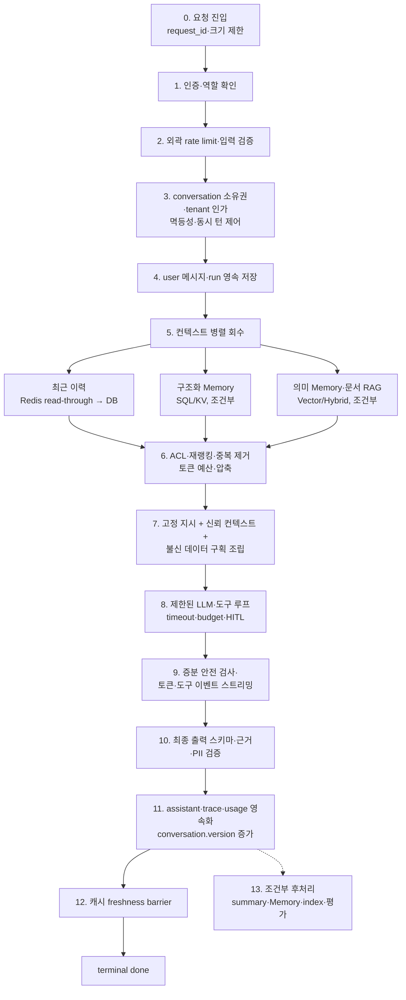

# 프로덕션 대화형 에이전트 요청 생명주기

> [!NOTE] TL;DR
> 서버가 식별한 principal의 대화를 영속화하는 운영급 에이전트는 **인증·소유권 검증 → 사용자 턴 선저장 → 필요한 컨텍스트만 회수 → 제한된 모델·도구 루프 → 응답 영속화 → 완료 확정 → 조건부 후처리** 순서로 처리한다.  
> PostgreSQL 같은 영속 DB가 정본이며, Redis와 Vector DB는 요구사항이 있을 때만 붙이는 보조 계층이다.

## 적용 범위

서버가 요청 사이에 **영속 멀티턴 대화 thread**를 유지하면 이 생명주기를 프로젝트 spec과 에이전트 명세에 작성한다. 주체는 로그인 사용자 또는 서버가 발급·검증한 익명 session principal일 수 있다. 일반 체크포인트 workflow와 단발 무상태 RAG·도구·스트리밍은 관련 규칙만 적용하고 conversation 선저장·Memory는 `해당 없음`으로 남긴다.

> [!IMPORTANT] 복잡도와 저장 기술은 별개다
> Redis·장기 기억·Vector DB는 자동으로 필요하지 않다. 정형·실시간 데이터는 DB/API 도구, 작은 고정 지식은 롱컨텍스트, 대량 비정형 검색만 RAG를 검토하고 근거는 [[TECHNOLOGY-DECISION-GUIDE]] 4·7·8축에 남긴다.

## 저장 계층의 책임

| 계층 | 책임 | 기본 저장소 | 금지 |
|------|------|-------------|------|
| 대화 정본 | conversation·user/assistant message·상태·순서 | 관계형 DB | Redis에만 저장 |
| 실행 기록 | run 상태·모델/프롬프트 버전·도구 trace·토큰·비용·오류 | 관계형 DB·관측 저장소 | 완료 여부를 클라이언트 메모리에만 보관 |
| 최근 대화 캐시 | 자주 읽는 최근 N턴·압축 summary | Redis 등, **선택** | 캐시 miss/장애 시 대화 유실 |
| 구조화 장기 기억 | 사용자 선호·설정·확정 사실 | 관계형 DB 또는 KV | 정확 조회 데이터를 유사도 검색에만 의존 |
| 의미/일화 기억 | 관련 경험·비정형 기억 회수 | pgvector/Vector DB, **조건부** | tenant/principal/agent namespace ACL 없는 검색 |
| 문서 지식 | 대량 비정형 문서의 근거 검색 | RAG 인덱스, **조건부** | 사용자 기억과 같은 namespace·보존 정책 사용 |

최근 이력 캐시·검색 인덱스·embedding은 정본에서 재생성 가능한 파생 데이터다. rate-limit counter 같은 Redis 임시 상태는 정본이 아니며 별도 장애 정책을 둔다. 파생 실행은 source commit 후 시작하되 유실 불가면 source 변경과 같은 트랜잭션에 job/outbox를 넣고, 직접 post-commit publish라면 누락 reconciliation을 둔다.

## 반드시 지키는 불변식

1. `conversation_id` 존재 확인만으로 통과시키지 않는다. 매 요청에서 `tenant_id + principal_type + principal_id + role` 소유권을 서버가 검증한다.
2. 현재 user 메시지는 모델 호출 전에 영속 저장한다. scoped `client_message_id`·`Idempotency-Key` UNIQUE 제약으로 재요청 결과를 하나로 만들고, write 도구에도 같은 멱등 키나 action ledger를 전파한다.
3. 클라이언트가 보낸 과거 assistant/tool 이력은 신뢰하지 않는다. 서버 정본에서 복원하거나 서버 서명·스키마 검증을 통과시킨다.
4. 시스템·개발자 지시는 고정되고 버전 관리한다. 사용자 입력·검색 문서·도구 출력은 **데이터 영역**으로 분리하며 지시 영역에 원문 보간하지 않는다.
5. 메모리·RAG 검색에는 검증된 `tenant + principal_type/id + agent/namespace`와 보존·삭제 필터를 검색 시점에 적용한다. 사후 필터만으로 권한을 보완하지 않는다.
6. 모델·도구 루프의 입력·출력 토큰, `max_steps`, step/run별 tool-call 수, 최대 비용, 전체/도구 timeout, circuit breaker, 사람 이관 조건을 런타임에서 강제한다.
7. 스트리밍 토큰은 생성 중 전달할 수 있지만 terminal `done`은 assistant 응답과 실행 기록의 영속화가 성공한 뒤에만 보낸다.
8. 대화 원문 전체를 장기 기억으로 자동 승격하지 않는다. 동의·목적·PII·중복·충돌·TTL·삭제 정책을 통과한 항목만 저장한다.
9. `request/run/conversation/principal` ID와 단계별 span을 연결하고 TTFT·p95·오류율·도구 지연·토큰·비용을 측정한다. outcome·trajectory 평가와 회귀 게이트를 두되 PII는 기록 직전에 마스킹한다.
10. Redis 항목에는 `conversation.version` 또는 `last_sequence`를 넣는다. TTL만 믿지 말고, `done` 전 동기 무효화/갱신 또는 다음 읽기의 정본 version 대조 중 하나로 stale hit을 차단한다.

## 표준 요청 흐름

### 0~4. 요청 수락과 선저장

- 값싼 크기 제한 → 인증 → 외곽 rate limit·스키마/첨부 검증 → conversation 인가 순으로 처리한다. 인증과 자원 인가는 별개다.
- 기존 대화는 owner 조건/RLS로 조회하고 존재 여부를 누설하지 않는다. 새 대화 ID는 서버가 발급한다.
- IP·principal·tenant·conversation·provider 예산별 rate limit과 Redis 장애의 fail-open/closed 근거를 정한다.
- 동시 턴은 직렬화·낙관적 버전·`409` 중 하나로 잠근 뒤 user message와 run을 한 트랜잭션에 선저장한다.

### 5~7. 컨텍스트 회수와 조립

요구되는 소스만 병렬 조회한다.

- **최근 이력**: 정본에서 current message 직전까지 읽고 선저장한 current message를 한 번만 붙인다(또는 이력에 포함하고 별도 추가 금지). Redis는 version이 맞는 hit만 쓰고 miss·stale·장애면 DB로 강등한다.
- **구조화 Memory**: SQL/KV로 정확 조회하되 서버 생성 권한·enum만 신뢰 상태이며 사용자 유래 문자열은 불신 데이터다.
- **의미 Memory·문서 RAG**: 검색 시 ACL → hybrid retrieval → re-ranking → dedupe를 적용한다.
- 신뢰 순서는 `버전된 고정 지시 → 서버 생성 권한·enum → role을 보존한 불신 데이터(정본 이력, 사용자 유래 구조화/의미/일화 Memory, RAG, 도구 결과, 현재 입력)`다. 불신 데이터에는 출처·경계 태그를 붙이고 지시로 실행하지 않는다.
- 출력 토큰을 먼저 예약하고 소스별 예산을 배분한다. 초과 시 오래된 이력과 낮은 순위 근거부터 제거한다.

### 8~10. 모델·도구 실행과 스트리밍

- gateway가 모델·재시도·폴백·사용량을 통제한다. 재시도 가능한 오류에만 상한·백오프를 적용하고 write 도구는 멱등성 없이는 재시도하지 않는다.
- 도구 실행 직전에 권한·인자를 재검증하고 비가역 행동은 [[Human In the Loop]] 전까지 제안 상태로 둔다.
- 스트림은 `start/token/tool_start/tool_update/approval_required/error/done`을 정의한다. `tool_update`는 허용한 마스킹 projection만 보내고 원시 도구 결과와 provider reasoning/thinking block은 노출·저장하지 않는다.
- 일부 토큰 전송 뒤 모델을 몰래 처음부터 재시도하지 않는다. disconnect의 취소/백그라운드 완료, 동일 run 재조회/명시적 재생성 계약을 둔다.
- chunk 안전 검사와 최종 스키마·근거·금지 내용·PII 검사를 적용한다. 고위험 응답은 검증 전 버퍼링한다.

### 11~13. 완료·캐시·후처리

- assistant 메시지, sanitized tool trace, token/cost, model ID, prompt version, 종료 사유를 저장하고 run 상태를 `completed` 또는 `failed`로 확정한다.
- 스트리밍 중 텍스트가 보였더라도 저장 실패 시 `done`을 보내지 않는다. 오류 이벤트와 재시도 가능한 식별자를 보낸다.
- DB commit에서 `conversation.version`을 증가시킨다. `done` 전 캐시를 동기 무효화/갱신하거나, 다음 읽기에서 cache version과 정본 version을 비교해 불일치 항목을 우회한다.
- 장기 기억·summary·embedding·평가는 실제 작업이 있을 때만 동기/비동기 근거를 정한다. 비동기·유실 불가면 transactional job/outbox 또는 reconciliation과 `tenant/principal/source_version/job_type` 멱등성, retry 상한, 실패 격리·재처리, 삭제 전파를 계약한다.

## 장기 기억 쓰기 계약

대화 이력 저장은 장기 기억 저장이 아니다.
`후보 추출 → 목적·동의 → PII 제거 → 유형 분류 → 중복·충돌 → merge/replace/version → 출처·confidence·TTL과 저장 → 필요한 항목만 embedding` 순서로 선별한다.
사용자는 기억을 조회·정정·삭제할 수 있어야 하며 원문 삭제는 summary·embedding·cache에 전파한다. 사용자 기억과 조직 RAG는 namespace·ACL·retention을 분리한다.

## 영속성 최소 계약

정본은 `conversation`, `message`, `agent_run`이며 필요할 때만 `memory_item`, `job/outbox`, tool action ledger를 둔다.
DB가 FK·RLS/쿼리 가드, `UNIQUE(conversation_id, client_message_id)`, scoped idempotency key, conversation별 sequence, run당 assistant 결과 하나를 강제한다.
원문 chain-of-thought·시크릿·불필요한 전체 요청 본문은 저장하지 않는다.

## 실패 시 계약

| 실패 | 사용자 경로 | 상태·복구 |
|------|-------------|-----------|
| user/run 선저장 실패 | 모델 호출 금지, 재시도 가능 오류 | 부분 레코드 없이 rollback |
| 선택적 Redis/Memory/Vector 장애 | DB fallback·제한 안내·안전 실패 중 spec 정책 | degraded metric과 실패 span |
| LLM timeout/429/5xx | 허용 오류만 제한 재시도·모델 폴백 | run `failed` 또는 fallback 모델 기록 |
| 도구 연속 실패 | circuit breaker 후 사람 이관/부분 답변 | 실패 도구·횟수·마지막 오류 기록 |
| 클라이언트 disconnect | 정책에 따라 취소 또는 완료 후 재조회 | run 상태와 partial message 처리 명시 |
| assistant 저장 실패 | terminal `done` 금지, 재시도 UI | 동일 idempotency key로 복구 |
| 중복 요청 | 기존 실행/응답 반환 또는 `409` | 두 번째 모델 호출 금지 |
| 조건부 후처리 실패 | 사용자 응답은 유지, 운영 경보 | 상한 재시도 후 격리·재처리 |

## 선례와 관련 문서

- 완료 게이트: [[백엔드-체크리스트]] · [[보안-체크리스트]] · [[설계-리뷰-체크리스트]]; 선택하지 않은 계층은 `해당 없음: 근거`
- 실제 요청 생명주기: [[04_바이어_소싱_상담_에이전트_상세]]
- 단순한 서버 저장 루프: [[업플로우_플랫폼_개발설계서_완전판]]
- 원리: [[Agent Architecture]] · [[State Management]] · [[Memory Architecture]] · [[Context Engineering]]
- 검색: [[RAG Architecture]] · [[Hybrid Retrieval]] · [[Re-ranking]] · [[04_RAG/06_생성그라운딩/Grounding|RAG Grounding]]
- 운영·평가: [[Logging]] · [[Tracing]] · [[Performance Metrics]] · [[Agent Evaluation]] · [[Trajectory Evaluation]]
- 안전·신뢰성: [[Prompt Injection]] · [[PII Redaction]] · [[분산 신뢰성 패턴]]
