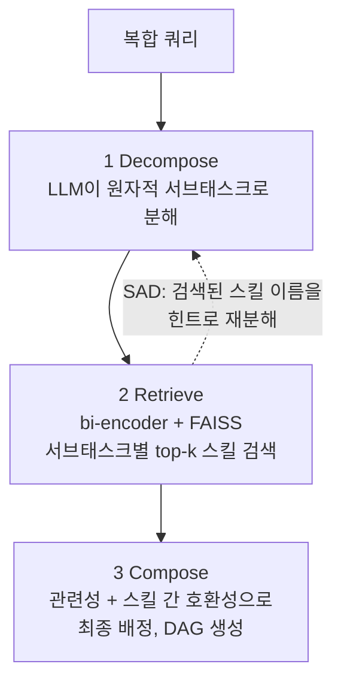

# Compositional Skill Routing (SkillWeaver)

> 수천 개 스킬 라이브러리에서 **여러 스킬을 조합해야 하는 복합 쿼리**를 올바른 스킬 체인으로 라우팅하는 문제의 공식화와 해법. 핵심 발견: **병목은 검색이 아니라 태스크 분해의 입도(granularity)** 이며, 검색된 스킬 어휘를 분해 단계에 되먹이는 것(SAD)이 가장 싼 교정 수단이다.

> [!NOTE] 출처
> Xueping Gao (Alibaba Cloud), *"Compositional Skill Routing for LLM Agents: Decompose, Retrieve, and Compose"*, arXiv:2606.18051, 2026-06. Anthropic SKILL.md 스펙의 "스킬" 정의를 그대로 사용. 벤치마크는 실제 MCP 서버 생태계(awesome-mcp-servers) 2,209개 스킬 기반.

## 문제 정의

기존 연구는 "쿼리 1개 → 스킬 1개 선택"만 다뤘다. 실제 쿼리는 여러 스킬의 순서 있는 조합이 필요하다.

- 예: "데이터셋 다운로드하고, 변환하고, 시각화 리포트 만들어줘" → API 클라이언트 + 데이터 처리기 + 차트 생성기
- **Compositional Skill Routing**: 쿼리 q와 스킬 라이브러리 S가 주어지면 ① 원자적 서브태스크로 분해(각각 스킬 하나가 처리) ② 서브태스크마다 스킬 검색 ③ 의존성 있는 실행 계획(DAG)으로 조합

## SkillWeaver 3단계 파이프라인



| 단계 | 구현 | 비고 |
|------|------|------|
| Decompose | Qwen2.5-7B, JSON 배열 출력 | "각 항목은 정확히 스킬 하나 필요" 지시 |
| Retrieve | all-MiniLM-L6-v2(384차원) + FAISS | **메타데이터(이름+설명)만 임베딩해도 충분** (CatR@10 69%) |
| Compose | 관련성·호환성(I/O 타입, 카테고리) 가중합 | 설계만 제시, 단독 평가는 미수행 |

## 핵심 발견 ① — 병목은 분해 입도

- 순정 LLM 분해: 스텝 수 정확도(DA) 51%, 카테고리 정확 검색률(CatR@1) 34.2%
- **분해가 정확한 쿼리만 보면(DA=1) CatR@1이 41.2%로 상승** → 스텝 수만 맞으면 검색은 이미 잘 됨
- 오라클로 스텝 수를 고정해 주면 DA 99.3% 회복 → SAD 이득의 대부분이 입도 교정에서 나옴을 확인
- 실패 유형: **과분해 36%** (스킬 하나짜리를 "연결→요청→파싱"으로 쪼갬) > 일반적 서술 28% > 어휘 불일치 22% > 과소분해 14%

## 핵심 발견 ② — SAD (Skill-Aware Decomposition)

검색 결과를 **출력이 아니라 입력(분해 단계)에** 되먹이는 패턴. Self-RAG·ReAct·Reflexion(출력측 피드백)과의 차별점.

1. Pass 1: 일단 분해
2. 서브태스크별로 스킬 검색 → top-H(=15)개 스킬 이름을 힌트 집합으로
3. Pass 2: 힌트를 프롬프트에 넣고 **재분해**

```text
(SAD Pass 2 프롬프트 골격)
Decompose the following query into atomic sub-tasks.
Available skills that may be relevant: {hint_list}
Query: {query}
```

- DA 51.0% → **67.7%** (+32.7% 상대, p < 10⁻⁶), 1회 반복이면 충분 (2회차부터 이득 없음)
- SAD는 어휘 정렬기가 아니라 **입도 교정기**: 양쪽 다 스텝 수가 맞는 쿼리에선 이득이 통계적으로 0 (p=0.97)
- 일반화 확인: 타깃 카테고리를 검색 풀에서 제거해도 +35.6% 상대 이득 유지 → 스킬 암기가 아닌 어휘 수준 학습
- 비용: LLM 추론 2회 (분해 지연 ~2배)

## 하네스 설계에 적용할 교훈

> [!TIP] 실무 체크리스트
> 1. **스킬 목록을 프롬프트에 나열하는 것만으론 부족하다.** 훨씬 강한 모델(qwen-max)에 스킬 100개를 직접 보여줘도 CatR@1 21% — 검색 기반 라우팅(37%)에 크게 못 미침. 명시적 라우팅 표/검색 계층이 필요한 실증 근거.
> 2. **분해 전에 사용 가능한 스킬 어휘를 보여줘라.** 라우터가 디스패치 전에 스킬 인벤토리(RESOLVER 표 등)를 읽는 구조는 사실상 SAD 1-pass — 분해 입도가 스킬 단위에 정렬된다.
> 3. **ReAct 루프만으론 멀티스킬 조합이 안 된다.** 명시적 분해 없는 생각-행동-관찰 루프는 멀티스텝을 단일 행동으로 뭉갬 (DA 0%). 복합 태스크는 구조화된 분해 단계를 강제할 것.
> 4. **큰 모델일수록 과분해 경향.** 14B가 7B보다 vanilla DA가 나쁨(32% vs 51%, 평균 4.72스텝 vs 3.62). 모델 업그레이드가 라우팅을 자동으로 개선하지 않음 — 입도 가이드가 별도로 필요.
> 5. **스킬 메타데이터 품질이 검색 품질.** 이름+한 줄 설명만으로 CatR@10 69%. 스킬 frontmatter description을 검색 가능한 어휘로 쓰는 것이 곧 라우팅 성능.
> 6. **컨텍스트 절감 효과가 크다.** 전체 스킬 노출 ~884K 토큰 → 라우팅 후 2~5개만 노출 ~1.2K 토큰 (99.9% 절감).
> 7. **top-1이 모자라면 리랭킹.** top-10엔 정답이 79% 들어있는데 top-1은 40% — LLM listwise 리랭커로 +10.3%, 더 강한 인코더(BGE)로 +14.5% 추가.

## 주요 수치 (CompSkillBench, 2,209 스킬 · 300 쿼리)

| 방법 | DA | CatR@1 | 비고 |
|------|----|--------|------|
| Vanilla (7B) | 51.0% | 34.2% | 기준선 |
| + SAD (H=15) | **67.7%** | 37.0% | 1회 반복 |
| LLM-Direct (qwen-max, 스킬 100개 나열) | 90.0% | 21.1% | 나열은 검색을 못 이김 |
| ReAct 스타일 | 0% | 15.4% | 명시적 분해 부재 |
| qwen-max + SAD | 92.0% | 39.4% | 50쿼리 서브셋 |

- 엔드투엔드 파일럿(목 실행기 30쿼리): 체인 완주율 76.7%
- 난이도별 SAD 이득: Easy +41.6% < Medium +18.2% < **Hard +50.0%** — 복잡할수록 분해가 중요

## 한계

- 쿼리가 템플릿 합성 (사람 스타일 쿼리 200개 보강 검증은 수행, 상대 이득 유지)
- 평가가 "올바른 카테고리 검색"까지 — 실제 실행 성공은 파일럿 수준
- 서브태스크↔스킬 1:1 가정, Compose 단계 단독 평가 없음
- 주 평가 모델이 7B 단일 (14B·qwen-max 스팟체크만)

## 관련 문서

- [[Conditional Workflow]] — 단일 분기 라우팅의 기초 (이 논문은 그 조합 확장판)
- [[Supervisor Pattern]] — 중앙 라우터가 서브에이전트를 배정하는 구조
- [[Workflow Design]] — DAG 기반 실행 계획
- [[Re-ranking]] — @10→@1 갭을 줄이는 검색 후처리
- [[Context Engineering]] — 스킬 노출 토큰 절감과 같은 맥락
