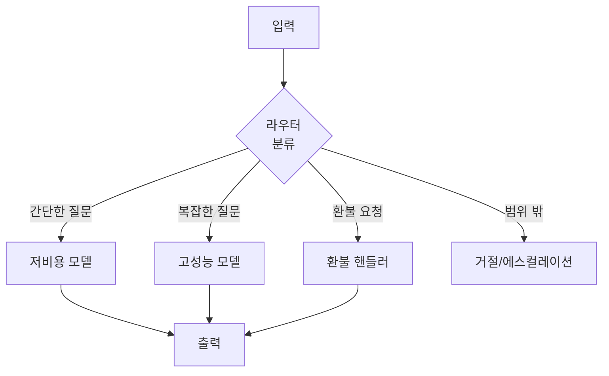

# Conditional Workflow

> 입력을 분류하거나 상태를 평가해 서로 다른 처리 경로로 분기하는 라우팅 기반 워크플로우.

## 핵심 개념

조건부 워크플로우(routing)는 입력을 분석해 어떤 경로로 보낼지 결정한다. 핵심은 **분류(classification)** 와 **분기(branching)** 다. 서로 다른 종류의 입력을 한 프롬프트로 우겨넣는 대신, 각 경로를 특화시켜 정확도를 높인다.



## 언제 쓰는가

- 입력 유형이 명확히 구분되고, 각각 다른 처리가 더 나을 때
- 고객 문의 분류(일반/환불/기술지원) 후 전용 흐름으로 라우팅
- 쉬운 질문은 Haiku 같은 작은 모델로, 어려운 질문은 큰 모델로 보내 **비용 최적화**

## 라우팅 방식

| 방식 | 설명 |
|------|------|
| LLM 분류 | LLM이 카테고리 레이블을 출력 |
| 임베딩 유사도 | 입력을 임베딩해 가장 가까운 경로 선택 |
| 규칙 기반 | 키워드·정규식 등 결정적 규칙 |

## LangGraph 조건부 엣지

LangGraph에서는 `add_conditional_edges`로 라우팅을 구현한다. 라우터 함수가 상태를 보고 다음 노드 이름을 반환한다.

```python
def route(state: State) -> str:
    category = classify(state["input"])
    return category  # "simple" | "complex" | "refund"

graph.add_conditional_edges(
    "router",
    route,
    {"simple": "small_model", "complex": "big_model", "refund": "refund_node"},
)
```

이 조건부 엣지는 에이전트 루프의 핵심이기도 하다. ReAct처럼 "도구를 더 호출할지 / 종료할지"를 상태(메시지에 tool_call 유무)로 판단해 분기한다([[ReAct]]).

## 순환(Cycle) 분기

조건부 엣지는 자기 자신이나 이전 노드로 돌아가는 **루프**도 만들 수 있다. 평가 결과가 기준 미달이면 다시 생성 노드로 보내는 식이다([[Reflection]], [[Self Correction]]).

## 관련 노트

- [[Workflow Design]]
- [[Sequential WorkFlow]]
- [[Parallel Workflow]]
- [[State Management]]
- [[LangGraph]]
- [[ReAct]]
- [[Agent Handoff]]
