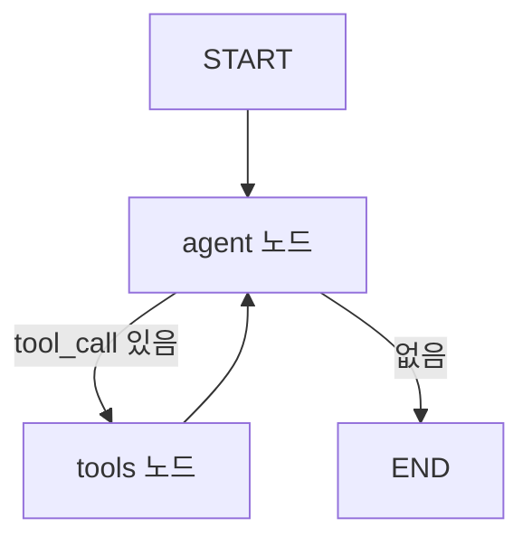

# LangGraph (오케스트레이션)

> 에이전트와 워크플로우를 **상태 그래프(StateGraph)** 로 모델링하는 오케스트레이션 프레임워크. 노드·엣지·공유 상태로 순환과 분기를 가진 흐름을 명시적으로 표현한다.

> [!note] 이 노트는 오케스트레이션 관점(그래프 구조)에 집중한다. 프레임워크 비교·생태계 관점은 [[LangChain]] 및 프레임워크 폴더의 LangGraph 노트를 참고.

## 핵심 개념

LangGraph는 에이전트 로직을 **방향 그래프**로 정의한다. 체인(직선)과 달리 **순환(cycle)** 과 **조건부 분기**를 지원해, 에이전트의 "생각→행동→관찰" 루프를 자연스럽게 표현할 수 있다. 세 가지 1차 구성요소는 다음과 같다.

- **State(상태)**: 그래프 전체가 공유하는 데이터. 노드가 읽고 갱신한다.
- **Node(노드)**: 작업 단위. 상태를 입력받아 부분 상태를 반환하는 함수/에이전트.
- **Edge(엣지)**: 노드 간 연결. 정적 엣지와 조건부 엣지가 있다.

## StateGraph 기본 구조

```python
from langgraph.graph import StateGraph, START, END
from typing import Annotated, TypedDict
from langgraph.graph import add_messages

class State(TypedDict):
    messages: Annotated[list, add_messages]

graph = StateGraph(State)
graph.add_node("agent", call_model)
graph.add_node("tools", tool_node)

graph.add_edge(START, "agent")
graph.add_conditional_edges("agent", should_continue, {"tools": "tools", "end": END})
graph.add_edge("tools", "agent")   # 루프: 도구 실행 후 다시 에이전트

app = graph.compile()
```

## 그래프 토폴로지



이 작은 그래프가 곧 ReAct 루프다. `should_continue`가 메시지에 도구 호출이 남았는지 보고 분기를 결정한다([[ReAct]], [[Tool Calling]]).

## 조건부 엣지와 상태

- **조건부 엣지**: 라우터 함수가 상태를 보고 다음 노드 이름을 반환해 분기/루프를 만든다([[Conditional Workflow]]).
- **상태 갱신**: 노드는 부분 dict를 반환하고, **리듀서**가 기존 상태와 병합한다. 누적이 필요한 키는 `add_messages`나 `operator.add`로 합친다([[State Management]]).

## 지속성과 운영 기능

- **Checkpointer**: 단계별 상태 저장 → 재개, 타임 트래블, 휴먼 인 더 루프([[Human In the Loop]])
- **Thread(스레드)**: `thread_id`로 세션별 대화·메모리 분리([[Short Term Memory]])
- **Streaming**: 노드 단위로 중간 상태·토큰 스트리밍
- **Interrupt**: 특정 노드 앞뒤에서 실행을 멈춰 사람 입력을 받음

## 워크플로우 패턴 매핑

| 패턴 | LangGraph 구현 |
|------|----------------|
| 순차 | 정적 엣지 체인 |
| 조건부 | `add_conditional_edges` |
| 병렬 | 다중 팬아웃 엣지 + 누적 리듀서 |
| 수퍼바이저 | 허브 노드 + 워커 복귀 엣지 |

## 관련 노트

- [[Workflow Design]]
- [[State Management]]
- [[Conditional Workflow]]
- [[Supervisor Pattern]]
- [[LangChain]]
- [[ReAct]]
- [[Human In the Loop]]
