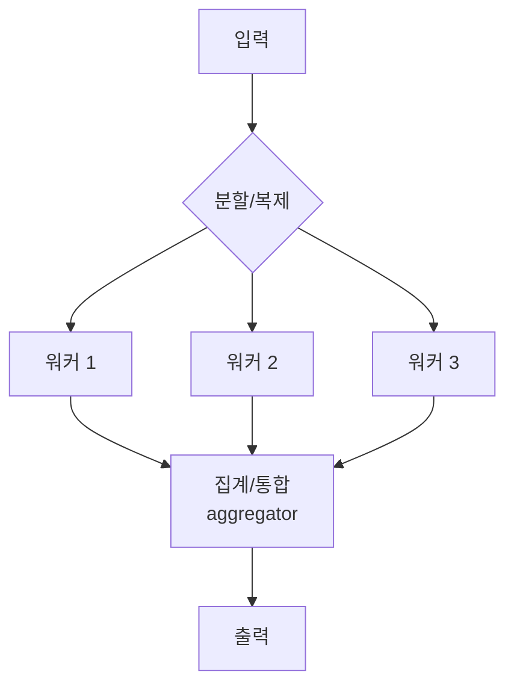

# Parallel Workflow

> 독립적인 하위 작업을 동시에 실행해 지연을 줄이거나, 같은 작업을 여러 번 실행해 결과 품질을 높이는 병렬화 패턴.

## 핵심 개념

병렬 워크플로우는 LLM이 여러 작업을 동시에 처리하고 그 출력을 프로그램적으로 통합한다. Anthropic은 두 가지 변형을 구분한다.

- **Sectioning(분할)**: 작업을 서로 독립적인 하위 작업으로 쪼개 동시에 실행.
- **Voting(투표)**: 같은 작업을 여러 번 실행해 다양한 출력을 얻고, 다수결·합의로 신뢰도를 높임.



## 언제 쓰는가

- **Sectioning**: 가드레일과 응답을 별도 호출로 분리, 긴 문서를 청크별 동시 처리, 여러 평가 기준을 각각의 LLM으로 채점
- **Voting**: 코드 취약점을 여러 프롬프트로 검토 후 합의, 콘텐츠 적절성 판정 시 임계 투표

## 집계(Aggregation) 전략

병렬 실행의 핵심은 **결과를 어떻게 합치느냐**다.

| 전략 | 설명 |
|------|------|
| Concat | 하위 결과를 단순 결합 |
| Reduce/Merge | LLM 또는 코드로 통합 요약 |
| Majority Vote | 다수결로 단일 답 선택 |
| Best-of-N | 평가 점수가 가장 높은 출력 채택 |

## LangGraph 의사코드

LangGraph에서는 하나의 노드가 여러 노드로 향하는 엣지를 추가하면 **팬아웃(fan-out)** 이 일어나 병렬 실행되고, 공통 후속 노드에서 **팬인(fan-in)** 으로 합쳐진다.

```python
graph.add_edge("dispatch", "worker_a")
graph.add_edge("dispatch", "worker_b")
graph.add_edge("dispatch", "worker_c")
graph.add_edge("worker_a", "aggregate")
graph.add_edge("worker_b", "aggregate")
graph.add_edge("worker_c", "aggregate")
```

병렬로 쓰이는 키는 상태에서 **리듀서(reducer)** (예: `operator.add`)로 누적해 동시 쓰기 충돌을 방지한다([[State Management]]).

## 주의점

- 병렬 호출은 **토큰 비용**을 배수로 증가시킨다([[Cost Monitoring]]).
- 하위 작업이 진짜 독립적인지 확인해야 한다. 의존성이 있으면 순차로 가야 한다([[Sequential WorkFlow]]).

## 관련 노트

- [[Workflow Design]]
- [[Sequential WorkFlow]]
- [[Supervisor Pattern]]
- [[State Management]]
- [[LangGraph]]
- [[Cost Monitoring]]
