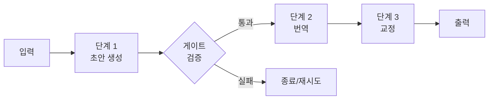

# Sequential Workflow

> 작업을 고정된 단계로 분해해 한 단계의 출력을 다음 단계의 입력으로 순차 전달하는 가장 기본적인 워크플로우.

## 핵심 개념

순차 워크플로우(prompt chaining)는 하나의 복잡한 작업을 여러 LLM 호출로 나누고, 각 호출이 직전 결과 위에 작업을 쌓아 올린다. "한 번에 다 시키지 않고, 한 번에 한 가지씩" 처리하는 전략이다.



## 언제 쓰는가

- 작업이 **명확하고 고정된 하위 단계**로 분해될 때
- 각 단계를 단순화해 정확도를 높이고 싶을 때 (지연 시간 증가는 감수)
- 예: 개요 작성 → 본문 작성, 마케팅 카피 생성 → 다른 언어로 번역, 문서 작성 → 검증

## 게이트(Gate) 검증

단계 사이에 프로그램적 체크포인트를 둘 수 있다. 중간 산출물이 기준을 만족하지 못하면 이후 단계로 넘어가지 않고 중단하거나 재시도한다. 이는 오류가 파이프라인 끝까지 전파되는 것을 막는다.

## LangGraph 의사코드

```python
graph = StateGraph(State)
graph.add_node("draft", draft_node)
graph.add_node("translate", translate_node)
graph.add_node("proofread", proofread_node)

graph.add_edge(START, "draft")
graph.add_edge("draft", "translate")
graph.add_edge("translate", "proofread")
graph.add_edge("proofread", END)
```

엣지가 모두 정적(static)이라는 점이 순차 워크플로우의 특징이다. 분기가 없다.

## 장단점

| 장점 | 단점 |
|------|------|
| 디버깅·테스트 용이 | 단계 수만큼 지연 누적 |
| 단계별 정확도 향상 | 단일 실패가 전체 중단 유발 |
| 예측 가능한 흐름 | 동적 상황 대응 불가 |

## 관련 노트

- [[Workflow Design]]
- [[Conditional Workflow]]
- [[Parallel Workflow]]
- [[State Management]]
- [[LangGraph]]
- [[Planning]]
