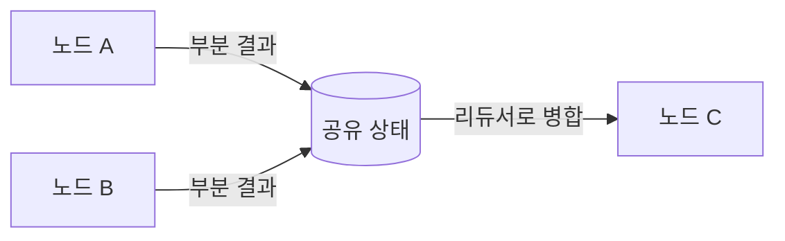

# State Management

> 워크플로우의 노드들이 공유하는 데이터를 어떻게 정의·전달·갱신할지 다루는 오케스트레이션의 중추.

## 핵심 개념

멀티스텝 워크플로우에서 각 노드는 진공 속에서 동작하지 않는다. 대화 이력, 중간 산출물, 도구 결과 같은 데이터를 **상태(state)** 로 공유한다. 상태 관리는 다음을 정의하는 일이다.

- **스키마(schema)**: 상태에 어떤 필드가 있는가
- **갱신(update)**: 노드가 상태를 어떻게 바꾸는가 (덮어쓰기 vs 누적)
- **지속성(persistence)**: 실행이 끊겨도 상태를 복원할 수 있는가

## 상태 스키마 정의

LangGraph에서는 보통 `TypedDict`나 Pydantic 모델로 상태를 정의한다.

```python
from typing import Annotated
from langgraph.graph import add_messages

class State(TypedDict):
    messages: Annotated[list, add_messages]  # 누적
    next_step: str                            # 덮어쓰기
    retrieved_docs: list                      # 덮어쓰기
```

## 리듀서(Reducer) — 갱신 방식의 핵심

각 필드가 새 값을 받았을 때 **어떻게 합칠지**를 리듀서가 결정한다.

| 리듀서 | 동작 | 용도 |
|--------|------|------|
| 기본(없음) | 새 값으로 **덮어쓰기** | 현재 단계, 분기 결정 |
| `add_messages` / `operator.add` | 기존에 **누적** | 대화 이력, 병렬 워커 결과 |

병렬 워크플로우에서 여러 노드가 동시에 같은 키에 쓸 때, 리듀서가 없으면 충돌이 난다. 누적 리듀서로 안전하게 합쳐야 한다([[Parallel Workflow]]).



## 지속성(Persistence)과 체크포인트

LangGraph의 **체크포인터(checkpointer)** 는 매 단계 상태를 저장한다. 이를 통해:

- **재개(resume)**: 중단된 지점부터 다시 실행
- **휴먼 인 더 루프**: 사람 승인을 기다리는 동안 상태 보존([[Human In the Loop]])
- **타임 트래블**: 과거 상태로 되돌려 다른 경로 탐색
- **스레드별 메모리**: `thread_id`로 대화 세션 분리

## 단기 vs 장기 상태

- **단기(in-graph) 상태**: 한 실행 안에서만 유효한 작업 메모리([[Short Term Memory]])
- **장기 메모리**: 세션을 넘어 영속되는 지식. 외부 스토어/벡터DB에 저장([[Long Term Memory]], [[Memory Architecture]])

## 설계 원칙

1. 상태는 **명시적**으로 둔다. 전역 변수 대신 스키마로.
2. 덮어쓰기 필드와 누적 필드를 의도적으로 구분한다.
3. 상태에 무한정 쌓지 않는다. 컨텍스트 윈도우를 고려해 요약·정리([[Context Engineering]]).

## 관련 노트

- [[Workflow Design]]
- [[Parallel Workflow]]
- [[Supervisor Pattern]]
- [[LangGraph]]
- [[Short Term Memory]]
- [[Memory Architecture]]
- [[Human In the Loop]]
