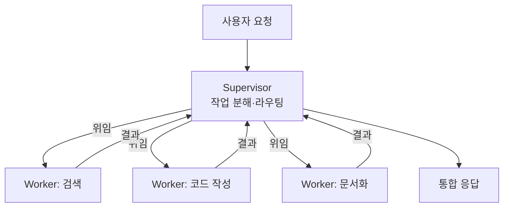

# Supervisor Pattern

> 중앙 오케스트레이터(supervisor)가 작업을 동적으로 분해해 전문 워커 에이전트에게 분배하고 결과를 통합하는 멀티에이전트 패턴.

## 핵심 개념

수퍼바이저 패턴(=orchestrator-workers)은 하나의 중앙 LLM이 "관리자" 역할을 맡는다. 들어온 작업을 하위 작업으로 쪼개 적절한 워커에게 위임하고, 워커들의 산출물을 받아 종합한다. 병렬 워크플로우와 달리 **하위 작업이 사전에 고정되지 않고 입력에 따라 동적으로 결정**된다는 점이 핵심이다.



## 언제 쓰는가

- 필요한 하위 작업을 **미리 예측할 수 없는** 복잡한 작업
- 여러 파일을 수정하는 코딩 작업(어떤 파일을 바꿀지 LLM이 판단)
- 여러 소스를 검색·종합하는 리서치 작업
- 각기 다른 전문성이 필요해 **역할 분리**가 이득일 때([[Single Agent vs Multi Agent]])

## 수퍼바이저의 책임

1. **분해(decompose)**: 요청을 처리 가능한 하위 작업으로 나눔
2. **라우팅(route)**: 각 작업을 가장 적합한 워커에게 배정([[Agent Handoff]])
3. **조율(coordinate)**: 워커 간 순서·의존성 관리
4. **통합(synthesize)**: 부분 결과를 일관된 최종 산출물로 합성

## LangGraph 구현 형태

LangGraph에서 수퍼바이저는 보통 조건부 엣지로 다음 워커를 선택하고, 각 워커가 끝나면 다시 수퍼바이저로 돌아오는 **허브 앤 스포크(hub-and-spoke)** 구조다.

```python
def supervisor(state) -> str:
    # LLM이 다음에 호출할 워커 결정, 끝났으면 "FINISH"
    return decide_next_worker(state)

graph.add_conditional_edges(
    "supervisor", supervisor,
    {"search": "search_agent", "coder": "code_agent", "FINISH": END},
)
graph.add_edge("search_agent", "supervisor")
graph.add_edge("code_agent", "supervisor")
```

## 관련 패턴과의 차이

| 패턴 | 하위 작업 | 제어 |
|------|-----------|------|
| Parallel(sectioning) | 사전 고정 | 정적 |
| **Supervisor** | 동적 결정 | 중앙 LLM |
| Network/swarm | 동적 | 에이전트 간 직접 핸드오프 |

## 주의점

- 중앙 LLM 호출이 매 라운드 추가되어 **지연·비용**이 늘어난다([[Cost Monitoring]]).
- 워커 수가 많아질수록 라우팅 정확도가 중요해진다.
- 상태 공유와 결과 통합을 명확히 설계해야 한다([[State Management]]).

## 관련 노트

- [[Workflow Design]]
- [[Multi Agent Architecture]]
- [[Single Agent vs Multi Agent]]
- [[Agent Handoff]]
- [[State Management]]
- [[LangGraph]]
- [[Parallel Workflow]]
