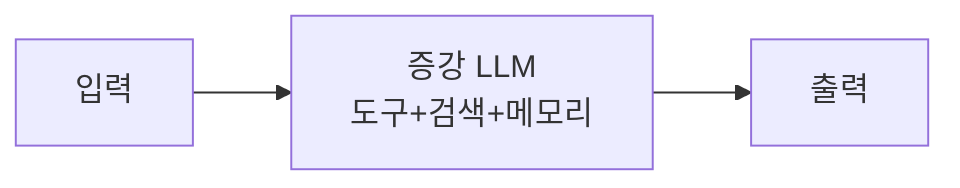

# Workflow Design

> 여러 LLM 호출·도구·에이전트를 어떤 순서와 제어 흐름으로 엮을지 설계하는 오케스트레이션의 출발점.

## 핵심 개념

워크플로우 설계는 "하나의 큰 프롬프트"로 모든 것을 처리하려는 시도 대신, 작업을 **명확한 단계(step)** 로 분해하고 각 단계를 노드로 연결하는 접근이다. Anthropic의 분류를 빌리면 크게 두 갈래로 나뉜다.

- **Workflow(워크플로우)**: 사람이 미리 정의한 코드 경로를 따라 LLM과 도구가 실행된다. 예측 가능하고 디버깅이 쉽다.
- **Agent(에이전트)**: LLM이 스스로 다음 행동과 도구 사용을 동적으로 결정한다. 유연하지만 비용·지연·예측 불가능성이 커진다.

대부분의 실무 시스템은 "필요한 만큼만 에이전트적"으로 설계하는 것이 권장된다. 단순한 작업은 워크플로우로 고정하고, 진짜 동적 판단이 필요한 곳에만 에이전트 자율성을 부여한다.

## 기본 빌딩 블록

증강 LLM(augmented LLM) = 검색(retrieval) + 도구(tool) + 메모리(memory)를 결합한 단위. 이 단위들을 어떻게 배치하느냐가 워크플로우 패턴을 결정한다.

## 대표 워크플로우 패턴

| 패턴 | 설명 | 대응 노트 |
|------|------|-----------|
| Prompt Chaining | 단계를 순차로 연결, 단계 사이 게이트 검증 | [[Sequential WorkFlow]] |
| Routing | 입력을 분류해 적절한 경로로 분기 | [[Conditional Workflow]] |
| Parallelization | 작업을 분할(sectioning) 또는 투표(voting)로 병렬 처리 | [[Parallel Workflow]] |
| Orchestrator-Workers | 중앙 LLM이 하위 작업을 분배·통합 | [[Supervisor Pattern]] |
| Evaluator-Optimizer | 생성→평가→개선 루프 | [[Reflection]] |

## 설계 원칙

1. **단순함 우선**: 워크플로우로 충분하면 에이전트를 도입하지 않는다.
2. **단계 경계 명확화**: 각 노드의 입력/출력 계약을 정의해 디버깅과 테스트를 쉽게 한다.
3. **관측 가능성 확보**: 단계별 로깅·트레이싱으로 어디서 실패했는지 추적한다.
4. **상태 분리**: 공유 상태는 명시적으로 관리한다([[State Management]]).
5. **휴먼 인 더 루프**: 위험·비가역 작업에는 사람 승인 단계를 둔다([[Human In the Loop]]).

## 관련 노트

- [[Sequential WorkFlow]]
- [[Parallel Workflow]]
- [[Conditional Workflow]]
- [[Supervisor Pattern]]
- [[State Management]]
- [[LangGraph]]
- [[Agent 설계 원칙]]
