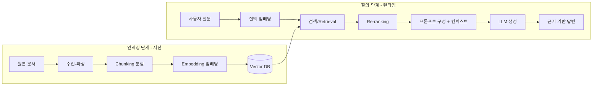

# RAG Architecture

> 외부 지식 베이스에서 질의와 관련된 문서를 검색(Retrieval)해 LLM의 프롬프트에 주입(Augmented)함으로써, 모델의 파라미터에 없는 최신·도메인 지식으로 답변을 생성(Generation)하는 구조.

## 핵심 개념

LLM은 학습 시점 이후의 정보를 모르고, 사내 문서 같은 비공개 지식도 갖고 있지 않으며, 모르는 것을 그럴듯하게 지어내는 **환각(Hallucination)** 문제가 있다. **RAG**는 답변 생성 직전에 관련 문서를 검색해 컨텍스트로 제공함으로써, 모델을 외부 사실에 **근거(Grounding)** 시켜 이 문제를 완화한다.

## 파이프라인

단계별 상세와 평가·개선 루프는 [[RAG 구축 지도]] — 이 폴더가 그 순서(00~08)로 정리되어 있다.

## 구성 요소

| 단계 | 설명 |
|------|------|
| **Chunking** | 문서를 검색 단위로 분할. 크기·중첩(overlap)이 검색 품질을 좌우 |
| **Embedding** | 텍스트를 의미 벡터로 변환 |
| **Vector DB** | 벡터를 저장하고 유사도 기반 근접 검색(ANN) 수행 |
| **Retrieval** | 의미 검색(dense) + 키워드 검색(BM25)을 결합한 하이브리드 권장 |
| **Re-ranking** | 1차 후보를 크로스인코더 등으로 재정렬해 정밀도 향상 |
| **Generation** | 검색 컨텍스트를 프롬프트에 넣어 LLM이 답변 생성 |

## RAG vs 에이전트

기본 RAG는 "검색 1회 → 생성 1회"의 직선 파이프라인이다. **에이전틱 RAG**는 에이전트가 질의를 재작성하고, 여러 차례 검색하며, 결과의 충분성을 스스로 판단(Reflection)해 재검색하는 루프로 확장된다.

## RAG 아키텍처 계열

기본 파이프라인은 다음 방향으로 진화한다.

- **[[Modular RAG]]**: 검색·생성을 교체 가능한 모듈로 분해 (Naive → Advanced → Modular).
- **[[Self-RAG]]**: 검색 여부·근거성을 모델이 스스로 판단.
- **[[Corrective RAG]]**: 검색 결과를 평가하고 실패 시 웹 검색으로 교정.
- **[[Adaptive RAG]]**: 질의 복잡도에 따라 검색 전략을 선택.
- **[[GraphRAG]]**: 지식 그래프 기반 종합·다중 홉 검색.
- **[[Agentic RAG]]**: 에이전트 루프로 검색을 능동 계획·반복·검증.

## 장단점

**장점**: 최신·비공개 지식 반영, 환각 감소, 출처 인용 가능, 재학습 불필요
**단점**: 검색 품질에 답변 품질이 종속, 인덱싱·인프라 비용, 컨텍스트 길이 한계

## 관련 노트

- [[Chunking]]
- [[Embedding]]
- [[Vector Database]]
- [[Hybrid Retrieval]]
- [[Re-ranking]]
- [[Grounding]]
- [[RAG Evaluation]]
