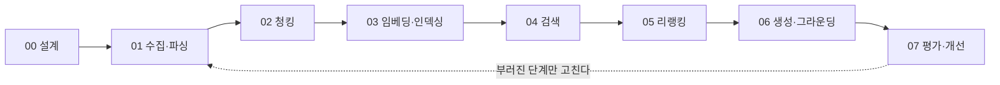

# RAG 구축 지도

> RAG는 하나의 조립 파이프라인이다. 이 폴더는 **만드는 순서(00→07)** 대로 정리돼 있고, 이름만 다른 수많은 "○○ RAG"는 별개 제품이 아니라 **기본 파이프라인의 특정 실패를 고치는 개선 패턴**(08)이다.

## 파이프라인 한눈에

01~03은 **문서를 넣을 때** 도는 길(인덱싱 타임), 04~06은 **질문이 올 때마다** 도는 길(쿼리 타임)이다 (기본형 기준 — 고급 패턴은 이 경계를 넘나들기도 한다).

## 단계별 폴더 — 각 단계가 답하는 질문

| 폴더 | 이 단계의 질문 | 노트 |
|------|--------------|------|
| **00_설계** | RAG가 필요한가? 전체 구조는? | [[RAG Architecture]] |
| **01_수집파싱** | 원본 문서를 어떻게 깨끗한 텍스트로 만드나? | [[문서 수집과 파싱]] |
| **02_청킹** | 어떤 단위로 자르나? | [[Chunking]] → 고급: [[Adaptive Chunking]] · [[Contextual Retrieval]](청크 맥락 보강) |
| **03_임베딩인덱싱** | 어떻게 벡터로 바꿔 저장하나? | [[Embedding]] · [[Vector Database]] |
| **04_검색** | 질문에 맞는 청크를 어떻게 찾나? | [[BM25]] · [[Hybrid Retrieval]] · [[Query Transformation]] |
| **05_리랭킹** | 찾은 후보를 어떻게 정밀하게 추리나? | [[Re-ranking]] |
| **06_생성그라운딩** | 근거에 묶인 답을 어떻게 만드나? | [[Grounding]] · [[Context Engineering]] |
| **07_평가개선** | 어디가 부러졌는지 어떻게 아나? | [[RAG 실패 진단과 개선]] (+ [[RAG Evaluation]]) |

각 단계에서 고를 수 있는 **선택지 전체는 단계 폴더의 전략 카탈로그**에: [[청킹 전략 카탈로그]] · [[임베딩·인덱싱 전략 카탈로그]] · [[검색 전략 카탈로그]] · [[리랭킹·압축 전략 카탈로그]] · [[생성·그라운딩 전략 카탈로그]]. (원리 노트로 개념을 잡고, 카탈로그에서 증상에 맞는 전략을 고른다.)

## 왜 "○○ RAG"가 이렇게 많은가 — 08_개선패턴

전부 위 파이프라인이 **특정 상황에서 실패하는 지점을 고치는 패치**다. 처음부터 고르는 메뉴가 아니라, 07 평가에서 실패가 확인될 때 꺼내는 처방전이다. 단, [[GraphRAG]]·[[Agentic RAG]]는 코퍼스 구조·질의 유형이 처음부터 요구하면 초기 설계에서 선택되기도 한다 — "패치"는 도입 순서의 기본값이지 금지 규칙이 아니다.

| 패턴 | 고치는 실패 | 한 줄 |
|------|-----------|------|
| [[Self-RAG]] | 필요 없는데도 항상 검색 / 근거 무시 | 모델이 검색 여부·결과 유용성·근거 부합을 스스로 판단 |
| [[Corrective RAG]] | 검색이 빗나가도 그대로 생성 → 환각 | 검색 결과를 채점해 품질이 낮으면 웹 검색 등으로 교정 |
| [[Adaptive RAG]] | 단순 질문에도 과한 검색 비용 | 질의 복잡도를 분류해 검색 강도를 조절 |
| [[Agentic RAG]] | 한 번의 검색으로 안 풀리는 멀티홉 질문 | 에이전트가 검색을 계획·반복·검증 |
| [[GraphRAG]] | "전체 조망·종합" 질문에 벡터 검색 무력 | 지식 그래프 + 커뮤니티 요약으로 인덱싱 |
| [[Modular RAG]] | (실패라기보다 관점) 위 전부를 담는 프레임 | 파이프라인을 교체 가능한 모듈 조합으로 보는 아키텍처 |

## 처음 만든다면 — 최소 경로

1. **골든셋부터**: 질문–정답 근거 쌍 20개 ([[Ground Truth]]) — 만들기 전에 채점표부터.
2. **기본 조립**: 고정 청킹 → 임베딩 → 벡터 top-k → 근거 강제 프롬프트. 여기까지로 골든셋 측정.
3. **표준 1차 업그레이드**: [[Hybrid Retrieval]] + [[Re-ranking]] (품질 우선 환경의 실무 기본값 — 소규모 코퍼스·저지연 요구에선 dense 단독도 충분할 수 있다).
4. **그 다음은 진단이 결정**: [[RAG 실패 진단과 개선]]의 증상→처방 표를 따라 부러진 단계만 고친다. 08_개선패턴은 이때 처음 연다.

## 관련 문서

- 도구 선택(벡터DB·OCR·임베딩): [[TECHNOLOGY-DECISION-GUIDE]] + `05_도구/`
- 평가 전반: [[RAG Evaluation]] · [[LLM-as-a-Judge]]
- 인덱스 신선도·실시간성: [[실시간 지식 파이프라인]]
