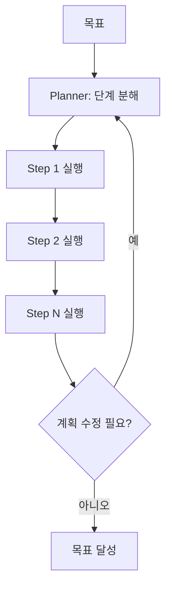

# Planning

> 복잡한 목표를 즉흥적으로 처리하는 대신, 먼저 하위 작업으로 분해한 계획(plan)을 수립하고 그 계획에 따라 단계적으로 실행하는 패턴.

## 핵심 개념

단순 반응형 루프(ReAct)는 매 단계 다음 행동만 결정하므로, 의존 관계가 복잡하거나 여러 단계를 내다봐야 하는 작업에서 길을 잃기 쉽다. **Planning 패턴**은 실행 전에 **전체 작업을 명시적 단계로 분해**하여, 일관성과 추적성을 확보한다.

## 대표 전략

- **Plan-and-Execute**: 플래너가 전체 단계 목록을 먼저 만들고, 실행기(executor)가 단계를 차례로 수행. 단계 완료 후 필요 시 계획을 재수립(replanning).
- **Decomposition(작업 분해)**: 큰 목표 → 하위 목표 트리로 분할.
- **Chain-of-Thought / Tree-of-Thought**: 추론 경로를 명시하거나 여러 경로를 탐색·평가.
- **ReWOO**: 도구 호출 계획을 미리 세워 LLM 호출 횟수를 절감.

## 동작 방식

## 구성 요소

| 요소 | 역할 |
|------|------|
| **Planner** | 목표를 실행 가능한 단계로 분해 |
| **Executor** | 각 단계를 도구·하위 에이전트로 수행 |
| **Replanner** | 중간 결과를 보고 계획을 갱신 |
| **상태 추적** | 완료/대기 단계와 중간 산출물 관리 |

## ReAct와의 비교

| | ReAct | Planning |
|---|-------|----------|
| 시점 | 한 단계씩 즉흥 결정 | 사전에 전체 계획 |
| 장점 | 유연·적응적 | 일관성·장기 작업에 강함 |
| 약점 | 장기 작업서 표류 | 계획 오류 시 비효율 |

실무에서는 둘을 결합한다. 즉, 계획을 세우되 각 단계를 ReAct로 수행하고 [[Reflection]]으로 재계획한다.

## 장단점

**장점**: 복잡·다단계 작업의 일관성, 단계별 검증·추적 용이
**단점**: 초기 계획 오류가 전체에 전파, 동적 환경에선 잦은 재계획 비용

## 관련 노트

- [[Plan-and-Execute]]
- [[ReAct]]
- [[Reflection]]
- [[Supervisor Pattern]]
- [[Workflow Design]]
- [[State Management]]
- [[Agent Architecture]]
