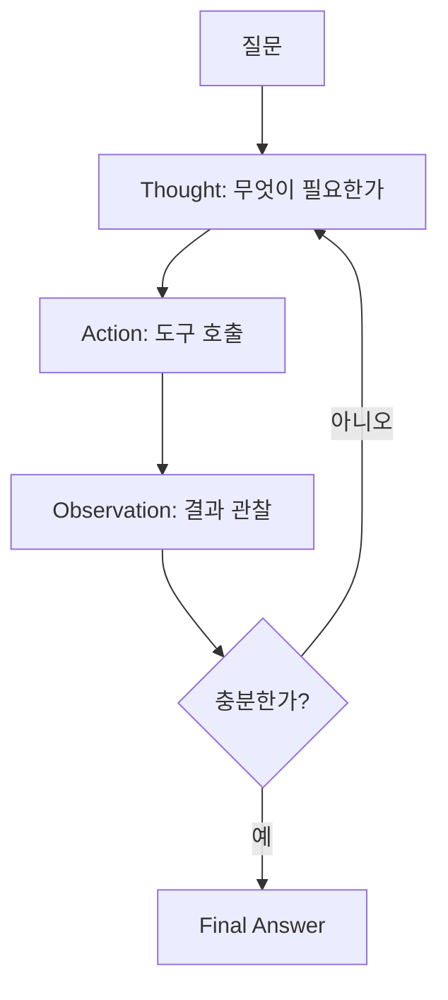

# ReAct

> Reasoning(추론)과 Acting(행동)을 하나의 루프에서 번갈아 수행하여, 생각 → 도구 사용 → 관찰을 반복하며 문제를 풀어가는 에이전트 패턴.

## 핵심 개념

**ReAct = Reason + Act**. 모델이 답을 한 번에 내놓는 대신, 각 단계에서 **무엇을 할지 추론(Thought)** 하고, **도구를 실행(Action)** 하며, **결과를 관찰(Observation)** 한 뒤 이를 다음 추론의 근거로 삼는다. 추론 흔적이 외부 도구로 보강되므로 환각이 줄고, 행동이 추론으로 설명되므로 해석 가능성이 높아진다. (Yao et al., 2022)

## 루프 구조



## 동작 예시 (의사 트레이스)

```text
Question: 작년 매출 1위 제품의 올해 재고는?
Thought: 작년 매출 1위 제품을 먼저 조회해야 한다.
Action: sales_db.query("2025 매출 1위")
Observation: "제품 A"
Thought: 이제 제품 A의 현재 재고를 확인한다.
Action: inventory_api.get("제품 A")
Observation: 1,240개
Thought: 답할 수 있다.
Final Answer: 제품 A이며 현재 재고는 1,240개입니다.
```

## 구성 요소

- **Thought**: 다음 행동을 결정하는 자연어 추론
- **Action**: 도구 이름 + 인자 (Tool Calling / Function Calling으로 구현)
- **Observation**: 도구 실행 결과를 컨텍스트에 다시 주입
- **종료 조건**: Final Answer 생성 또는 최대 step 한도

## 장단점

**장점**: 외부 사실 기반으로 환각 감소, 추론 과정이 투명, 동적 다단계 작업에 강함
**단점**: 반복마다 LLM 호출 → 비용·지연 증가, 잘못된 관찰 해석 시 루프 이탈·반복 위험

## 관련 패턴과의 차이

ReAct는 **행동하며 추론**하는 반응형 루프인 반면, [[Planning]]은 **먼저 전체 계획을 세운 뒤** 실행한다. [[Reflection]]을 결합하면 ReAct 루프의 결과를 스스로 비평·교정할 수 있다.

## 관련 노트

- [[Planning]]
- [[Reflection]]
- [[Tool Calling]]
- [[Function Calling]]
- [[Agent Architecture]]
