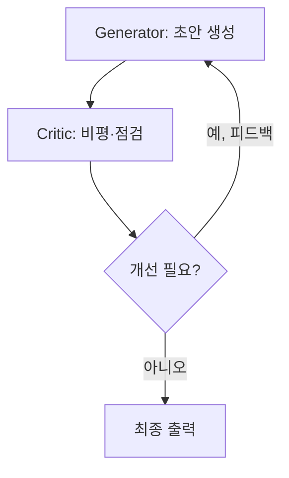

# Reflection

> 에이전트가 자신의 출력을 스스로(또는 비평 에이전트가) 검토·비평하고, 그 피드백을 반영해 결과를 반복 개선하는 패턴.

## 핵심 개념

LLM의 첫 번째 출력은 종종 불완전하거나 오류를 포함한다. **Reflection 패턴**은 "생성 → 비평 → 수정"의 루프를 추가해, 모델이 자신의 결과를 평가 기준에 비추어 약점을 찾아내고 개선하도록 한다. 인간이 초안을 쓰고 퇴고하는 과정과 같다. 대표 연구로 **Reflexion**, **Self-Refine**이 있다.

## 동작 방식

1. **Generator**가 초안을 만든다.
2. **Critic**(같은 모델의 다른 프롬프트 또는 별도 에이전트)이 명세·테스트·체크리스트에 비추어 문제점을 지적한다.
3. 피드백을 컨텍스트에 더해 다시 생성한다.
4. 비평이 통과하거나 최대 반복에 도달하면 종료한다.

## 자기반성과 외부 신호

- **순수 자기반성(self-critique)**: 모델이 스스로 평가. 구현이 쉽지만 자기 오류를 못 볼 수 있음.
- **외부 신호 기반**: 테스트 실행 결과, 컴파일러 오류, 검색 사실, 평가 점수 등 **객관적 피드백**을 비평에 사용하면 효과가 크게 향상된다. (예: 코드 생성 후 테스트 실패 메시지를 다시 입력)

## 구성 요소

| 요소 | 역할 |
|------|------|
| **Generator** | 작업 결과 생성 |
| **Critic** | 평가·결함 탐지·개선 지시 |
| **평가 기준** | 명세, 루브릭, 테스트, 사실 근거 |
| **종료 조건** | 비평 통과 또는 최대 반복 횟수 |

## 장단점

**장점**: 출력 품질·정확도 향상, 환각·논리 오류 자가 교정
**단점**: 반복마다 추가 호출로 비용·지연 증가, 외부 신호 없는 자기반성은 효과 제한적, 과도한 반복 시 수렴 실패

## 관련 노트

- [[Self Correction]]
- [[Critic Agent]]
- [[Episodic Memory]]
- [[ReAct]]
- [[Planning]]
- [[Agent Evaluation]]
