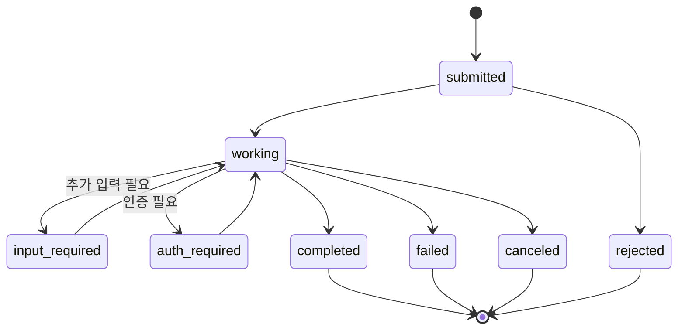
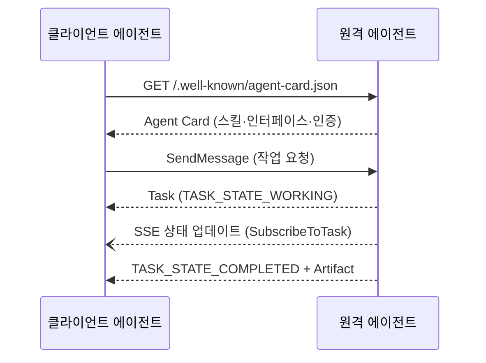

# A2A (Agent2Agent Protocol)

> 한 줄 정의
> 서로 다른 벤더·프레임워크로 만든 에이전트들이 서로를 **발견하고 작업을 위임·교환**하기 위한 개방형 상호운용 표준. Google이 2025년 4월 공개, 2025년 6월 Linux Foundation 이관, **2026년 4월 v1.0 안정판** 도달. 150개 이상 조직이 지원하며 주요 클라우드 에이전트 런타임에 탑재됐다.

## 왜 필요한가

실제 기업 환경에는 LangGraph, CrewAI, ADK, Bedrock Agents 등 **서로 다른 프레임워크의 에이전트**가 공존한다. 이들이 협업하려면 내부 구현을 노출하지 않고도 작업을 위임·교환할 공통 규약이 필요하다. A2A는 에이전트를 **불투명한(opaque) 서비스**로 보고 — 내부 상태·메모리·도구를 공유하지 않는다 — 능력 발견과 작업 위임만 표준화한다.

> [!NOTE] 비유
> 웹 서비스에게 HTTP가 하는 역할을 에이전트에게 한다. 얇고 프레임워크 중립적인 규약이라, 어떤 스택으로 만든 에이전트든 다른 스택의 에이전트에 일을 맡길 수 있다.

## 타임라인과 현재 상태 (2026-07 기준)

| 시점 | 사건 |
|------|------|
| 2025-04 | Google 공개. 출시 시점 50+ 파트너 |
| 2025-06 | Linux Foundation 이관. 창립 멤버: AWS·Cisco·Google·Microsoft·Salesforce·SAP·ServiceNow |
| 2025 하반기 | v0.3 — gRPC 바인딩 추가, Agent Card 경로가 `agent-card.json`으로 |
| 2026-04-09 | **v1.0 안정판** — 서명된 Agent Card, 3개 바인딩 공식화·동등성 보장, 웹 정렬 아키텍처 |
| 2026-05 | v1.0.1 — 확장(extension) 메커니즘 정비 |

150+ 조직 지원, 첫해에 엔터프라이즈 프로덕션 사용 사례 확보. 스펙과 문서는 [a2a-protocol.org](https://a2a-protocol.org), 저장소는 `github.com/a2aproject/A2A`.

## 핵심 개념

### Agent Card — 발견(Discovery)

에이전트가 자신을 광고하는 메타데이터 문서. 보통 `/.well-known/agent-card.json`으로 공개된다.

- **무엇을 담나**: 이름·설명, 제공 스킬(skills), 인증 방식(securitySchemes), 지원 기능(capabilities)
- **v1.0 구조 변화**: 최상위 `url`·`preferredTransport` 대신 `supportedInterfaces[]` 배열 — 인터페이스마다 `url`·`protocolBinding`·`protocolVersion`을 따로 선언한다. 한 에이전트가 여러 바인딩·여러 프로토콜 버전을 동시에 지원할 수 있는 구조
- **서명 (v1.0)**: JWS(RFC 7515) + JSON 정규화(RFC 8785)로 카드에 암호학적 서명 가능 → 발견한 에이전트의 신원·메타데이터 위변조 검증

### Task — 협업의 단위

작업 위임의 기본 단위. 장기 실행을 전제로 생명주기를 가진다.

- 와이어 포맷 상태값은 v1.0부터 `TASK_STATE_COMPLETED`처럼 SCREAMING_SNAKE + 접두사
- `input-required`·`auth-required`는 **중단(interrupt) 상태** — 사람 또는 호출 측의 개입 후 재개
- v1.0 추가: `createdAt`·`lastModified` 타임스탬프(ISO 8601), 커서 기반 페이지네이션, 필터링 가능한 `ListTasks`. `GetTask`는 인증된 호출자 범위로 스코핑

### Message · Part · Artifact

- **Message**: 에이전트 간 대화 턴. 역할은 `ROLE_USER` / `ROLE_AGENT`
- **Part**: 메시지·산출물의 콘텐츠 조각. v1.0에서 TextPart/FilePart/DataPart 구분이 **단일 Part 타입으로 통합** — `kind` 필드 대신 멤버 존재로 판별(`"text" in part`). 파일은 `url`(참조) 또는 `raw`(base64 인라인), MIME 필드는 `mediaType`
- **Artifact**: 태스크의 산출물(파일·구조화 데이터). Message와 Artifact 모두 `extensions[]` 배열 지원

### 전송 바인딩 — 3개 공식, 동등성 보장

| 바인딩 | 용도 |
|--------|------|
| JSON-RPC 2.0 (HTTP) | 초기부터의 기본 바인딩 |
| gRPC | 고성능·스트리밍, v1.0에서 네이티브 테넌트 스코핑 |
| HTTP+JSON (REST) | 웹 친화적 통합 |

- 세 바인딩은 v1.0에서 **기능 동등성(equivalence)** 을 공식 보장 — 무엇으로 붙어도 같은 의미론
- 스트리밍은 SSE(`SendStreamingMessage`), 장기 작업은 웹훅 푸시 알림
- 프로토콜 버전은 `A2A-Version` HTTP 헤더로 전달, URL의 `/v1/` 접두사는 제거됨

## 동작 흐름

## 주요 오퍼레이션 (v1.0 이름 ← v0.x 이름)

| v1.0 | v0.x | 역할 |
|------|------|------|
| `SendMessage` | `message/send` | 메시지 전송·태스크 시작 |
| `SendStreamingMessage` | `message/stream` | SSE 스트리밍 전송 |
| `GetTask` | `tasks/get` | 태스크 상태 조회 |
| `ListTasks` | (신규) | 태스크 목록·필터·커서 페이지네이션 |
| `CancelTask` | `tasks/cancel` | 태스크 취소 |
| `SubscribeToTask` | `tasks/resubscribe` | 진행 중 태스크 스트림 재구독 |
| `GetExtendedAgentCard` | `agent/getAuthenticatedExtendedCard` | 인증 후 확장 카드 |
| `CreateTaskPushNotificationConfig` 등 | `tasks/pushNotificationConfig/*` | 푸시 알림 설정 CRUD |

> [!WARNING] v0.x → v1.0 마이그레이션 핵심 (호환성 깨짐)
> - 오퍼레이션 이름 전면 개편 (동사-명사 패턴, 위 표)
> - Part 타입 통합 — `kind` 판별 코드는 전부 멤버 존재 검사로 수정
> - enum 값 변경 — `"completed"` → `"TASK_STATE_COMPLETED"`, `"user"` → `"ROLE_USER"`
> - 스트림 이벤트의 `final` 불리언 제거 — 스트림 종료 자체가 완료 신호
> - 에러가 `google.rpc.Status` + `ErrorInfo`(domain: `a2a-protocol.org`) 구조로 표준화
> - 멀티테넌시: 요청과 `AgentInterface`에 `tenant` 필드 추가
> - 인터페이스별 프로토콜 버전 선언이 가능해 v0.3/v1.0 **점진 이행**(dual support)이 공식 권장 경로

## 보안

- **불투명성 원칙**: 에이전트는 내부 상태·메모리·도구를 노출하지 않는다. 교환은 Message/Artifact로만
- **신원**: 서명된 Agent Card로 발견 단계의 신뢰 확보. 인증은 카드의 `securitySchemes`에 선언 — OAuth 2.0, API 키, OpenID Connect
- **OAuth 현대화 (v1.0)**: implicit·password 플로우 폐기, Device Code 플로우(RFC 8628)와 PKCE(RFC 7636, `pkce_required`) 추가
- **신뢰 경계**: 외부 에이전트의 응답은 **지시가 아니라 데이터**다. 상대 에이전트가 오염됐을 수 있으므로 응답 내 지시문 실행은 indirect prompt injection 경로가 된다 → [[Prompt Injection]], [[가드레일]]

## MCP와의 관계

| | 연결 대상 | 비유 |
|---|---|---|
| [[MCP]] | 에이전트 ↔ 도구·데이터 | 작업자가 쓰는 연장 |
| **A2A** | 에이전트 ↔ 에이전트 | 작업자끼리의 협업 |

둘은 경쟁이 아니라 **보완**이다. 한 에이전트가 MCP로 도구를 쓰면서, A2A로 다른 전문 에이전트에 하위 작업을 위임할 수 있다. 수직(도구 접근)은 MCP, 수평(동료 위임)은 A2A로 기억하면 된다.

## 에이전트 설계에서의 의미

- 멀티에이전트 시스템을 단일 프레임워크에 묶지 않고 **이종 조합**으로 구성할 수 있다 → [[Multi Agent Architecture]]
- 작업 위임은 [[Agent Handoff]]·[[Supervisor Pattern]]을 **네트워크·조직 경계 너머로** 확장한 형태다
- v1.0의 웹 정렬 설계(무상태·계층·표준 바인딩) 덕분에 로드밸런서·API 게이트웨이·옵저버빌리티 등 **기존 웹 인프라 패턴을 그대로 재사용**할 수 있다
- **언제 쓰나**: 팀·조직·벤더 경계를 넘는 위임에 적합. 단일 프레임워크 내부의 서브에이전트 호출까지 A2A로 감싸는 건 과설계다 → [[Single Agent vs Multi Agent]]

## 생태계 (2026-07)

- **공식 SDK**: Python(`a2a-sdk`)·JavaScript/TypeScript·Java·.NET·Go
- **프레임워크·런타임**: Google ADK, Microsoft Azure AI Foundry·Copilot Studio, AWS Bedrock AgentCore 등 주요 클라우드 에이전트 플랫폼이 지원
- **거버넌스**: Linux Foundation 산하 중립 프로젝트 — 특정 벤더 종속 없음

## 관련 노트

- [[MCP]]
- [[AP2]] — A2A 위의 결제 신뢰 계층
- [[Multi Agent Architecture]]
- [[Agent Handoff]]
- [[Supervisor Pattern]]
- [[Single Agent vs Multi Agent]]
- [[Prompt Injection]]

## 출처 (2026-07-15 확인)

- [A2A 공식 — What's New in v1.0](https://a2a-protocol.org/latest/whats-new-v1/)
- [A2A 공식 — Announcing Version 1.0](https://a2a-protocol.org/latest/announcing-1.0/)
- [Linux Foundation — A2A 프로젝트 출범 (2025-06)](https://www.linuxfoundation.org/press/linux-foundation-launches-the-agent2agent-protocol-project-to-enable-secure-intelligent-communication-between-ai-agents)
- [Linux Foundation — 150+ 조직·프로덕션 채택 (2026)](https://www.linuxfoundation.org/press/a2a-protocol-surpasses-150-organizations-lands-in-major-cloud-platforms-and-sees-enterprise-production-use-in-first-year)
- [IBM — What Is Agent2Agent (A2A) Protocol?](https://www.ibm.com/think/topics/agent2agent-protocol)
