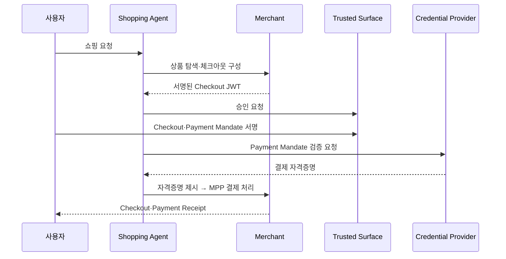

# AP2 (Agent Payments Protocol)

> 한 줄 정의
> AI 에이전트가 사용자를 대신해 **결제**할 때, 그 결제가 정말 사용자의 위임을 받은 것인지 암호학적으로 증명하는 개방형 표준. Google이 2025년 9월 60여 결제·기술 파트너와 공개했고, 이후 **FIDO Alliance에 기증**됐다. 2026년 4월 v0.2 — 아직 초기 채택 단계의 젊은 스펙이다.

## 왜 필요한가

에이전트 커머스의 근본 질문: **"이 구매, 진짜 사용자가 시킨 게 맞나?"** 사람이 직접 클릭하던 기존 결제 인프라는 이 질문에 답할 수단이 없다. AP2는 세 가지를 검증 가능하게 만든다.

| 문제 | 질문 | AP2의 답 |
|------|------|----------|
| 권한 (Authorization) | 사용자가 이 구매를 허락했나 | 사용자·에이전트가 서명한 Mandate |
| 진본성 (Authenticity) | 요청이 위변조되지 않았나 | 디지털 서명 + 해시 바인딩 |
| 책임소재 (Accountability) | 분쟁 시 누가 책임지나 | 부인 방지 가능한 Mandate·Receipt 증거 체인 |

[[A2A]]·[[MCP]] 위에서 동작하는 **결제 신뢰 계층**이다 — 상거래 의미론 전체를 정의하지 않고, 위임 증명에 집중한다.

## 타임라인과 현재 상태 (2026-07 기준)

| 시점 | 사건 |
|------|------|
| 2025-09-16 | Google 공개. PayPal·Mastercard·Amex·Adyen·Coinbase·Salesforce·ServiceNow·Worldpay·JCB·UnionPay·Etsy 등 60+ 파트너 |
| 2025~ | FIDO Alliance에 기증 — 벤더 중립 표준화 트랙 |
| 2026-04 | **v0.2.0** — Mandate 구조 재편(SD-JWT), 레퍼런스 구현 Python(주력)·TypeScript·Kotlin·Go |
| 2026 상반기 | 공개 배포 사례: PayPal 지갑 × Google Cloud 대화형 커머스 에이전트, PayPal 내 Mastercard Agent Pay 파일럿, A2A **x402 확장**(암호화폐) |
| 2026 I/O | Google Universal Cart 발표와 함께 AP2 업데이트 — UCP(Universal Commerce Protocol) 호환 전제 설계 |

스펙·문서: [ap2-protocol.org](https://ap2-protocol.org), 저장소 `github.com/google-agentic-commerce/AP2`.

## 핵심 개념

### Mandate — 서명된 위임장

검증 가능한 디지털 자격증명(VDC)으로 발행되는 암호학적 위임 계약. v0.2는 **SD-JWT**(선택적 공개) 포맷, `vct` 클레임의 숫자 접미사로 스키마 버전을 관리한다.

- **Checkout Mandate**: "이 체크아웃을 이 에이전트가 구매해도 된다"의 증명. 판매자가 서명한 Checkout JWT에 `checkout_hash`로 바인딩 → 처리 후 **Checkout Receipt**
- **Payment Mandate**: "이 체크아웃 대금을 지불해도 된다"의 증명. 같은 해시에 바인딩 → 처리 후 `transaction_id`가 담긴 **Payment Receipt**

> [!NOTE] 명칭 변천
> 2025-09 발표 시점 자료는 **Intent Mandate / Cart Mandate / Payment Mandate** 3종으로 설명한다. v0.2에서 Cart → Checkout Mandate로 재편되고, Intent Mandate의 "조건부 사전 위임" 개념은 아래 **open mandate**로 흡수됐다. 구 문헌을 읽을 때 혼동 주의.

### open vs closed — 사람이 있을 때와 없을 때

| 모드 | 서명 방식 | 시나리오 |
|------|-----------|----------|
| **Human Present** (직접) | 사용자가 Trusted Surface에서 확정된(closed) Checkout·Payment Mandate에 직접 서명 | "이 장바구니 이 가격, 지금 승인" |
| **Human Not Present** (자율) | 사용자가 **제약 조건이 담긴 open mandate**에 서명(`cnf` 클레임에 에이전트 공개키, `exp` 만료 권장) → 조건 충족 시점에 에이전트가 자기 키로 closed mandate 서명 | "티켓 오픈되면 20만원 한도로 사놔" |

자율 모드에서는 검증자가 **사용자 서명 open mandate + 에이전트 서명 closed mandate를 함께** 받아 제약 조건 충족을 평가한다. 이전 제출의 거절 영수증 없이 다음 open mandate를 제시할 수 없다 — 재시도 남용 방지.

### 5개 역할

| 역할 | 하는 일 | agentic 여부 |
|------|---------|--------------|
| Shopping Agent (SA) | 상품 탐색·체크아웃 구성·구매 실행 | **반드시 agentic** |
| Credential Provider (CP) | 결제 자격증명 보관·에이전트 권한 검증 | 선택 |
| Merchant (M) | 체크아웃 제공·재고/가격 확인·서명 | 선택 |
| Merchant Payment Processor (MPP) | 결제 처리·자격증명 스코프 검증 | 선택 |
| **Trusted Surface (TS)** | 사용자 동의·서명을 받는 UI | **반드시 non-agentic** |

**agentic = 통신 경로에 LLM이 개입** — 조작 가능성을 전제하고 변조 방지(서명·해시) 검증을 요구한다. 결제 승인 화면(TS)은 결정론적 코드여야 한다는 것이 프로토콜 수준의 요구사항이다.

## 동작 흐름 (Human Present 기본형)

## 검증과 분쟁

- **판매자**: `checkout_hash`가 제시된 Checkout JWT와 일치하는지, closed checkout이 모든 제약을 충족하는지
- **CP·결제망**: Payment Mandate가 권한 규칙과 제약 조건에 맞는지
- **MPP**: 결제 자격증명이 해당 체크아웃으로 스코프됐는지
- **분쟁 시**: 양쪽 Mandate 독립 검증 → `checkout_jwt` 해시 재계산 → Receipt의 참조를 Mandate 해시(`sd_hash`)와 대조 → 제약 준수 확인. 서명 체인이 곧 증거다

## 보안 모델

- 서명은 레인보우 테이블 공격 방지를 위해 결정론적 방식보다 **ECDSA 선호**
- SD-JWT 선택적 공개 — 에이전트는 필요한 open mandate 필드만 공개(최소 공개 원칙)
- LLM 경로(agentic)는 **변조될 수 있다고 전제**하고, 신뢰는 프롬프트가 아니라 서명·해시에서만 나온다 → [[Prompt Injection]]

## A2A·MCP와의 관계 — 프로토콜 스택

| 계층 | 프로토콜 | 역할 |
|------|----------|------|
| 도구·데이터 접근 | [[MCP]] | 에이전트 ↔ 도구 |
| 에이전트 협업 | [[A2A]] | 에이전트 ↔ 에이전트 |
| **결제 신뢰** | **AP2** | 위임 증명·정산 책임 |

- AP2는 A2A의 확장으로 출발했고 MCP와도 함께 동작한다. **x402 확장**은 암호화폐·스테이블코인 결제 경로(Coinbase 협력)
- 상거래 의미론(장바구니·카탈로그)은 **UCP**가, 결제 위임 증명은 AP2가 맡는 분업 구조로 수렴 중
- 결제 수단 불가지론 — 카드·계좌이체·스테이블코인 모두 `type` 필드로 확장
- 별도 진영: OpenAI×Stripe의 **ACP(Agentic Commerce Protocol)**, Visa·Mastercard의 자체 에이전트 결제 트랙도 병행 — 표준 경쟁은 아직 진행형

## 에이전트 설계에서의 의미

- **돈을 만지는 에이전트의 가드레일은 프롬프트가 아니라 암호학적 제약이어야 한다** — open mandate의 한도·만료·조건이 곧 하드 가드레일 → [[가드레일]]
- **Trusted Surface 원칙은 일반화된다**: 되돌리기 어려운 승인(결제·배포·삭제)은 LLM 출력이 아니라 비-에이전트 경로로 받는다 — 사람 게이트의 프로토콜 버전
- 자율 구매는 "허용"이 아니라 **"제약된 위임"** 으로 설계한다 — 무엇을 살 수 있나가 아니라 무엇까지만 살 수 있나
- 감사 추적(Receipt 체인)이 내장된 구조 — 옵저버빌리티를 사후에 붙이는 게 아니라 프로토콜이 강제

## 관련 노트

- [[A2A]]
- [[MCP]]
- [[Prompt Injection]]
- [[가드레일]]
- [[Multi Agent Architecture]]

## 출처 (2026-07-15 확인)

- [AP2 공식 문서](https://ap2-protocol.org/)
- [AP2 공식 스펙 (v0.2)](https://ap2-protocol.org/ap2/specification/)
- [Cobo — AP2 Protocol Complete Guide (2026)](https://www.cobo.com/post/ap2-protocol-complete-guide-to-agent-payments-for-web3-developers-2026)
- [TNW — Google I/O 2026 Universal Cart·AP2 업데이트](https://thenextweb.com/news/google-universal-cart-agent-payments-shopping-io-2026)
- [FindSkill — AP2 Plain-Language Guide (2026)](https://findskill.ai/learn/agent-payments-protocol/)
