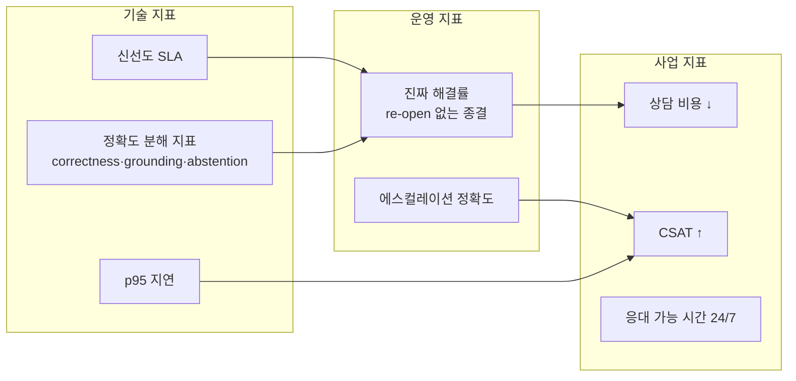

# 경쟁력 있는 에이전트 기획·컨설팅

> [!NOTE] 요약
> 기술 경쟁력(정확도·속도·신선도)을 **고객의 언어(비용 절감·CSAT·SLA)로 번역**하고, 숫자로 약속하고, 단계별로 증명하는 것이 기획·컨설팅의 일이다. 단 약속의 형식이 중요하다 — **객관 측정 가능한 것(지연·신선도·가용성)만 SLA로 걸고, 정답률은 범위·판정 방식을 고정한 acceptance test로 분리**한다. "AI 챗봇 만들어드려요"는 커머디티 제안이고, 측정 가능한 수치 약속은 차별화된 제안이다.

## 1. 디스커버리 — 계약 전에 물어야 할 것

| 질문 | 알아내는 것 | 아키텍처 영향 |
|------|-----------|-------------|
| 문의 상위 20개 유형과 월 건수는? | 자동화 가치가 어디 있는지 | 시맨틱 캐시 히트율 예측, 우선 지식 범위 |
| 지금 문의 1건 처리 비용·시간은? | ROI 분모 | 제안 가격의 근거 |
| 정보가 바뀌는 주기와 원천은? (사이트·CMS·DB·담당자 머릿속) | 신선도 요구 수준 | webhook vs 크롤링, SLA 수치 → [[실시간 지식 파이프라인]] |
| **원천 시스템에 webhook/API를 걸 수 있나?** | 크롤링 필요 여부 | 파이프라인 전체 구조가 바뀌는 단일 질문 |
| 틀린 답의 비용은? (환불 오안내 vs 영업시간 오답) | 가드레일·HITL 강도 | 자동 답변 범위 vs 사람 승인 범위 |
| 실패 시 에스컬레이션 받을 조직이 있나? | 운영 체계 | Human-in-the-Loop 설계 |
| 보안·개인정보 요건은? (PII, 보존 기간, 권한 등급, 감사 로그) | 규제·심사 부담 | 가드레일·ACL·로그 설계, 일정에 보안 심사 반영 |
| 채널·언어·피크 트래픽은? (웹/앱/전화, 다국어, 이벤트 피크) | 용량·비용 산정 | 인프라·라우팅·캐시 설계 |
| 연동 대상 시스템은? (CRM·티켓·주문 DB, SSO) | 통합 공수 — 보통 전체 공수의 절반 | 도구 계층·권한 모델 설계 |
| 성공을 무엇으로 측정할 건가? | 발주자의 진짜 KPI | 평가 하네스 설계 |

> [!WARNING] 데모와 운영의 간극
> 에이전트 프로젝트 실패의 전형: 정적 문서 몇 개로 만든 데모는 훌륭한데, 운영 투입 후 3주 만에 정보가 낡고, 평가가 없어 품질 하락을 아무도 모르고, 이상한 답변 스크린샷이 임원에게 전달되며 프로젝트가 죽는다. **기획 단계에서 파이프라인·평가·가드레일을 범위에 넣지 않으면 이 결말은 예정돼 있다.**

## 2. KPI 체계 — 기술 지표를 사업 지표로

| 층 | 지표 | 주의점 |
|----|------|--------|
| 사업 | 문의 자동 해결률(deflection), 건당 비용, CSAT, 첫 응답 시간 | 발주자 보고용 — 제안서·결과보고서의 헤드라인 |
| 운영 | 진짜 해결률(re-open 없는 종결), 에스컬레이션 비율·정확도, 재문의율, 이탈률, 세션당 비용 | deflection은 잘못된 차단으로도 올라가는 위험 지표 — 재문의율·이탈률과 반드시 세트로 본다 |
| 기술 | 정확도 분해(correctness·grounding·abstention), 환각률, TTFT/p95, freshness SLA, 캐시 히트율 | 주간 대시보드 — [[Agent Evaluation]] 하네스가 자동 산출 |

> [!TIP] SLA로 파는 법
> "저희 에이전트는 똑똑합니다"는 검증 불가능한 주장이다. **"홈페이지 변경 후 1시간 내 반영(p95)·단순 질문 완료 p95 3초·월 가용성 99.5%"처럼 객관 측정 가능한 항목을 SLA로** 걸면 경쟁 제안 대부분이 따라오지 못한다. 단 SLA 문구는 **측정 정의까지 고정**해야 계약이 된다 — "응답 3초"는 TTFT인지 완료 시간인지 어느 유형 기준인지, "가용성"은 산정 기간·예정 점검·LLM 제공사 장애·성능 저하 모드의 포함/제외를 명시한다. 단 **정답률은 SLA가 아니라 acceptance test로 분리한다** — 합의된 평가셋·판정 방식(judge)·측정 주기·out-of-scope 정의를 계약서에 고정하고, 그 프로토콜 안에서 목표치(예: 90%)를 약속한다. 범위 정의 없는 "정답률 90% 보장"은 분쟁 제조기다. 이 약속이 가능한 이유는 [[레이턴시 엔지니어링]]과 [[실시간 지식 파이프라인]]이고, 여기가 기술 경쟁력이 영업 경쟁력으로 전환되는 지점이다.

## 3. 단계별 로드맵 (제안서 골격)

| 단계 | 기간 감 | 산출물 | 게이트 (다음 단계 조건) |
|------|--------|--------|----------------------|
| **0. 진단** | 1~2주 | 문의 유형 분석, 원천 데이터 감사, KPI 합의 | 상위 문의 커버 가능성 확인 |
| **1. PoC** | 2~4주 | 정적 스냅샷 RAG + 층화 평가 질문셋(빈도 상위 유형 × 리스크 등급 × out-of-scope) | 저위험 유형 정답률 기준선 통과 + 고위험(환불·정책·금전) 유형 치명 오답 0건 |
| **2. 파이프라인** | 4~6주 | 변경 감지→증분 인덱싱, freshness SLA 측정 | 카나리 질문 반영 시간 SLA 충족 |
| **3. 운영화** | 4주~ | 가드레일·에스컬레이션, 대시보드, 온콜 체계 | 파일럿 트래픽 n% 실전 투입 |
| **4. 개선 루프** | 상시 | 실패 사례→평가셋 확장→주간 회귀 | deflection·CSAT 목표 수렴 |

- 각 단계에 **게이트(기계 검증 가능한 통과 조건)**를 두면 "언제 끝나요?" 분쟁이 크게 줄어든다 — 사라지진 않는다. 측정 도구·샘플링 방법·고객 측 의존성(데이터 접근·의사결정)·변경 요청 절차까지 계약서에 있어야 한다.
- 1단계 평가 질문셋은 이후 모든 단계의 회귀 테스트가 된다 — 처음부터 만들게 하라. 균일 100개가 아니라 **층화 구성**(빈도 × 리스크 등급 × out-of-scope × 공격성 질문)이 기준이고, 고위험 답변은 별도 셋에서 훨씬 높은 기준을 건다. "치명 오답 0건" 게이트는 **심각도 rubric과 표본 수까지 고정**해야 의미가 있다 — 표본 20개의 0건과 500개의 0건은 다른 약속이다.
- 위 기간은 원천 접근·의사결정이 원활한 중형 프로젝트 기준이다. 엔터프라이즈는 **보안 심사·법무 검토·조달·시스템 연동·UAT**가 더해져 통상 1.5~2배로 늘어난다 — 제안 단계에서 이 항목들을 일정에 명시하는 것 자체가 신뢰 신호다.

## 4. Build vs Buy 판단

| 상황 | 권고 |
|------|------|
| 문의 유형이 일반적(배송·환불·영업시간)이고 볼륨 작음 | SaaS 챗봇 구매 — 커스텀 개발은 과잉 |
| 도메인 지식이 복잡하고 정보 변경이 잦음 | **커스텀 파이프라인 구축** — 여기가 차별화 영역 |
| 원천 데이터가 사내 시스템에 산재 | 커스텀 + 통합 프로젝트 병행 (데이터 정리가 절반) |
| 규제·감사 요건 강함 (금융·의료) | 커스텀 + 강한 가드레일·감사로그, HITL 기본값 |

컨설턴트의 정직한 판별 기준: **경쟁력이 파이프라인·도메인 정책에서 나오는가?** 그렇다면 build. 화면과 일반 FAQ가 전부라면 buy를 권하는 게 신뢰를 산다. 단 최신 SaaS도 RAG·커넥터·가드레일·분석을 기본 제공하므로, 기능표 나열이 아니라 **TCO·보안 요건·확장성·운영 책임 소재·탈출 비용(exit cost)** 기준의 비교표를 만들어야 정직한 판단이 된다.

## 5. 컨설팅 산출물 체크리스트

- [ ] 문의 유형 × 건수 × 자동화 적합도 매트릭스
- [ ] 원천 데이터 감사서 (형식·갱신 주기·webhook 가능 여부·품질)
- [ ] 목표 KPI + SLA 합의서 (숫자, 측정 방법 포함)
- [ ] 아키텍처 다이어그램 (파이프라인·캐시·라우팅·에스컬레이션 경로)
- [ ] 평가 계획 (질문셋 규모·주기·판정 방식 — [[LLM-as-a-Judge]] 포함 시 명시)
- [ ] 리스크 대장 (환각·인젝션·파이프라인 정지·모델 가격 변동) + 대응
- [ ] 운영 이관 계획 (대시보드·알림·온콜·개선 루프 오너)

## 흔한 실패 패턴

- ❌ **평가 없이 출시** — 프롬프트 하나 고칠 때마다 러시안룰렛
- ❌ **신선도 미정의** — "최신 정보 반영"이 범위에 있는데 SLA가 없어 분쟁
- ❌ **deflection 허수** — 답변률만 세고 재문의율·이탈률을 안 봄 (잘못된 자동 차단도 deflection을 올린다)
- ❌ **정답률을 SLA로 계약** — 범위·판정 방식 정의 없이 "90% 보장"을 써넣고 검수 분쟁
- ❌ **모델 스펙으로 차별화 시도** — 3개월 뒤 경쟁사도 같은 모델
- ❌ **운영 오너 부재** — 출시일에 프로젝트 팀 해산, 6개월 뒤 방치된 챗봇

## 관련 문서

- [[에이전트 경쟁력 모델]] — 이 문서의 전략적 토대
- [[레이턴시 엔지니어링]] · [[실시간 지식 파이프라인]] — SLA를 가능하게 하는 기술
- [[Agent Evaluation]] · [[가드레일]] · [[Human In the Loop]]
