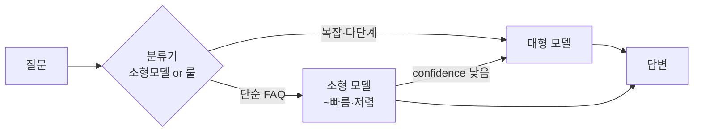

# 레이턴시 엔지니어링

> [!NOTE] 요약
> 에이전트 속도는 "빠른 모델 선택" 문제가 아니라 **예산 관리** 문제다. 대화형 UI라면 **스트리밍(체감 속도)부터 켜고**, 실제 지연은 구간별로 측정한 뒤 캐싱 → 라우팅 → 병렬화 순으로 줄인다. 에이전트는 루프라서 순차 스텝당 0.5초 절감이 10스텝이면 5초 절감이 된다.

## 1. 레이턴시 예산부터 세운다

측정 없이 최적화하면 엉뚱한 곳을 고친다. RAG 에이전트 1턴의 분해 예시 — 아래 수치는 규모감 참고용이며 모델·리전·토큰 수·reasoning 설정·동시성에 따라 크게 달라진다. **반드시 자기 시스템에서 실측한 값으로 예산표를 다시 채운다**:

| 구간 | 전형적 비중 | 주요 변수 |
|------|-----------|----------|
| 임베딩 + 벡터 검색 | 50~200ms | 인덱스 크기, re-rank 여부 |
| Re-rank | 100~500ms | cross-encoder 사용 시 |
| LLM TTFT (첫 토큰) | 300ms~2s | 입력 토큰 수, 모델 크기, 캐시 히트 |
| LLM 생성 | 출력토큰 × 10~50ms | 출력 길이, 모델 크기 |
| 도구 호출 (API·DB) | 가변 (수십ms~수초) | 외부 시스템 |
| 에이전트 루프 반복 | 순차 스텝은 위 합계가 누적 (병렬 구간은 가장 느린 호출 기준, 재시도·큐잉이 tail 증폭) | 스텝 수, 계획 품질 |

> [!TIP] 두 가지 다른 속도
> - **TTFT(Time To First Token)** — 체감 반응성. 스트리밍이면 이게 사용자가 느끼는 "속도"다.
> - **총 완료 시간** — 자동화 파이프라인·배치에서 중요.
> CS 챗봇은 TTFT를, 백오피스 자동화는 총 시간을 최적화한다.

## 2. 줄이는 순서 (효과 대비 노력)

### ① 캐싱 — 가장 싸고 효과 큼

3층으로 나눠 생각한다:

| 층 | 대상 | 기법 | 효과 |
|----|------|------|------|
| **프롬프트 캐시** | 시스템 프롬프트·도구 정의·고정 컨텍스트 | 제공사 prompt caching (변하지 않는 부분을 앞에 배치) | TTFT 감소 + 캐시된 입력 토큰 비용 대폭↓ (벤더 제약 큼 — 아래 주의) |
| **시맨틱 캐시** | 반복되는 유사 질문 | 질문 임베딩 유사도 ≥ 임계값이면 저장된 답 반환 | 히트 건은 LLM 호출 0회. 히트율은 의도 분포에 따라 천차만별 — 도입 전 로그에서 반복 질문 비율을 실측 |
| **결과 캐시** | 도구·검색 결과 | TTL 기반 (원천 갱신 주기와 연동) | 외부 API 지연 제거 |

> [!NOTE] 프롬프트 캐시의 벤더 제약
> "최대 90% 절감" 같은 홍보 수치는 조건부다: **정확한 prefix 일치** 필요(앞부분 한 글자만 바뀌어도 그 뒤 전부 miss), **최소 토큰 하한**(제공사·모델별 약 1k~4k), **짧은 TTL**(기본 수 분, 연장은 유료인 곳도), 일부 벤더는 **캐시 쓰기 비용 별도 과금**. 도입 전 자기 트래픽 패턴으로 실효 절감률을 계산한다.

> [!WARNING] 시맨틱 캐시의 함정
> 신선도가 중요한 도메인에서는 캐시가 낡은 답을 뱉는 주범이 된다. **원천 데이터가 갱신되면 관련 캐시를 무효화**하는 배선이 필수 → [[실시간 지식 파이프라인]]의 변경 감지 이벤트와 연결.

### ② 모델 라우팅 / 캐스케이드

모든 질문에 최상위 모델을 쓰는 건 돈과 시간 낭비다.

- **small-first**: 소형 모델이 먼저 시도, 확신 낮으면 대형으로 승급(escalate). 단 승급 건은 두 모델을 순차로 타므로 **p95가 오히려 나빠질 수 있다** — confidence 임계값을 calibration 데이터로 검증하고, 승급률이 높은 유형은 처음부터 대형 고정 또는 소형·대형 **병렬 race**(먼저 합격 기준을 넘는 답 사용)로 전환한다.
- **작업별 고정 라우팅**: 분류·추출·요약은 소형, 계획·추론은 대형. 에이전트 내부 스텝마다 다른 모델을 쓰는 게 정상이다.
- **파인튜닝/증류**: 트래픽이 커지면 대형 모델의 답변으로 소형 모델을 증류 — 반복 작업 한정 품질 유지 + 속도·비용 급감.

### ③ 병렬화

- **병렬 도구 호출**: 독립적인 검색·API 호출은 동시에. "주문 조회 + 배송 조회 + FAQ 검색"을 순차로 하면 3배 느리다.
- **프리페치**: 사용자가 타이핑하는 동안 세션 컨텍스트·자주 쓰는 데이터를 미리 로드.
- **투기적 실행(speculative)**: 다음에 필요할 확률 높은 검색을 미리 던져두고, 안 쓰면 버린다.
- **병렬화의 규율**: 타임아웃·취소(cancellation)·재시도 예산·멱등성 없는 병렬화는 지연 절감을 비용 폭증과 장애 전파로 바꿀 뿐이다. 외부 API에는 서킷브레이커와 rate limit 준수를 함께 배선한다.

### ④ 컨텍스트 다이어트

입력 토큰이 줄면 TTFT와 비용이 같이 준다.

- 검색 결과는 top-k를 낮추고 re-rank로 질을 보전 (k=20 넣기보다 re-rank 후 k=5)
- 대화 이력은 요약·압축 → [[Context Compaction]]
- 도구 정의 다이어트는 **프롬프트 캐시와 상충**한다 — 도구 정의가 prefix에 있으면 턴마다 바꿀 때 캐시가 깨진다. 기본은 도구 정의를 고정 prefix로 두고 캐시를 살리는 것, 도구 수가 매우 많아 토큰 비용이 캐시 이득을 넘을 때만 동적 로드로 전환(둘 다 실측 비교)

### ⑤ 스트리밍 + 체감 설계

실제 지연을 다 줄인 뒤에도 남는 지연은 **체감**으로 흡수한다:

- 토큰 스트리밍 (대화형 UI의 기본값 — 미적용이면 다른 최적화 전에 이것부터). 예외: 환불 승인·의료·금융처럼 **최종 검증 전 부분 답변이 위험한 도메인**은 진행 상태만 스트리밍하고, 답변 본문은 가드레일 통과 후 내보낸다
- 진행 상태 표시: "주문 내역 확인 중…" — 같은 5초도 무음이면 느리고, 중계가 있으면 참을 만하다
- 낙관적 응답: 확실한 부분(인사·구조)을 먼저 내보내고 검색 결과를 이어 붙임 — 위 스트리밍과 동일한 규제 도메인 예외 적용(검증 전 본문 선출력 금지)

## 3. 인프라 레벨

- **리전 근접성**: 사용자↔서버↔LLM API 왕복. 한국 사용자에 미국 리전 API면 왕복만 수백 ms.
- **프로비저닝 처리량**: 트래픽이 안정적이면 전용 처리량(provisioned)으로 콜드 지연·429를 크게 줄인다 — 제거는 아니다. 용량 산정 실패·버스트·제공사 장애 시 여전히 발생하므로 재시도·폴백 경로는 유지한다.
- **커넥션 재사용**: HTTP keep-alive, 커넥션 풀. 매 호출 TLS 핸드셰이크 낭비 금지.

## 4. 측정과 SLO

> [!SUCCESS] 예시 SLO (CS 에이전트 — 수치는 예시일 뿐, 자기 트래픽 실측으로 설정)
> - TTFT p95 < 1.5s
> - 단순 질문 완료 p95 < 4s
> - 다단계(도구 3회+) 완료 p95 < 15s
> - 타임아웃·재시도율 < 1%

- p50만 보지 말고 **p95·p99와 타임아웃·재시도율을 같이 본다** — 느린 5%가 불만 리뷰를 쓰고, tail의 원인은 대개 재시도·큐잉이다.
- 구간별 분해 측정(trace)이 없으면 최적화는 추측이다. 스텝별 span을 남겨라 (LangSmith·OpenTelemetry 등).

## 안티패턴

- ❌ 스트리밍 없이 30초 무음 후 완벽한 답 — 사용자는 15초에 떠났다
- ❌ 모든 스텝에 최대 모델 — 분류 한 줄에 대형 모델 쓰기
- ❌ 매 턴 전체 문서를 컨텍스트에 재주입 — 프롬프트 캐시 무효화 + 토큰 폭증
- ❌ 캐시 도입 후 무효화 설계 없음 — 속도 얻고 신선도 잃음
- ❌ 측정 없는 최적화 — 병목이 검색인데 모델을 바꿈

## 관련 문서

- [[에이전트 경쟁력 모델]] — 속도가 경쟁력인 이유
- [[실시간 지식 파이프라인]] — 캐시 무효화의 원천이 되는 변경 감지
- [[Context Compaction]] — 컨텍스트 다이어트 상세
