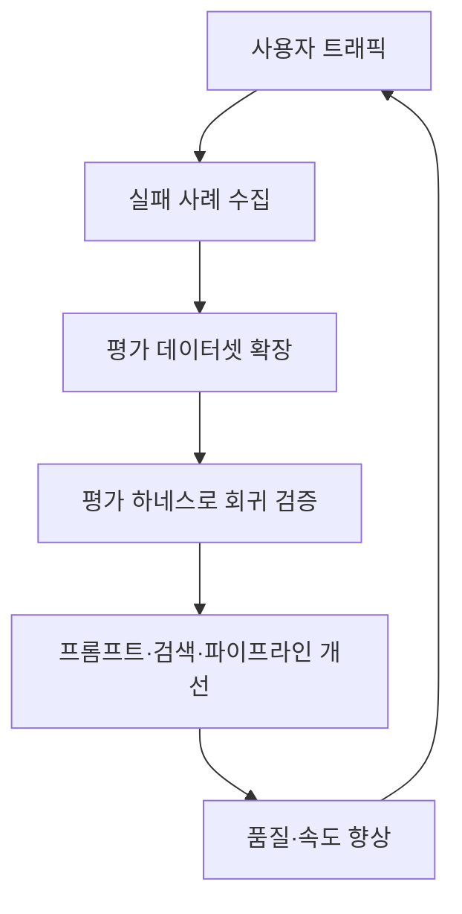

# 에이전트 경쟁력 모델

> [!NOTE] 요약
> 모델 자체는 누구나 API로 쓸 수 있는 커머디티다. 에이전트의 경쟁력은 **정확도 × 속도 × 신선도 ÷ 비용**(기억용 은유 — 실제 측정은 아래 축별 지표로 분해한다), 그리고 이를 지속시키는 **평가·데이터 파이프라인(해자)**에서 나온다.

## 왜 성능과 속도가 "경쟁력"인가

같은 GPT/Claude를 쓰는 두 회사의 CS 에이전트가 완전히 다른 결과를 내는 이유:

1. **속도는 사용량을 결정한다** — 허용 지연은 도메인마다 다르다(실시간 채팅 CS는 수 초, 백오피스 자동화는 수 분도 허용). 공통점은 에이전트가 루프 구조라 **순차 스텝의 지연이 스텝 수만큼 누적**된다는 것이다(스텝당 2초 × 순차 10스텝 = 20초. 병렬 구간은 가장 느린 호출 기준, 큐잉·rate limit은 tail을 더 키운다). 스텝당 지연을 줄이는 팀이 체감 품질에서 앞선다.
2. **정확도는 신뢰를 결정한다** — 한 번 틀린 답을 받은 사용자는 다시 검증하기 시작하고, 그 순간 에이전트의 가치(시간 절약)가 사라진다.
3. **신선도는 변동 정보 정확도의 전제다** — 어제 바뀐 요금제를 오늘 모르는 에이전트는 아무리 똑똑해도 틀린다. 대기업 CS 에이전트가 매일 자사 홈페이지를 크롤링해 RAG를 갱신하는 이유가 이것이다 → [[실시간 지식 파이프라인]]. 단, 규정·약관·매뉴얼류는 최신성보다 **출처 권위·발효일(effective date)**이 우선일 수 있다 — 최신 문서가 항상 정답은 아니다.
4. **비용은 스케일을 결정한다** — 세션당 $0.5와 $0.05는 같은 기능이라도 사업성이 다르다.

## 경쟁력 6축과 측정 지표

| 축 | 정의 | 측정 지표 | 개선 수단 |
|----|------|----------|----------|
| **정확도** | 틀리지 않고, 근거 있게 답함 | 단일 정답률이 아니라 분해: coverage(답변 가능 범위) · correctness · grounding 비율 · abstention(모를 때 안 답함) · 에스컬레이션 정확도 | RAG 품질, [[LLM-as-a-Judge]] 평가 하네스, [[가드레일]] |
| **속도** | 첫 토큰까지·완료까지 시간 | TTFT, p50/p95/p99 응답시간 | [[레이턴시 엔지니어링]] |
| **신선도** | 원천 변경 → 답변 반영 시차 | freshness SLA (변경 후 N분 내 반영, p95) | 증분 크롤링·인덱싱 파이프라인 |
| **비용** | 세션·해결 건당 비용 | $/세션, $/해결, 토큰/세션 | 모델 라우팅, 캐싱, 컨텍스트 다이어트 |
| **신뢰·안전** | 하면 안 되는 것을 안 함 | 가드레일 차단율(오차단 FP·미차단 FN 모두), 권한 위반 건수, 감사로그 완전성 | [[Prompt Injection]] 방어, ACL·권한 모델, Human-in-the-Loop |
| **운영성** | 죽지 않고, 죽어도 빨리 복구 | 도구 호출 성공률, 가용성, 파이프라인 MTTR | 재시도·서킷브레이커, 모니터링·온콜 체계 |

> [!WARNING] 신뢰·안전은 배포 게이트에 가깝다
> 다른 축들은 서로 트레이드오프가 가능하지만, 신뢰·안전 사고는 **배포 자체를 막는다** — 환불을 멋대로 승인하는 에이전트는 아무리 빨라도 못 내보낸다. 단, 가드레일의 **강도** 자체는 게이트가 아니라 트레이드오프다: 과차단(FP)은 자동화율과 UX를 깎으므로 차단율·오차단율을 함께 측정해 조정한다.

## 진짜 해자(Moat)는 어디에 있나

- **모델**: 대체로 해자 아님. 경쟁사도 같은 API를 쓰고, 다음 모델이 나오면 격차가 리셋된다. 예외적으로 전용 모델 접근권·파인튜닝용 독점 데이터·전용 처리량(latency tier) 계약은 우위가 될 수 있다 — 단 이건 데이터·계약의 해자지, 모델 자체의 해자는 아니다.
- **데이터 파이프라인**: 해자. 자사 도메인 문서를 깨끗하게 수집·청킹·갱신하는 파이프라인은 복제에 수개월 걸린다.
- **평가 하네스**: 해자. 실제 사용자 질문에서 추출한 수백~수천 개의 회귀 질문셋은 시간이 쌓아주는 자산이다. 평가 없는 팀은 개선이 개악인지조차 모른다 → [[Agent Evaluation]].
- **도메인 가드레일·정책**: 해자. "이 케이스는 사람에게 넘긴다"는 판단 규칙은 운영 경험에서만 나온다.
- **위 플라이휠이 돌아가는 조직 습관**: 가장 큰 해자.

> [!WARNING] 플라이휠의 전제
> 실패 사례 수집은 공짜가 아니다 — PII 마스킹·수집 동의·보존 기간 정책, 라벨링 품질 관리, 애매한 케이스의 사람 판정(adjudication) 절차 위에서만 돌릴 수 있다. 이 기반 없이 대화 로그를 긁어모으는 순간 자산이 아니라 리스크가 된다.

> [!TIP] 한 줄 전략
> "더 좋은 모델을 쓰자"가 아니라 **"같은 모델로 더 빠르고, 더 신선하고, 더 검증되게"**가 경쟁 전략이다. 모델 업그레이드는 모두가 공짜로 받는 밀물이고, 파이프라인·평가·속도는 내 배의 성능이다.

## 문서 지도

- [[레이턴시 엔지니어링]] — 속도를 만드는 구체 기법 (캐싱·라우팅·병렬화·스트리밍)
- [[실시간 지식 파이프라인]] — 신선도를 만드는 크롤링→증분 인덱싱→RAG 아키텍처
- [[경쟁력 있는 에이전트 기획·컨설팅]] — 이 경쟁력을 기획·수주·컨설팅 언어로 옮기기
- 기존 지식: [[Agent Evaluation]], [[RAG Evaluation]], [[Context Compaction]], [[가드레일]]
