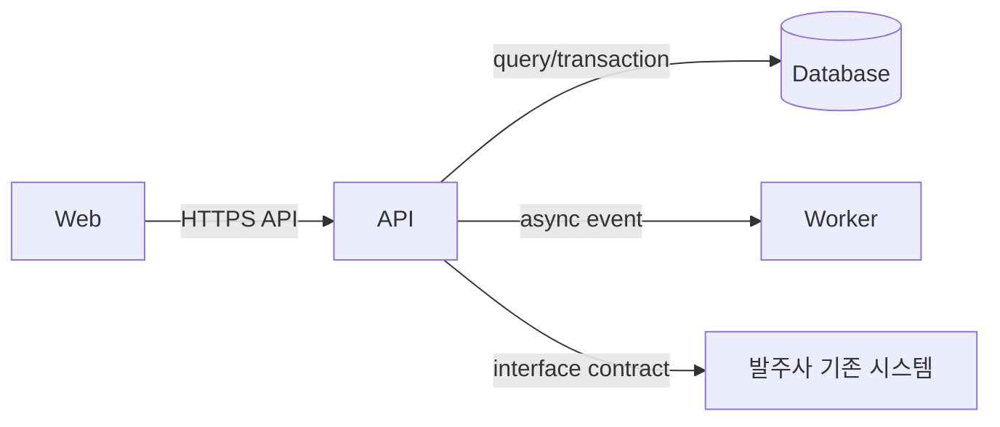

# 시스템 경계·구성도

> 시스템 안팎, 배포 단위, 데이터 소유권과 신뢰 경계를 C1·C2 수준에서 고정한다. 이 문서가 납품 문서 **시스템구성도(아키텍처)**의 원본이다 — 없으면 인수 후 발주사 운영자가 시스템 전체 모양을 모른다 ([[외주 개발 산출물]]). 발주사 인프라·기존 시스템과의 경계를 반드시 포함한다.

## 설계 범위

| 항목 | 값 |
|---|---|
| 프로젝트·변경 | `{이름}` |
| 연결 요구·NFR | `{FR/NFR ID}` |
| 기준 시스템·commit | `{경로·SHA}` |
| Owner / Reviewer | `{역할·이름}` |
| 범위 밖 | `{OUT ID — 계약서 제외 명시와 일치}` |
| 발주사 인프라 제약 | `{내부망/DMZ·클라우드 정책·서버 사양·계약 근거}` |

## C1 Context

| Actor·외부 시스템 | 목적·교환 데이터 | 신뢰 수준 | 인증·승인 | 장애 시 영향 | Owner |
|---|---|---|---|---|---|
| `{현업 사용자·발주사 기존 시스템·외부 서비스}` | `{입력/출력}` | `신뢰/비신뢰/부분` | `{방식 — 발주사 SSO 등}` | `{영향}` | `{수행사/발주사}` |

```mermaid
flowchart LR
    U[현업 사용자·업무 역할] -->|{행동·데이터}| S[{시스템}]
    S -->|{연동 계약}| E[발주사 기존 시스템·외부 시스템]
    O[발주사 운영자] -->|관측·승인| S
```

> 발주사 기존 시스템과의 연동은 Actor마다 **담당 창구(발주사 측 담당자)와 자료 제공 상태**를 함께 기록한다. 인터페이스 사양 미제공은 대표적인 발주사 지연 — 날짜·영향을 기록한다.

## C2 Container

| Container | 책임 | 배포 단위·환경 | 소유 데이터 | 제공·사용 계약 | 확장·장애 격리 | Owner |
|---|---|---|---|---|---|---|
| `{Web/API/Worker/DB}` | `{한 문장}` | `{발주사 환경 — 내부망/클라우드}` | `{데이터}` | `{API/event}` | `{방식}` | `{역할}` |



## 도메인·데이터 경계

| 경계·컨텍스트 | 핵심 용어·책임 | 데이터 Owner | 변경 이유 | 외부 공개 계약 | 금지된 직접 접근 |
|---|---|---|---|---|---|
| `{Bounded Context}` | `{책임}` | `{서비스·팀 — 발주사 시스템 데이터는 발주사 Owner}` | `{변화 축}` | `{API/event}` | `{예: 발주사 DB 직접 조회}` |

## 신뢰·보안 경계

| 경계 | 들어오는 데이터 | 검증·인가 | 민감도·보존 | 로그·마스킹 | 발주사 보안 정책 근거 |
|---|---|---|---|---|---|
| `{Internet→Web / 내부망→DMZ}` | `{값}` | `{통제}` | `{PII 등}` | `{정책}` | `{망분리·암호화·계정 규정 링크}` |

> 발주사 보안 정책(망분리, 계정 발급, 암호화 표준, 반출 절차)은 설계 선택지가 아니라 **고정 제약**이다. 정책 때문에 요구 구현이 불가하면 임의 우회하지 말고 PM에 CR·범위 재협상으로 회부한다.

## 설계 가정·미결

| ID | 가정·질문 | 틀리면 영향 | 확인법 | Owner·기한 | 기본 행동 |
|---|---|---|---|---|---|
| `ARCH-Q-01` | `{내용}` | `{영향}` | `{코드·측정·발주사 확인}` | `{값 — 발주사 확인 대기면 지연 기록}` | `{보수적 기본값}` |

## 완료 증거

- C1·C2 다이어그램 위치: `{경로}` — 시스템구성도 납품본 기준 버전
- 실제 코드·배포와 대조한 날짜: `{날짜}`
- 발주사 확인·승인: `{설계 검토 회의·승인자·일자}`
- 영향받는 API·데이터·ADR: `{링크}`
- Reviewer 판정·미검토: `{값}`
