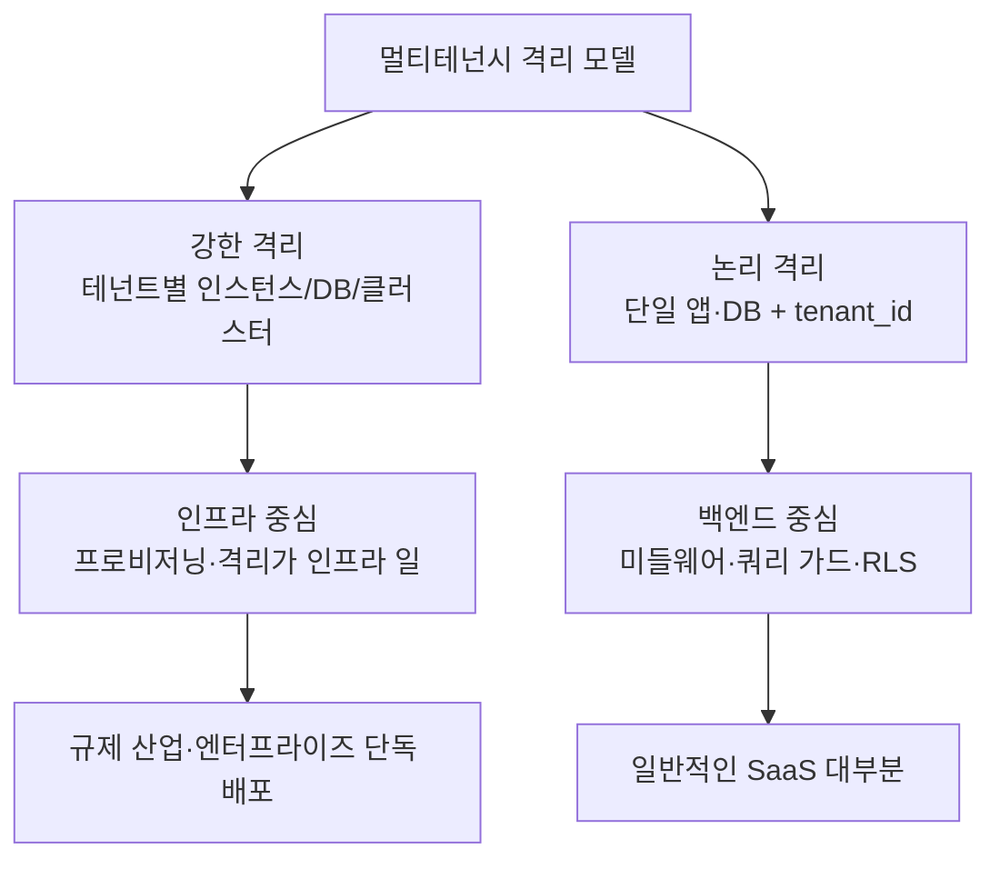

# 멀티테넌시 설계와 책임 경계

> [!NOTE] TL;DR
> "테넌트 관리 = 인프라 일"은 절반만 맞다. 대부분의 SaaS에서 무게중심은 **백엔드/아키텍처**에 있고, 인프라는 프로비저닝 자동화를 거들 뿐이다. 격리 전략 자체는 초기 **아키텍처 결정**이라 인프라·보안까지 같이 논의해야 한다.

## 핵심 질문

> "테넌트 관리는 보통 인프라 일인가?"

여러 계층에 걸친 일이며, 어느 쪽이 주도하느냐는 **"테넌트 관리"가 무엇을 뜻하느냐**와 **어떤 격리 모델을 쓰느냐**에 따라 갈린다.

## "테넌트 관리"를 쪼개서 보면

| 하는 일 | 주 담당 | 이유 |
|---------|---------|------|
| 격리 방식 결정 (DB 분리 vs 스키마 분리 vs row 단위 `tenant_id`) | **아키텍처 + 백엔드** | 데이터 모델·쿼리·성능이 여기서 갈림 |
| 테넌트 프로비저닝 (신규 생성 시 DB/스키마/리소스 자동 생성) | **인프라/DevOps + 백엔드** | 자동화·IaC 영역이지만 트리거는 앱 로직 |
| 요청마다 테넌트 식별·컨텍스트 주입 (미들웨어, `tenant_id` 강제) | **백엔드** | 애플리케이션 레이어의 핵심 로직 |
| 테넌트 간 데이터 누수 방지 (RLS, 쿼리 가드) | **백엔드 + 보안** | 격리 위반은 곧 보안 사고 |
| 온보딩·과금·설정 UI | **백엔드 + 프론트** | 제품 기능 |
| 물리적 리소스 격리·쿼터·네트워크 분리 | **인프라** | 여기가 진짜 "인프라 일" |

## 격리 모델과 소유권

### 인프라가 테넌트를 관리하는 경우
- 테넌트마다 별도 인스턴스/클러스터/DB를 띄우는 **강한 격리 모델**
- 규제 산업, 엔터프라이즈 단독 배포(single-tenant deployment)
- 프로비저닝·격리의 무게중심이 인프라에 있음

### 백엔드가 테넌트를 관리하는 경우 (대부분)
- 하나의 앱·DB를 `tenant_id`로 논리 분리하는 **흔한 SaaS 모델**
- 인프라는 거의 안 건드리고 애플리케이션 레이어가 다 함
- 격리 실패 = 데이터 누수 = 보안 사고이므로 백엔드 + 보안이 함께 책임

### 스키마 분리는 중간형
- 테넌트별 스키마는 논리 격리의 운영 단순함과 물리 격리의 격리성 사이 — DB는 하나, 스키마 프로비저닝·마이그레이션 비용은 테넌트 수에 비례.
- 격리 모델 결정 시 **noisy neighbor(리소스 독식) 대응·테넌트별 백업/복원·논리→물리 승격 기준**을 같이 정한다 — 큰 고객 하나가 단독 배포를 요구하는 순간이 반드시 온다.

## 결론

> [!TIP] 실무 원칙
> - **무게중심은 백엔드/아키텍처.** 인프라는 프로비저닝 자동화 조력자.
> - **격리 전략은 초기 아키텍처 결정.** 나중에 바꾸기 어려우므로 인프라·보안과 함께 논의.
> - "누가 맡나"를 정하기 전에 **"어떤 격리 모델인가"부터** 확정할 것.

## 체크리스트 — 새 멀티테넌트 시스템 시작 시

- [ ] 격리 모델 결정 (물리 격리 vs 논리 격리) — 아키텍처 주도
- [ ] `tenant_id` 전파 경로 설계 (인증 → 미들웨어 → 쿼리) — 백엔드
- [ ] 데이터 누수 방지 장치 (RLS / 쿼리 가드 / 테스트) — 백엔드 + 보안
- [ ] 테넌트 프로비저닝 자동화 — 인프라 + 백엔드
- [ ] 테넌트별 쿼터·리소스 격리 필요 여부 — 인프라

## 관련 문서

- [[도메인 경계 설계]]
- [[아키텍처 스타일 선택]]
- [[설계 결정과 리뷰]]
- [[05_보안 설계]] — 테넌트 격리 실패 = 보안 사고, 데이터 분류·RLS 판정
- [[04_인프라 설계]] — 물리 격리·프로비저닝·쿼터의 실무 결정
