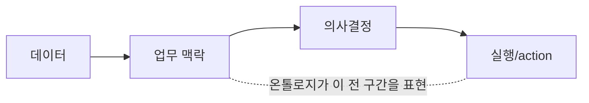

# ① Ontology — 이 구조의 심장 (시맨틱 레이어)

> [!NOTE] TL;DR
> Ontology는 데이터 카탈로그도, ERD도 아니다. **조직의 업무 세계를 객체·관계·행동·권한으로 모델링한 운영 계층(operational layer)** = digital twin이다.
> AI가 이 "지도" 없이 자연어만 보고 판단하면 테이블·컬럼·join·권한·상태를 **추측**하다 환각을 낸다. 온톨로지가 있으면 "어떤 개체 / 어떤 관계 / 어떤 권한 / 어떤 조치"가 명확해진다.

---

## 다섯 가지 구성 요소

| 요소 | 정의 | 예시 | 비유 |
|------|------|------|------|
| `Object` | 현실의 엔티티/이벤트 스키마 | 고객, 주문, 항공편, 설비, 작업지시, 클레임 | 도시 지도의 건물·도로 |
| `Property` | 객체의 속성 | 주문 상태, 설비 온도, 위험 점수, 예상 납기 | 건물·도로의 속성 |
| `Link` | 객체 간 관계(≈ join) | 고객↔주문, 주문↔배송, 설비↔공장 | 도로 연결망 |
| `Action` | 객체·속성·링크를 바꾸는 단일 업무 트랜잭션 | 작업자 배정, 주문 보류, 재고 이동, 승인 요청 | 허가된 공사 명령 |
| `Function` | 서버측 코드 로직(TS/Python) | 위험점수 계산, 배차 최적화, 외부 조회 | 교통량 계산 알고리즘 |

> [!TIP] Object vs Object Type
> `Object Type` = 스키마(예: "주문"이라는 개념). `Object` = 그 인스턴스(예: 주문 #12345). Property는 object type의 특성 정의, Link Type은 두 object type 사이 관계의 스키마.

---

## 왜 BI 시맨틱 레이어와 다른가 — "행동"까지 포함

일반 시맨틱 레이어는 BI의 metric/dimension/measure 중심이다. Foundry 온톨로지는 **업무 행동 가능성(action)까지** 포함한다.

예: "납기 지연 위험 주문을 찾아줘"
- 시맨틱 레이어 없음 → AI가 테이블·컬럼·join·보안·상태 정의를 추측
- 온톨로지 있음 → 아래가 전부 **명시**된다:
  - `Order`가 무엇인지, `Customer/Shipment/Inventory/Supplier`와 어떻게 연결되는지
  - `riskScore/promisedDate/currentStatus`의 의미
  - **누가 볼 수 있는지** (권한)
  - `ExpediteShipment/HoldOrder/NotifyAccountOwner` action 가능 여부와 실행 전 승인·감사·side effect

→ 온톨로지 = **"데이터 → 업무 맥락 → 의사결정 → 실행"을 잇는 계층.**

---

## 온톨로지가 LLM에 주는 4가지 안정성

1. **타입 안정성** — "고객·주문·설비"의 schema가 명확
2. **관계 안정성** — 어떤 link traversal이 가능한지 명확
3. **권한 안정성** — 볼 수 있는 객체/속성/action만 노출
4. **실행 안정성** — 허용된 action/function만 수행

> 이 4가지가 [[04_AIP — 온톨로지 위의 AI 계층]]의 grounding을 가능하게 한다.

---

## 설계 원칙

> [!WARNING] 전사 표준 온톨로지를 한 번에 만들면 실패한다
> **도메인 하나에서 object 5~10개, link 10~20개, action 3~5개**로 시작. pilot에서도 최소 온톨로지부터. 산출물은 ERD가 아니라 **"업무자가 실제로 보는 객체 + 수행하는 action"**이어야 한다.

- 모든 object에 **business owner**와 **stable primary key** 지정
- 모든 link에 cardinality와 생성 근거
- 핵심 property에 출처 dataset 또는 계산 function 매핑
- action마다 입력·validation·승인 조건·side effect 정의
- object 이름은 **테이블명이 아니라 업무자의 언어**로

관련: [[06_안티패턴 — 흔한 실패 모드]]의 "ERP 테이블 그대로 object화" · [[07_전략 — 7단계 실행 로드맵]] 2단계
