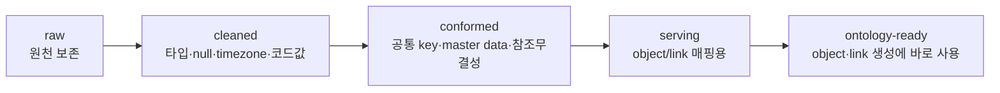

# ② Data Integration — 파이프라인과 Lineage

> [!NOTE] TL;DR
> 목표는 "데이터를 다 가져오는 것"이 아니라 **온톨로지에 넣을 만큼 신뢰 가능한 데이터 제품**을 만드는 것.
> 흐름: `source → sync/ingest → dataset → transform → curated dataset → ontology mapping`.

---

## 구성 요소

| 구성 | 역할 | 비고 |
|------|------|------|
| `Connector/Sync` | ERP·DB·object storage·SaaS·stream 수집 | SAP·Snowflake·BigQuery·S3·Kafka·REST |
| `Dataset` | 랜딩된 데이터의 핵심 표현 | 파일 컬렉션 wrapper + 권한·스키마·버전 관리 |
| `Transaction` | dataset의 원자적 변경(≈ git commit) | `SNAPSHOT`·`APPEND`·`UPDATE`·`DELETE` |
| `Transform` | 정제·조인·집계·표준화 | Pipeline Builder / Code Repos / Spark·Flink·SQL |
| `Pipeline` | transform 흐름 | batch·incremental·streaming |
| `Lineage` | 데이터 흐름 추적 | ancestor/descendant·schema·생성 코드 확인 |

---

## 계층화 (medallion 유사)

각 계층마다 **소유자·SLA·데이터 품질 체크·권한 전파 정책**을 정의한다.

> [!TIP] streaming부터 하지 말 것
> daily/hourly **batch로 안정화** 후, latency가 실제 병목일 때 incremental/streaming으로 확장.

---

## 데이터 품질 게이트 (파이프라인 → 온톨로지 넘어가기 전)

> 수치 정본은 [[07_전략 — 7단계 실행 로드맵]] 3단계 Done — 여기와 어긋나면 07이 이긴다.
> 통과율은 **격리(quarantine) 후** 계산한다: critical 테스트 실패 레코드와 중복 PK 레코드는 온톨로지로 넘기지 않고 격리한다 — stable primary key는 온톨로지의 필수 불변식([[01_Ontology — 시맨틱 레이어]])이라 "98% 통과·0.1% 중복 허용"이 오염 레코드의 통과를 뜻해선 안 된다.

- 핵심 object의 **90%+**, 핵심 link의 **85%+** 가 데이터로 생성 가능
- dataset freshness SLA 충족률 **95%+**
- critical data quality test 통과율 **98%+**
- primary key 중복률 **0.1% 미만**
- 필수 property null 비율 기준 이하 (예: 주문 상태 null 0%, 납기일 null 1% 이하)
- **lineage가 source → transform → object property까지 연결**

체크 항목: row count · freshness · uniqueness · 참조 무결성 · 허용값(allowed values)

---

## Lineage는 두 종류를 모두 이어야 한다

1. **데이터 lineage**: source → transform → data product → semantic object/property → AI context/action
2. **모델 lineage**: 어떤 prompt·model version·tool version·retrieval index·eval suite가 어떤 결과를 만들었나

> [!WARNING] lineage가 dataset에서 끊기면 안 된다
> AI prompt/context/action까지 이어져야 "이 자동 실행이 어떤 데이터·모델에서 나왔나"를 감사할 수 있다. → [[03_보안·거버넌스 모델]]

관련: [[07_전략 — 7단계 실행 로드맵]] 3단계 · [[05_대체 스택 — 계층별 조합]]
