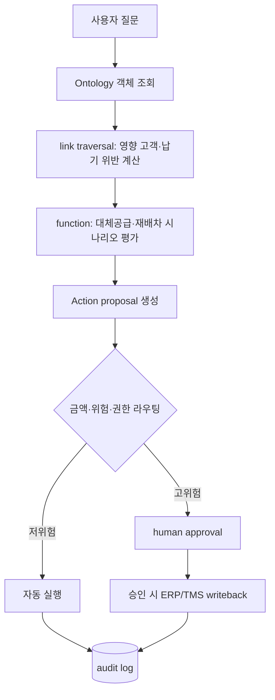

# ④ AIP — 온톨로지 위의 AI 계층 (= "AI 에이전트" 단계)

> [!NOTE] 이 계층이 전체 스택의 맨 위 한 층
> AIP = Foundry의 데이터·온톨로지·보안 위에 LLM과 에이전트 워크플로를 얹는 계층. **이게 "AI 에이전트"에 해당하지만, 그 아래 ①~③ 계층이 먼저 서 있어야 동작한다.** ([[00_MOC — Foundry+AIP 플랫폼 설계]]의 5계층 그림 참고)
> 단 AIP의 제품 범위는 에이전트보다 넓다 — Logic·model management·eval·Assist를 포함하고, 문서 RAG 같은 read 용도는 완성된 업무 온톨로지 없이도 시작할 수 있다. 이 문서는 "온톨로지 위의 에이전트" 관점 중심 서술이다.

> [!TIP] 명칭 변경 (GPT 웹검색, 2026-07)
> `AIP Agent Studio → AIP Chatbot Studio`, `AIP Agents → AIP Chatbots`. 아래는 신·구 병기.

---

## 세 가지 주요 도구

| 도구 | 역할 | 한 줄 |
|------|------|-------|
| **AIP Logic** | LLM 기반 function을 no-code로 구축·테스트·평가·배포 | 자연어/문서/객체 입력 → 구조화된 판단 → string·object·**Ontology edit** 출력 |
| **AIP Chatbot Studio** (구 Agent Studio) | 엔터프라이즈 정보·도구를 갖춘 대화형 assistant | Ontology·문서·custom tool 컨텍스트, read+**write** 워크플로 |
| **AIP Assist** | Foundry 사용자용 copilot | 플랫폼/개발 문서 + 조직 custom 문서(runbook·API·카탈로그) |

---

## LLM을 Ontology에 grounding하는 방식

> [!IMPORTANT] Grounding = 말로만 그럴듯한 답 방지
> LLM이 **실제 기업 객체·관계·권한·현재 상태**에 기반해 답하게 만드는 것. 매 사용자 메시지마다 retrieval context를 **결정적으로** 실행해 LLM에 전달.

지원 context 3종:
- **Ontology context** — 객체를 컨텍스트로. vector embedding property가 있으면 semantic search
- **Document context** — 문서 RAG
- **Function-backed context** — 함수 실행 결과를 컨텍스트로

Tool 계층 (LLM이 자기 능력을 넘어 조회·실행):
| Tool | 하는 일 |
|------|---------|
| `Object query` | 접근 가능한 객체·속성만 제한적으로 쿼리(필터·집계·link traversal) |
| `Action` | Ontology edit 실행 (자동 or 사용자 확인 후) |
| `Function` | Foundry/AIP Logic function 호출 |
| `Command` | 다른 앱 작업 트리거 |
| `Request clarification` | 불명확하면 되묻기 |

> Tool 계층의 안정성은 [[01_Ontology — 시맨틱 레이어]]의 "4가지 안정성"에서 나온다.

---

## 일반 RAG와의 결정적 차이 — 실행까지 잇는다

- 일반 RAG: `질문 → 문서 검색 → 답변`
- Foundry+AIP형: `질문 → 객체 조회 → 판단 → action proposal → 승인/실행 → 감사`

> [!WARNING] read-only에서 멈추면 "비싼 검색기"에 그친다
> 반대로 승인·감사·rollback 없이 실행부터 열면 [[06_안티패턴 — 흔한 실패 모드]]로 직행. 그래서 로드맵은 **read(4) → proposal(5) → 제한적 자동실행(6)** 순서를 강제한다. → [[07_전략 — 7단계 실행 로드맵]]

승인·checkpoint·eval의 거버넌스는 [[03_보안·거버넌스 모델]] 참고.
