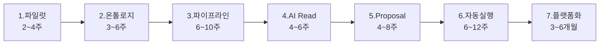

# ⑦ 전략 — 7단계 실행 로드맵 (플레이북)

> [!NOTE] 전제
> 한 도메인에서 실제 착수한다고 가정. 규모: **원천 시스템 3~5개 · 핵심 object 5~10개 · 초기 사용자 20~50명 · 업무 action 3~5개.** 1차 운영 전환까지 현실적으로 **6~9개월** — 단계 기간의 단순 합(25~46주)이 아니라 **일부 병렬 전제**다(온톨로지 확정 중 파이프라인 착수, 파이프라인 후반과 AI Read 준비 병행).

> [!IMPORTANT] "AI 에이전트"는 4~6단계
> 1~3단계(파일럿·온톨로지·파이프라인)는 AI가 등장하지 않는다. **그런데 여기가 전체 성패를 좌우한다.** 게이트·KPI·조직은 [[08_전략 — 게이트·KPI·RACI]].

---

## 1단계 — 파일럿 선정 · `2~4주`

**목표:** "AI로 뭔가 해보자"가 아니라 **업무 폐루프**가 있는 문제 하나. 폐루프 = `상황 감지 → 판단 → 조치 → 결과 확인`.

좋은 후보: 공급망 지연 대응 · 설비 이상→작업지시 · 클레임 분류·보상 제안 · 영업 위험 신호 · 재고 부족/과잉.

| 필요 역할 | 참여 방식 |
|-----------|-----------|
| 도메인 오너 | 최종 의사결정. KPI·범위 확정 |
| 업무 SME 2~4명 | 실제 프로세스·예외·승인 기준 |
| 데이터 리드 | 원천 시스템·데이터 품질 현실 점검 |
| 플랫폼 아키텍트 | 전체 구조·보안·통합 방향 |
| AI 리드 | 적용 가능성·eval·위험도 |
| 보안/거버넌스 | 민감도·접근 조건·감사 요구 |
| 변화관리/운영 | rollout·교육·운영 프로세스 |

> [!SUCCESS] Done 기준 (다음 단계로 넘어가도 되는 게이트)
> - 대상 업무가 **하나의 흐름**으로 명확 · 초기 사용자 20~50명 식별 · 원천 3~5개 이하
> - **KPI가 숫자로** 정의 (예: 처리시간 30%↓, 수작업 검토 40%↓, 납기 위반 10%↓)
> - action 후보 3~5개 · 보안팀 "파일럿 접근 가능" 판정 · 8~12주 내 read-only MVP 가능 판단

**산출물:** 파일럿 차터 1장 · 업무 프로세스 맵 · KPI baseline · 데이터 소스 목록 · object/action 후보 · 위험·권한·승인 초안 · go/no-go 기록

---

## 2단계 — 최소 온톨로지 · `3~6주`

**가장 중요한 단계.** 데이터 모델이 아니라 **운영 모델**을 만든다. → 개념: [[01_Ontology — 시맨틱 레이어]]

권장 범위: object `5~10` · link `10~20` · object당 property `10~30` · action `3~5` · function `2~5` · role `3~6`.

> [!EXAMPLE] 공급망 도메인
> - Objects: `PurchaseOrder`·`Supplier`·`Shipment`·`Material`·`Plant`·`InventoryPosition`·`RiskEvent`
> - Links: PO→Supplier, PO→Material, Shipment→PO
> - Actions: `FlagSupplyRisk`·`RequestExpedite`·`CreateSupplierEscalation`
> - Functions: `calculateDelayRisk`·`recommendMitigationOption`

> [!SUCCESS] Done 기준
> - 모든 object에 **business owner + stable primary key** · 모든 link에 cardinality·근거
> - 핵심 property에 출처 dataset/function 매핑 · action마다 입력·validation·승인 조건·side effect
> - 민감 property 접근 정책 초안 · **SME 2명+ 가 "이 모델로 내 업무를 설명할 수 있다" 확인** · 정의 1차 freeze

**산출물:** Ontology spec · Object/Link dictionary · Property catalog · Action/Function contract · Permission matrix · 업무 시나리오 10~20개 · AI grounding guide

---

## 3단계 — 데이터 파이프라인 · `6~10주`

**목표:** 온톨로지에 넣을 만큼 신뢰 가능한 데이터 제품. → 개념: [[02_Data Integration — 파이프라인과 Lineage]]

| 필요 역할 | 참여 |
|-----------|------|
| 데이터 엔지니어 | ingest·transform·quality check |
| 플랫폼 엔지니어 | orchestration·CI/CD·compute |
| 도메인 SME | 데이터 의미·예외 검증 |
| 보안 | masking·row/column policy·태그 |
| 거버넌스 | lineage·catalog·owner·SLA |
| QA | 테스트·데이터 검증 자동화 |

> [!SUCCESS] Done 기준
> - 핵심 object 90%+·link 85%+ 생성 가능 · freshness SLA 95%+ · quality test 98%+ · PK 중복 0.1% 미만
> - 필수 property null 기준 이하 · **lineage가 source→object property까지** · 민감 태그·권한 적용 · rebuild·rollback·알림 절차

**산출물:** Ingestion jobs · transform code(dbt/Spark) · data quality test suite · lineage graph · catalog entries · freshness dashboard · object mapping table · security tagging report · 운영 runbook

---

## 4단계 — AI Read (실행 없음) · `4~6주`

**목표:** 권한 내 조회·설명·추천. 아직 action 실행 안 함. → 개념: [[04_AIP — 온톨로지 위의 AI 계층]]

기능: object query · semantic/hybrid search · document RAG · link traversal 설명 · **citation** · "모름/권한없음/추가확인" · eval regression.

> [!SUCCESS] Done 기준
> - eval set 100~300개 · 답변 수용률 70%+ · citation 포함률 95%+ · 근거 없는 단정 5% 미만
> - **권한 위반 테스트 0건** · p95 latency 10초 이하 · 사용자 20명+ 2주 사용 · "모름" 처리 기준 정의

**산출물:** system prompt · retrieval config · tool/object query allowlist · eval dataset·report · security test report · usage/cost/latency dashboard · feedback log

---

## 5단계 — AI Action Proposal (인간 승인) · `4~8주`

**목표:** AI가 실행하지 않고 **실행 가능한 초안**을 만든다. → 거버넌스: [[03_보안·거버넌스 모델]]

예: "이 8개 주문에 expedite request proposal 생성" / "이 클레임을 fraud review로 넘기는 proposal".

> [!SUCCESS] Done 기준
> - action별 schema·validation · proposal dry-run 성공률 95%+ · invalid 5% 미만
> - 승인자에게 **diff·근거·영향범위 표시** · 모든 proposal에 근거·context 기록 · 고위험은 반드시 approval
> - 2~4주 shadow review에서 **critical unsafe proposal 0건** · acceptance rate 40~70%(형식적 승인 경계) · 거절 사유 taxonomy 수집

**산출물:** action schema · proposal generator · validation rules · approval workflow · review UI · audit event schema · rejection reason taxonomy · human review playbook · action eval suite · **rollback/보상 action 설계**

---

## 6단계 — 제한적 자동실행 · `6~12주`

**목표:** 기술적으로 가능해서가 아니라 **위험이 낮고 반복성 높고 회수 가능할 때만** 자동화.

> [!EXAMPLE] 자동실행 조건 예시
> 예상 금액 100만 원 이하 · 고객 직접 영향 없음 · 동일 유형 최근 100건 승인률 90%+ · confidence/rule score 충족 · 필수 데이터 null 없음 · 업무시간 내 모니터링 가능

> [!SUCCESS] Done 기준
> - **30일 shadow mode 완료** · simulated success 95~99% · critical validation failure 0건
> - action별 **kill switch** · circuit breaker 기준(실패율 2% 초과·rejection spike·freshness breach) · 모든 자동 action audit · rollback 테스트 완료 · on-call/escalation 경로

**산출물:** automation policy · auto-exec allowlist · risk scoring rule · circuit breaker · kill switch · monitoring dashboard · incident runbook · rollback test report · auto-action audit report · post-deployment review

---

## 7단계 — 플랫폼화 · `3~6개월` (파일럿 운영과 병행)

**목표:** 첫 도메인의 결과물을 다른 도메인이 반복 가능하게.

플랫폼화 대상: Ontology template · naming convention · data product template · pipeline CI/CD template · quality check library · permission/marking pattern · LLM gateway · tool/prompt/eval registry · action approval framework · audit·cost dashboard · runbook template.

> [!SUCCESS] Done 기준
> - **두 번째 도메인이 첫 도메인 대비 50% 이하 리드타임**으로 MVP 착수 · 공통 template 사용률 70%+
> - object/action review 정례화 · **domain owner가 ontology 변경 승인권 보유** · 중앙팀 없이 property/action 추가 가능 · eval·audit이 모든 AI workflow에 기본 포함

**산출물:** platform operating model · ontology governance board · domain onboarding kit · reference architecture · reusable templates · **RACI matrix** · policy-as-code library · AI safety checklist · cost allocation model · maturity scorecard

> [!IMPORTANT] 중앙팀 vs 도메인팀
> 중앙 플랫폼팀은 **"도로·신호체계·안전규정"**을 만들고, 도메인팀은 **"자기 도시의 지도와 운영 규칙"**을 소유한다. 그렇지 않으면 확장할수록 중앙팀이 병목이 되고 온톨로지는 죽은 중앙 데이터 모델로 굳는다. → 소유권 이관 상세: [[08_전략 — 게이트·KPI·RACI]]
