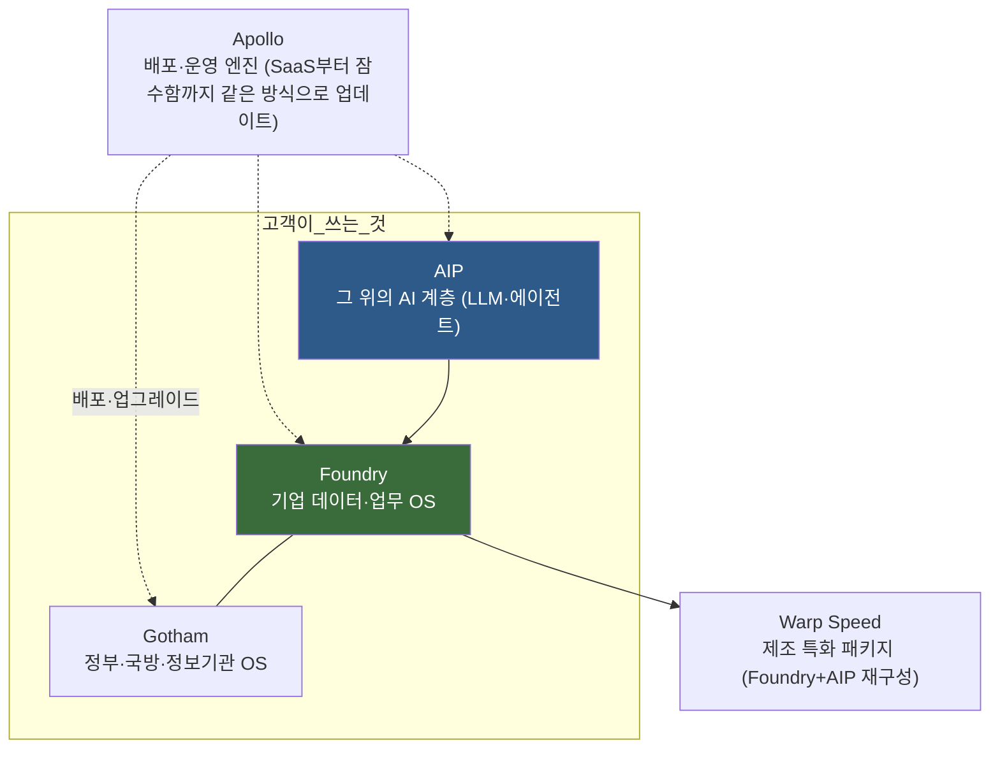

# ⑨ Palantir — 회사·제품·행보 총람

> [!NOTE] TL;DR
> 팔란티어는 **AI 모델을 만드는 회사가 아니다.** "조직의 데이터·업무·권한을 하나의 운영 모델(온톨로지)로 묶고, 그 위에 아무 LLM이나 꽂아 실제 의사결정을 실행하게 만드는" **기업용 운영체제 회사**다.
> 2003년 대테러 소프트웨어로 시작 → 2020년 상장 시점까지 17년 연속 적자(첫 연간 흑자는 2023년) → 2023년 AIP 출시 후 폭발 성장. **2026년 1분기 매출 $1.63B(전년 +85%), 2026년 연 가이던스 $7.65B(약 10조 원).**
> 이 폴더의 01~08 문서가 "이런 구조를 어떻게 만드나"라면, 이 문서는 **"그 원본 회사가 실제로 뭘 만들었고 뭘 했나"**다.

---

## 1. 어떤 회사인가 — 3분 스토리

| 시기 | 사건 |
|------|------|
| 2003 | 피터 틸(PayPal 공동창업자)·알렉스 카프(CEO)·스티븐 코헨·조 론스데일 창업. **PayPal의 사기거래 탐지 기법을 대테러에 적용하자**는 아이디어에서 출발 |
| 2005 | CIA의 벤처캐피털 **In-Q-Tel**이 초기 투자(약 $2M) — 첫 고객도 사실상 미 정보기관 |
| 2008~ | 정부·정보기관용 **Gotham** 확산. "빈라덴 추적에 쓰였다"는 전설이 따라다니지만 **공식 확인된 적 없음**(회사도 긍정도 부정도 안 함) |
| 2016 | 민간 기업용 **Foundry** 출시 — 국방에서 검증한 데이터 통합을 제조·금융·의료로 |
| 2020.09 | NYSE **직상장**(direct listing). 당시까지 17년 연속 적자 |
| 2023.04 | ChatGPT 붐 직후 **AIP** 출시. 같은 해 첫 연간 흑자(GAAP) |
| 2024 | S&P 500(9월)·나스닥100(12월) 편입. 제조 OS **Warp Speed** 출시 |
| 2025~26 | 미군 전군 계약·NATO 도입. 매출 성장률이 오히려 **가속**(2024 +29% → 2026 Q1 +85%). 시총 기준 미국 최상위권 기술주 |

> [!TIP] 이름의 유래
> 반지의 제왕에 나오는 **팔란티르(palantír, 멀리 보는 돌)**. "세상을 보는 돌 = 데이터로 세상을 보는 도구"라는 창업 철학이 이름에 그대로 있다.

**회사의 축을 이해하는 열쇠 — 두 개의 사업이 한 몸이다.**
- **정부 사업**(Gotham 계열): 계약이 크고 길다. 기술 신뢰의 원천. "미군이 전장에서 쓰는 물건"이라는 레퍼런스 자체가 영업 자산.
- **민간 사업**(Foundry/AIP 계열): 정부에서 검증한 스택을 기업에 재판매. 최근 성장 엔진(특히 미국 민간, AIP 붐).

---

## 2. 제품 지도 — 4개의 OS + 파생

| 제품 | 한 줄 정의 | 고객 | 비유 |
|------|-----------|------|------|
| **Gotham** | 흩어진 정보(신호·위성·문서·DB)를 실시간 한 화면으로 묶는 국방·수사 OS | 미군, 정보기관, NATO, 경찰 | 전장의 관제탑 |
| **Foundry** | 데이터 통합 + [[01_Ontology — 시맨틱 레이어\|온톨로지]] + 분석 + 업무 실행을 한 플랫폼에 담은 기업 OS | 제조·에너지·금융·의료 대기업 | 회사 전체의 디지털 트윈 |
| **Apollo** | 수백 개 서비스·수천 환경(클라우드·공장·함정·기밀망)에 무중단 자동 배포 | 내부 인프라 + 별도 판매 | 소프트웨어 택배망 |
| **AIP** | Foundry/Gotham 위에서 LLM이 조직 데이터를 읽고 **행동까지 하게** 만드는 AI 계층 | 위 고객 전부 | 온톨로지에 접속된 AI 두뇌 |
| **Warp Speed** | 제조업 특화 재패키징(MRP·공급망·설계변경) — "미국 재산업화 OS" 마케팅 | 방산·조선·중공업 스타트업/대기업 | 공장용 Foundry |

> [!IMPORTANT] 왜 "OS"라고 부르나
> 팔란티어는 자사를 SaaS 툴이 아니라 **Enterprise Operating System**으로 정의한다. 개별 기능(BI, ETL, 챗봇)을 파는 게 아니라, **데이터→의미(온톨로지)→권한→실행**의 전체 루프를 장악하는 걸 판다. 이 관점이 이 폴더 01~08 문서 전체의 전제다.

---

## 3. 기술의 심장 — 온톨로지 (요약)

상세는 [[01_Ontology — 시맨틱 레이어]]. 여기선 팔란티어식 표현만:

- 온톨로지 = **명사(Object: 고객·설비·주문) + 동사(Action: 승인·발주·정비지시)**로 조직 전체를 모델링한 시맨틱 레이어.
- 데이터 카탈로그와 결정적 차이: **읽기 전용이 아니라 쓰기(실행)까지 정의**한다. Action은 권한·승인·감사와 **함께 모델링할 수 있고**, 그렇게 구성했을 때 원본 시스템(ERP·MES) write-back이 안전해진다 — 승인·감사·보상(rollback)은 자동 내장이 아니라 설계자가 붙이는 구성 사항이다 ([[04_AIP — 온톨로지 위의 AI 계층]]의 "자동 or 사용자 확인 후"와 동일 맥락).
- 팔란티어의 영업 논리: *"AI의 가치는 모델이 아니라 모델이 접속할 수 있는 조직의 운영 모델에서 나온다."* 그래서 LLM 경쟁이 치열해질수록(모델 커모디티화) 온톨로지를 가진 자기들이 유리하다고 주장한다.

---

## 4. AI를 다루는 방식 — "모델은 부품, 온톨로지가 본체"

> [!NOTE] 핵심 철학
> 팔란티어는 **자체 LLM을 만들지 않는다.** GPT·Claude·Gemini·Llama 등을 **Model Catalog**에서 갈아끼우는 부품으로 취급하고(k-LLM 패러다임 — 여러 모델을 병렬·교체 운용), 자신들은 그 모델이 **안전하게 일하게 만드는 환경**(grounding + 권한 + 실행 + 평가)을 판다.

작동 원리 4요소:

1. **OAG (Ontology Augmented Generation)** — RAG의 확장판. 문서 조각 검색(RAG)이 아니라 **객체·관계·로직·액션이 연결된 온톨로지**를 컨텍스트로 준다. LLM이 "테이블·조인·권한을 추측"하다 환각 내는 문제를 구조로 차단.
2. **권한 상속** — AI는 사용자의 권한을 그대로 물려받는다. 데이터에 접근 못 하는 사용자는 AI를 통해서도 못 본다(marking·ACL이 AI 계층까지 관통). → [[03_보안·거버넌스 모델]]
3. **인간 승인 루프** — AI의 행동 제안은 시나리오로 스테이징되고, 사람이 승인해야 실행. 저위험 액션만 조건부 자동화.
4. **Evals 프레임워크** — 프로덕션 AI 워크플로를 상시 평가·회귀 테스트. "데모가 아니라 운영"을 강조하는 근거.

> [!TIP] 재미있는 포지션
> 경쟁자였던 AI 랩들이 이제 파트너다. **Anthropic은 Claude를 미 정부에 팔기 위해 팔란티어 FedStart를 통해 들어갔다**(FedRAMP High·IL5, 2025.04 / IL6 환경은 2024.11 AWS 협력). 모델 회사가 유통을 팔란티어에 의존하는 구도.

---

## 5. 에이전트를 어떻게 만드나 — AIP의 조립 방식

상세 계층 설명은 [[04_AIP — 온톨로지 위의 AI 계층]]. 실제 빌딩 블록:

| 블록 | 역할 | 쉽게 말하면 |
|------|------|------------|
| **AIP Logic** | 노코드 LLM 함수 빌더. 입력=온톨로지 객체/텍스트, 출력=구조화 값/온톨로지 편집 | "LLM 한 번 호출"을 함수로 포장 |
| **Function/Action 도구** | 에이전트가 호출 가능한 도구 = 온톨로지의 Action·Function | 에이전트의 손발 (권한 검사 내장) |
| **AIP Agent Studio** (현 Chatbot Studio) | 도구를 쥔 대화형 에이전트 구성 — 객체 조회·편집·멀티스텝 작업 | 에이전트 조립대 |
| **Automate** | 조건 트리거로 Logic/에이전트를 무인 실행 | 크론 + 이벤트 훅 |
| **Evals** | 에이전트 품질 회귀 테스트 | 에이전트용 CI |

에이전트-온톨로지 상호작용 5계층(2026.04 팔란티어 블로그 "Connecting Agents to Decisions" 계열 정리):
**① Retrieval Context**(문서·비정형 검색) → **② Object Query**(구조화 객체 조회) → **③ AIP Logic**(추론·판단) → **④ Action Tools**(실행) → **⑤ Governance**(전 계층 권한·감사).

> [!IMPORTANT] 우리 하네스와의 접점
> 이 구조는 결국 "도구 계층화 + 가드레일 + 평가"다. sj-agent-dev의 10축과 1:1로 대응된다 — 팔란티어는 그걸 **온톨로지라는 단일 기반** 위에 상품화한 것. 대체 조합은 [[05_대체 스택 — 계층별 조합]] 참고.

---

## 6. 뭘 해왔나 — 대표 실적

### 정부·국방 (레퍼런스의 원천)

| 사업 | 내용 | 규모·상태 |
|------|------|----------|
| **Maven Smart System** | 위성·드론 영상을 AI로 분석해 표적 식별 → 지휘 결정까지. 미군의 대표 AI 전장 시스템 | 2024 $480M → 2025.05 **$1.3B 규모로 증액 보도**(약 $795M 추가분의 계약 구조 — 증액 vs 별도 라이선스 — 는 보도별 해석 상이, 재검증 필요). 2026.03 국방부가 **program of record**(정식 편제) 지정 |
| **미 육군 Enterprise Agreement** | 육군 전체의 데이터·소프트웨어 통합 창구 | 10년 **최대 $10B**(2025) |
| **NGC2** | 차세대 지휘통제(Next-Gen C2) 프로토타입 | $100M(2025)·Anduril 등과 컨소시엄 |
| **NATO** | Maven NATO판을 유럽연합군사령부(ACO)에 도입 | 2025.04 계약 — NATO 역대급 속도(6개월) 조달 |
| **우크라이나** | 2022년부터 표적·물류·지뢰제거 지원. 2026.01 **Brave1 Dataroom** — 우크라 방산기업들이 실전 데이터로 AI 훈련하는 플랫폼을 팔란티어 인프라로 구축 | 진행 중 |
| **COVID-19** | 미 HHS Protect(감염 현황 통합), **Tiberius**(백신 유통 배분), 영국 NHS 백신 물류 | 2020~ |
| **영국 NHS FDP** | 국가 의료 데이터 연합 플랫폼 | £330M(2023, 논란 속 수주) |

### 민간 (성장 엔진)

| 고객 | 내용 |
|------|------|
| **Airbus** | Skywise — A350 양산 램프업, 항공사 정비 데이터 플랫폼 (2017~, 민간 1호 대형 레퍼런스) |
| **HD현대** | 2021 오일뱅크에서 시작 → 조선·건설기계 → 2026 다보스에서 **그룹 전체 확대 + 공동 CoE** 발표. "선박 생산 약 30% 가속" 공표. 팔란티어의 한국 최대 파트너십 |
| **KT** | 한국 기업 최초 팔란티어 공식 파트너 에코시스템 멤버(2025) — AX(AI 전환) 사업에 Foundry/AIP 결합 |
| **Warp Speed 고객군** | Anduril·L3Harris·Shield AI·Panasonic Energy(1기, 2024.11), Epirus·Red Cat·Saildrone·Saronic·Ursa Major·SNC(2025.03) — 미국 신방산·제조 스타트업 벨트. 해군 잠수함 산업기반과 "**Warp Speed for Warships**"(2025) |
| 기타 | BP(에너지), Merck(제약), 금융·보험 다수. 미국 민간 매출이 최근 분기 +100%대 성장 구간 |

---

## 7. SaaS로는 뭘 파나 — 상품화 라인업

과거엔 "억대 컨설팅 딜만 하는 회사"였지만, 지금은 명확한 SaaS 상품군이 있다:

| 상품 | 무엇 | 과금·형태 |
|------|------|----------|
| **Foundry (SaaS)** | 클라우드 완전관리형 — 호스팅·통합·분석·온톨로지·앱빌더 전부 포함 | 구독(모듈·사용량) |
| **AIP** | Foundry 위 AI 계층. 보통 Foundry와 패키지 | 구독 |
| **Foundry for Builders** | 스타트업용 경량 구독 프로그램(2021~) — 초기엔 팔란티어 출신 창업사부터 | 저가 구독 |
| **FedStart** | **컴플라이언스 SaaS**: 남의 소프트웨어를 팔란티어의 인증 환경(FedRAMP High 등)에서 돌려 미 정부 시장 진입을 대행. Anthropic(Claude)·xAI 등 AI 기업이 고객. 참가사가 상속하는 인증 범위(IL5/IL6 포함 여부)·과금 구조는 계약별 — 인용 전 재검증 | 구독 |
| **Warp Speed** | 제조 OS 패키지(MRP·공급망·설계변경 CI/CD) | 구독 |
| **Apollo** | 배포 플랫폼 단독 판매(자사 소프트웨어를 규제 환경에 배포하려는 SW 기업용) | 구독 |
| **AIP Bootcamp** | 판매 도구에 가까움 — **1~5일간 고객 실데이터로 실동작 프로토타입**을 만들어주는 무료/저가 스프린트. 2023년부터 수천 회, 영업 깔때기의 입구 | 리드 확보용 |

> [!TIP] 부트캠프가 영업을 바꿨다
> 예전: FDE가 수개월 상주하며 파일럿(고비용, 느림) → 지금: **부트캠프 5일 안에 "당신 데이터로 돌아가는 앱"을 보여주고** 계약으로 전환. "PoC 티켓 끊기"가 아니라 실제 업무에 박아 넣는 쐐기(wedge) 전략.

---

## 8. 비즈니스 모델 — FDE와 3단계 확장

- **FDE(Forward Deployed Engineer)**: 고객사에 파견·상주하며 제품을 고객 업무에 맞게 구축하는 엔지니어. 컨설턴트가 아니라 제품 엔지니어가 현장에 간다는 게 차별점. 이 직군 이름 자체가 팔란티어 발명품이고, 지금은 업계 표준 용어가 됐다(OpenAI 등도 채용).
- **Acquire → Expand → Scale**: 초기 파일럿은 팔란티어가 비용을 떠안고(적자), 조직 안에 퍼진 뒤(Expand) 구독 마진으로 회수(Scale). 17년 적자를 버틴 이유이자, 지금 이익률이 급개선되는 이유.
- **숫자로 본 현재(2026-07 기준)**: 2024 매출 $2.87B → 2025 약 $4.4B → **2026 가이던스 $7.65B(+71%)**. 2026 Q1 $1.63B(+85%, 상장 후 최고 성장률). 미국 상업 부문과 국방 부문이 동시 가속.

---

## 9. 논란도 세트로 알아두기

> [!WARNING] 팔란티어를 말할 때 항상 따라오는 것들
> - **감시 논란**: ICE(미 이민단속국) 추방 작전 지원 계약(2025 ImmigrationOS 포함), 경찰 예측치안(LAPD·NOPD) 이력 — 시민단체의 단골 표적.
> - **의료 데이터**: NHS 계약에 대한 영국 내 프라이버시 반발.
> - **락인**: 온톨로지에 업무를 태울수록 빠져나오기 어렵다는 구조적 비판(이 폴더 [[05_대체 스택 — 계층별 조합]]이 존재하는 이유).
> - **밸류에이션**: 매출 대비 시총이 극단적으로 높아 "실적이 아니라 신앙"이라는 논쟁이 상시 진행형.
> - CEO 알렉스 카프는 "서방의 기술 우위" 노선을 공공연히 주장(저서 *The Technological Republic*, 2025) — 호불호가 갈리는 정치적 캐릭터.

---

## 관련 문서

- [[00_MOC — Foundry+AIP 플랫폼 설계]] — 이 구조를 직접 설계하려면
- [[01_Ontology — 시맨틱 레이어]] · [[04_AIP — 온톨로지 위의 AI 계층]] — 기술 심화
- [[10_한국형 팔란티어 — 기업 지도]] — 한국에서 누가 이 모델을 따라가나

## 출처 (2026-07-15 확인)

- 제품 구조: [Palantir Docs — AIP/Foundry/Apollo](https://www.palantir.com/docs/foundry/architecture-center/platforms), [AIP Overview](https://www.palantir.com/docs/foundry/aip/overview), [Wikipedia — Palantir](https://en.wikipedia.org/wiki/Palantir)
- 에이전트·온톨로지: [Palantir Blog — Connecting Agents to Decisions (2026.04)](https://blog.palantir.com/connecting-agents-to-decisions-277dee8ddb40), [Logic Tools for RAG/OAG](https://blog.palantir.com/building-with-palantir-aip-logic-tools-for-rag-oag-fdaf8938d02e), [AIP 5계층 분석](https://zerofuturetech.substack.com/p/palantir-aip-agent-ontology-interaction)
- 실적: [Q1 2026 8-K (SEC)](https://www.sec.gov/Archives/edgar/data/0001321655/000132165526000026/a2026q1ex991pressrelease.htm), [CNBC Q1 2026](https://www.cnbc.com/2026/05/04/palantir-pltr-q1-earnings-report-2026.html)
- 국방 계약: [DefenseScoop — Maven $1B+](https://defensescoop.com/2025/05/23/dod-palantir-maven-smart-system-contract-increase/), [NATO Maven](https://defensescoop.com/2025/04/14/nato-palantir-maven-smart-system-contract/), [Military.com — program of record](https://www.military.com/feature/2026/03/22/pentagon-expands-palantirs-role-ai-contract.html)
- SaaS·파트너십: [Warp Speed](https://www.palantir.com/warpspeed/), [Foundry for Builders](https://www.palantir.com/newsroom/press-releases/palantir-introduces-foundry-for-builders/), [Anthropic joins FedStart](https://investors.palantir.com/news-details/2025/Anthropic-Joins-Palantirs-FedStart-Program-to-Deploy-Claude-Application/), [Warp Speed for Warships](https://www.stocktitan.net/news/PLTR/blue-forge-alliance-and-palantir-launch-warp-speed-for-warships-to-p6iq9p84zc0f.html)
- FDE 모델: [Pragmatic Engineer — FDE](https://newsletter.pragmaticengineer.com/p/forward-deployed-engineers), [Everest Group](https://www.everestgrp.com/palantir-inside-the-category-of-one-forward-deployed-software-engineers-blog/)
- 한국: [HD현대-팔란티어 확대 (뉴스와이어)](https://www.newswire.co.kr/newsRead.php?no=1027307), [한국일보 — KT 파트너십](https://www.hankookilbo.com/News/Read/A2025031310540002283)
