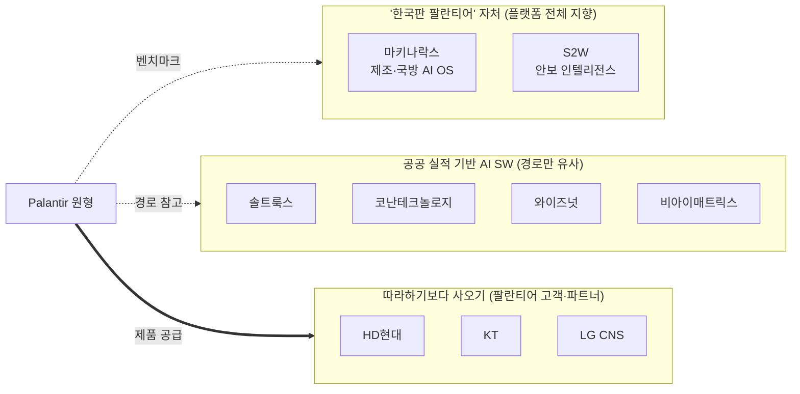

# ⑩ 한국형 팔란티어 — 기업 지도

> [!NOTE] TL;DR
> 2026년 현재 "한국형 팔란티어"는 **정부 공식 정책 용어**가 됐다(2026-06-26 중기부 발표, 대통령 직접 언급). 민간에서는 **마키나락스**(제조·국방 AI OS, 2026-05 코스닥 상장)와 **S2W**(다크웹·멀티도메인 인텔리전스, 2025-09 상장)가 대표 주자.
> 이들이 따라한 건 팔란티어의 기술 하나가 아니라 **경로 전체** — ① 공공·국방 레퍼런스로 신뢰 확보 → ② 온톨로지/지식그래프로 데이터에 의미 부여 → ③ "모델"이 아니라 "운영 OS" 포지셔닝 → ④ SaaS 구독 전환.

---

## 1. 왜 지금 "한국형 팔란티어" 열풍인가

세 가지가 겹쳤다:

1. **원본의 폭발** — 팔란티어가 2023 AIP 이후 매출 성장 +85%(2026 Q1), 미 육군 $10B 계약 등으로 "국방 AI = 초고수익 산업" 증명. → [[09_Palantir — 회사·제품·행보]]
2. **한국 정부의 수요** — AX(AI 전환) 국정과제 + 방산 수출 붐 + "기술 우위가 안보 우위" 기조. 팔란티어를 벤치마크로 지목한 육성책이 2026년 6월 공식화.
3. **국내 기업의 스토리 필요** — 온톨로지·지식그래프·산업 AI를 하던 회사들이 IPO 국면에서 "한국판 팔란티어"를 가장 강력한 투자 서사로 채택. 마키나락스·S2W 상장 흥행이 이를 증명.

---

## 2. 정부 정책 — "K-팔란티어 + 한국형 인큐텔" (2026-06-26)

중소벤처기업부 주관(국방부·우주항공청 협력) 발표. 미국의 **팔란티어 성장 공식을 국가가 역설계**한 구조다:

| 항목 | 내용 | 팔란티어의 원형 |
|------|------|----------------|
| 목표 | 2030년까지 신안보 **유니콘(1조 원) 5개** + **매출 1,000억 이상 혁신기업 50개** (대통령 발언으로는 "55개") | 팔란티어 자체 |
| **한국형 인큐텔** | 정부 100% 직접 출자 투자기관 **설립 계획**(발표 시점 미설립 — 5절 관전 포인트) — 초기 자금 공백 메우기 | CIA의 In-Q-Tel(팔란티어 첫 투자자) |
| 재원 | 5년간 최대 **10조 원** 전략기술 투자 재원 조성 | — |
| R&D | 기업당 최대 5년 **100억 원 OTA형** 지원(성과 기반 유연 계약) | 미 국방부 OTA 조달 (참고: 팔란티어의 2016년 육군 소송은 OTA가 아니라 **상용품 우선 검토 의무**(FASA)를 다퉈 이긴 사건 — "조달 관행을 소송으로 깬" 상징으로 자주 함께 인용된다) |
| 5대 전략 분야 | 드론·로봇 / 국방 AI·반도체 / 국방 센서·미래소재 / 우주·항공 / 사이버보안·양자통신 | — |

> [!IMPORTANT] 읽는 법
> 이 정책의 본질은 "팔란티어 같은 **회사**를 만들자"가 아니라 "팔란티어를 만든 **생태계 장치**(In-Q-Tel 투자 + OTA 조달 + 정부 레퍼런스)를 이식하자"다. 회사보다 **조달·투자 제도**를 복제하는 접근.

---

## 3. 기업 지도 — 누가 어떤 조각을 따라하나

### 직접 추격 — "한국판 팔란티어" 타이틀의 실소유자들

| | **마키나락스 (MakinaRocks)** | **S2W (에스투더블유)** |
|---|---|---|
| 정체 | 제조·국방 **산업 AI OS** | 다크웹·안보 **데이터 인텔리전스** |
| 팔란티어의 무엇을 따라했나 | **Foundry+AIP 노선**: 온톨로지 개념 + 데이터 관리→AI 앱까지 통합 플랫폼("Runway"), 제조 현장·국방에서 "실제 작동하는 AI OS" | **Gotham 노선**: 다크웹·텔레그램·블록체인·SNS를 **지식그래프**로 교차분석해 수사·안보 의사결정 지원 |
| 대표 제품 | Runway (데이터 관리~애플리케이션 연계 통합) | XARVIS(국가기관 수사), QUAXAR(기업 보안), SAIP(산업 AI 플랫폼) |
| 레퍼런스 | 삼성·SK·현대차·LG·두산 + **국방과학연구소** | **인터폴**(2020 파트너십, 유럽·아프리카·중동 수출), 싱가포르·일본 정부 |
| 상장 | 2026-05 코스닥 (공모가 크게 상회, "K팔란티어" 흥행) | 2025-09 코스닥 (청약 경쟁률 약 1,900:1) |
| 숫자 | 2025 매출 115억(영업손실 80억) → 2026 목표 225억 | 매출 약 80%가 SaaS 구독, 재계약률 100% 공표 |
| 팔란티어와 같은 점 | 온톨로지·현장 상주 구축·국방+민간 양다리 | 공공 레퍼런스 우선·지식그래프·구독 모델 |
| 다른 점 | 규모(팔란티어의 수백분의 1)·제조 도메인 집중 | 수집 데이터가 "외부 위협 데이터" 중심(팔란티어는 고객 내부 데이터 통합이 본체) |

### 공공 실적 기반 AI SW — 경로(공공→민간)가 닮은 그룹

| 기업 | 무기 | 팔란티어스러운 점 | 차이 |
|------|------|------------------|------|
| **솔트룩스** | 온톨로지·지식그래프 20년+ 원조, 자체 LLM "루시아" | 온톨로지를 가장 먼저 말한 국내 기업. 공공 매출 64.6%(2024 매출 227억) | **자체 LLM 개발 노선** — 팔란티어는 모델을 안 만든다(정반대 베팅) |
| **코난테크놀로지** | 코난 LLM(2023), 텍스트 분석, 공공 조달 강자 | 국방·공공 텍스트 인텔리전스 | 위와 동일 — 모델 자체 개발 노선 |
| **와이즈넛** | 공공 검색엔진 점유 47.9%·공공 챗봇 67.5%, 13년 연속 흑자 | 공공 시장 지배 → 민간 확장 경로 | 플랫폼이 아니라 검색·챗봇 제품군 |
| **비아이매트릭스** | 자연어로 데이터 조회·분석·시각화(기업용), 일본 공공 수출 | "비개발자가 데이터로 의사결정" 지향 | 분석 툴 층위, 실행(Action) 계층 없음 |

### 수입 진영 — 따라하기 대신 사오기

- **HD현대** — 팔란티어의 **한국 최대 고객**. 2021 오일뱅크 → 조선("선박 생산 30% 가속" 공표) → 2026 다보스에서 그룹 전체 + 공동 CoE로 확대. 방산(함정) 수출과 미국 조선 협력까지 얽힌 전략 동맹.
- **KT** — 한국 기업 **최초 팔란티어 공식 파트너**(2025). 팔란티어 스택을 자사 AX 사업의 엔진으로 재판매하는 포지션.
- **LG CNS** — AX 플랫폼 사업에 팔란티어 협력 카드 활용.

> [!TIP] 이 구도의 의미
> 국내 대기업 SI·통신이 팔란티어를 "수입"하는 동안, 스타트업들이 "국산화"를 시도하는 그림. 정부 정책(2절)은 후자에 베팅한 것이다. 관전 포인트는 **공공·국방 조달에서 국산 플랫폼이 팔란티어 수입을 이길 수 있느냐**.

---

## 4. 무엇을 따라했나 — 5가지 공통 패턴

1. **공공·국방 먼저, 민간은 나중** — 정부 레퍼런스로 기술 신뢰를 쌓고 민간으로 확장(팔란티어의 Gotham→Foundry 경로). 국내 4개사 모두 공공 매출 비중이 높다.
2. **온톨로지/지식그래프 = 시맨틱 레이어** — "데이터를 모으는 것"이 아니라 "의미로 연결하는 것"을 차별점으로 내세움. → 개념 상세는 [[01_Ontology — 시맨틱 레이어]]
3. **"AI 모델"이 아니라 "AI OS" 포지셔닝** — 데모용 챗봇이 아니라 현장에서 도는 운영 시스템임을 강조(마키나락스가 가장 노골적).
4. **구독(SaaS) 전환** — 프로젝트 매출(SI)에서 반복 매출로. S2W 매출 80% 구독이 대표 사례.
5. **상주형 구축** — 팔란티어 FDE처럼 엔지니어가 고객 현장에 들어가 도메인을 학습하며 구축.

> [!WARNING] 따라하지 못한 것 (냉정한 격차)
> - **규모**: 연 매출 기준 팔란티어 약 10조 원(2026 가이던스 $7.65B) vs 국내 주자 100~250억. 수백 배 차이.
> - **17년 적자를 버틴 자본** — Acquire→Expand→Scale 모델은 선투자 여력이 전제. 국내는 그 체력이 없어 정부가 "한국형 인큐텔"로 메우려는 것.
> - **인가·신뢰 네트워크** — 팔란티어의 해자는 기술이 아니라 미 정보기관·5-eyes·NATO의 기밀 환경에서 일할 수 있는 **보안 인가·인증·수의 신뢰 관계**다(데이터 자체의 소유·접근권은 각 고객 기관에 있다). 이건 기업이 아니라 국가 지위의 문제.
> - **배포 인프라(Apollo)** — 기밀망·함정·공장까지 무중단 배포하는 계층은 국내 어디에도 아직 없다.
> - **자체 LLM 노선의 역베팅** — 솔트룩스·코난은 모델을 직접 만든다. 팔란티어는 "모델은 커모디티, 온톨로지가 해자"에 걸었다. 정반대 방향의 베팅이라 시장이 어느 쪽 손을 들어주는지가 핵심 관전 포인트다(양쪽이 세그먼트별로 공존할 수도 있다).

---

## 5. 관전 포인트 (2026 하반기~)

- [ ] **한국형 인큐텔 실제 설립** — 출자 규모·첫 포트폴리오가 정책 진정성의 시금석
- [ ] **마키나락스 "2.0"** — 상장일 예고한 차기 플랫폼이 온톨로지·에이전트 계층을 어디까지 갖추나
- [ ] **S2W 글로벌 확장** — 인터폴 레퍼런스가 중동·유럽 정부 계약으로 이어지는 속도
- [ ] **국방 AI 조달에서 국산 vs 팔란티어(HD현대·KT 경유) 맞대결** 발생 여부
- [ ] 팔란티어 한국 직진출 강도 — 파트너십(KT·LG CNS)이 늘수록 "한국형"의 설 자리는 좁아진다

---

## 관련 문서

- [[09_Palantir — 회사·제품·행보]] — 원본 회사 총람
- [[00_MOC — Foundry+AIP 플랫폼 설계]] — 이런 플랫폼을 직접 설계하는 법 (01~08)
- [[05_대체 스택 — 계층별 조합]] — 팔란티어 없이 계층별로 조합하는 선택지

## 출처 (2026-07-15 확인)

- 정부 정책: [아시아투데이 — '한국형 팔란티어' 2030년까지 50개사 육성](https://www.asiatoday.co.kr/kn/view.php?key=20260626010009467), [폴리뉴스 — 李 "혁신기업 55개"·한국형 인큐텔](https://www.polinews.co.kr/news/articleView.html?idxno=735306), [아시아경제 — 신안보 유니콘 5개](https://view.asiae.co.kr/article/2026062614371135131)
- 마키나락스: [딜사이트 — '한국판 팔란티어'의 야심](https://dealsite.co.kr/articles/163010), [이데일리 — 코스닥 출격, AI 무기는?](https://www.edaily.co.kr/News/Read?newsId=06127046645446624&mediaCodeNo=257), [한국경제 — 상장일](https://www.hankyung.com/article/2026052076416)
- S2W: [한국R&D신문 — 한국의 팔란티어 S2W](https://www.k-rnd.net/news/articleView.html?idxno=217), [ZDNet — 인터폴 단골 된 이유](https://zdnet.co.kr/view/?no=20250616152019), [인베스트뉴스 — 공모 경쟁률 1900:1](https://www.investnews.co.kr/news/articleView.html?idxno=3002020), [테크M — IPO·K-팔란티어 도약](https://www.techm.kr/news/articleView.html?idxno=142880)
- 공공 AI 4사: [MTN — '한국의 팔란티어' 주목 AI기업 4곳](https://news.mtn.co.kr/news-detail/2025060515300721888)
- 수입 진영: [뉴스와이어 — HD현대·팔란티어 그룹 확대](https://www.newswire.co.kr/newsRead.php?no=1027307), [한국일보 — KT도 손잡은 팔란티어](https://www.hankookilbo.com/News/Read/A2025031310540002283)
