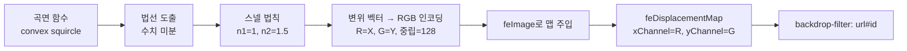

# SVG와 SVG 필터

> [!NOTE] TL;DR
> SVG 필터는 브라우저 네이티브 이미지 처리 파이프라인이다. 프리미티브(`fe*`)를 체이닝해 노이즈·듀오톤·구이·굴절(리퀴드 글래스) 같은 효과를 **이미지 파일 없이** 만든다. `filter: url(#id)`는 전 브라우저 지원, `backdrop-filter: url(#id)`는 Chromium 전용(2026 현재) — 후자에 의존하는 효과는 반드시 폴백을 설계한다.

## 1. 디자인 도구로서의 SVG 요점

- **벡터 + viewBox** — 해상도 독립. `viewBox`가 내부 좌표계를 정의하므로 아이콘·일러스트는 실제 렌더 크기와 무관하게 좌표를 잡는다.
- **currentColor** — `fill="currentColor"`로 만들면 아이콘 색이 부모 텍스트 색을 따라간다. 테마 대응 아이콘의 기본기.
- **인라인 SVG vs ``** — 필터·CSS 제어·애니메이션이 필요하면 인라인. 단순 표시는 ``/`background-image`(단, 이 경우 내부 CSS·필터 조작 불가).
- **stroke 애니메이션** — `stroke-dasharray`/`stroke-dashoffset`으로 선이 그려지는 모션. 로고 리빌·언더라인 강조에 사용.

## 2. 필터 파이프라인 개념

필터는 프리미티브를 **위에서 아래로 체이닝**하는 미니 그래프다. `result`로 이름 붙이고 `in`/`in2`로 참조한다.

```xml
<svg width="0" height="0" aria-hidden="true">
  <filter id="my-filter">
    <feGaussianBlur in="SourceGraphic" stdDeviation="4" result="blurred"/>
    <feColorMatrix in="blurred" type="saturate" values="1.4"/>
  </filter>
</svg>
```

```css
.target { filter: url(#my-filter); }
```

> [!WARNING] 흔한 함정 3가지
> 1. **색 공간** — 필터 기본 연산은 linearRGB. 포토샵과 같은 결과를 원하면 `color-interpolation-filters="sRGB"`를 명시한다 (듀오톤에서 특히 체감).
> 2. **필터 영역** — 기본 filter region은 요소 바운딩 박스의 110%. 블러·그림자가 잘리면 `x="-20%" y="-20%" width="140%" height="140%"`처럼 확장한다.
> 3. **외부 파일 참조** — Chromium은 외부 `.svg` 파일의 필터 참조(`url(file.svg#id)`)에 버그가 있다. 필터는 **같은 HTML 문서에 인라인**으로 두는 게 안전하다.

## 3. 주요 프리미티브 지도

| 프리미티브 | 역할 | 대표 용도 |
|---|---|---|
| `feTurbulence` | 펄린 노이즈 생성 | 그레인, 텍스처, 왜곡 소스 |
| `feDisplacementMap` | 한 이미지의 색으로 다른 이미지를 왜곡 | 굴절, 손그림 선, 물결 |
| `feColorMatrix` | 픽셀 단위 색 행렬 연산 | 그레이스케일, 채도, 알파 대비(구이) |
| `feComponentTransfer` | 채널별 커브 조정 (`feFuncR/G/B/A`) | 듀오톤 그라디언트 맵, 레벨 조정 |
| `feGaussianBlur` | 블러. `stdDeviation="15 0"`처럼 **방향성 블러** 가능 | 글로우, 구이 전처리, 모션 느낌 |
| `feComposite` | 두 입력 합성 (`in/atop/over/arithmetic`) | 마스킹, 구이 마무리 |
| `feBlend` | 블렌드 모드 합성 | 하이라이트 오버레이 |
| `feImage` | 외부/데이터 이미지를 입력으로 로드 | 디스플레이스먼트 맵 주입 |
| `feMorphology` | 팽창/침식 | 굵기 조절, 스티커 외곽 |
| `feDropShadow` | 그림자 단축 | 단순 그림자 (체이닝 불필요 시) |
| `feDiffuseLighting` / `feSpecularLighting` | 법선 기반 조명 | 엠보스, 재질감 |

핵심 조합 공식: **feTurbulence(소스 생성) → feColorMatrix(대비 조정) → feDisplacementMap(왜곡 적용)**. 단독으로는 밋밋한 프리미티브가 조합에서 시각적으로 강한 효과를 낸다.

## 4. 실전 레시피

### 4a. 노이즈 / 필름 그레인

플랫한 대면적 배경에 유기적 질감을 얹는 가장 싼 방법. [[AI 티 없는 웹디자인 원칙]]의 "질감 없는 균일 표면 회피"와 직결된다.

```xml
<filter id="grain">
  <feTurbulence type="fractalNoise" baseFrequency="0.85"
                numOctaves="3" stitchTiles="stitch"/>
  <feColorMatrix type="saturate" values="0"/>
  <feComposite in2="SourceGraphic" operator="in"/>
</filter>
```

- `type="fractalNoise"`가 유기적(구름·종이결), `type="turbulence"`는 유화 같은 결.
- `baseFrequency` ↑ = 입자 작아짐. 그레인은 0.6~0.9, 물결·대리석은 0.01~0.05 영역.
- `numOctaves` ↑ = 디테일 레이어 추가 (3 이상은 비용 대비 차이 적음).
- 오버레이로 쓸 땐 별도 레이어에 낮은 `opacity`(0.04~0.08) + `mix-blend-mode: overlay`가 실무 패턴.

### 4b. 듀오톤 (그라디언트 맵)

포토샵 듀오톤과 동일 원리: **그레이스케일 → 채널별 두 색 사이 보간**.

```xml
<filter id="duotone" color-interpolation-filters="sRGB">
  <feColorMatrix type="matrix"
    values=".33 .33 .33 0 0
            .33 .33 .33 0 0
            .33 .33 .33 0 0
            0   0   0   1 0"/>
  <feComponentTransfer>
    <feFuncR type="table" tableValues="0.878 0.788"/>
    <feFuncG type="table" tableValues="0.141 0.784"/>
    <feFuncB type="table" tableValues="0.435 0.173"/>
  </feComponentTransfer>
</filter>
```

- `tableValues="어두운값 밝은값"` — 각 채널의 섀도우 색/하이라이트 색을 0~1로 넣는다 (hex ÷ 255).
- 값 3개 이상 넣으면 트라이톤 이상도 가능.
- 브랜드 컬러 2색으로 사진 톤을 통일할 때 이미지 에디터 없이 CSS 한 줄로 적용·해제 가능한 게 강점.

### 4c. 구이(Gooey) 효과

인접 도형이 끈적하게 붙는 메타볼. 메뉴 팝·로딩 닷·블롭 버튼에 쓰인다.

```xml
<filter id="goo">
  <feGaussianBlur in="SourceGraphic" stdDeviation="10" result="blur"/>
  <feColorMatrix in="blur" type="matrix"
    values="1 0 0 0 0  0 1 0 0 0  0 0 1 0 0  0 0 0 19 -9" result="goo"/>
  <feComposite in="SourceGraphic" in2="goo" operator="atop"/>
</filter>
```

원리: 블러로 알파를 번지게 → 알파 채널 대비를 극단화(`19 -9`)해 중간값을 잘라냄 → 원본을 위에 합성. 대비 계수를 키우면 더 단단하게 붙는다.

### 4d. 리퀴드 글래스 (2025~ 트렌드)

Apple이 2025-06 iOS 26/macOS Tahoe에서 발표한 Liquid Glass 머티리얼의 웹 재현. 단순 글래스모피즘(블러+투명도)과 달리 **뒤 콘텐츠가 유리 곡면을 따라 굴절**된다.

구현 파이프라인:



```xml
<filter id="liquid-glass">
  <feImage href="data:image/png;base64,..." result="map"/>
  <feGaussianBlur in="SourceGraphic" stdDeviation="2" result="soft"/>
  <feDisplacementMap in="soft" in2="map" scale="40"
                     xChannelSelector="R" yChannelSelector="G"/>
</filter>
```

```css
.glass { backdrop-filter: url(#liquid-glass); }
```

> [!WARNING] 지원 현실 (2026-07 기준)
> `backdrop-filter: url(#...)`은 **Chromium 전용**. Firefox·Safari는 backdrop-filter에 CSS 함수(blur 등)만 허용한다.
> 실무 패턴: 기능 감지 후 미지원 브라우저는 `backdrop-filter: blur() saturate()` 글래스모피즘으로 폴백. Electron 등 Chromium 고정 런타임에서는 안심하고 사용.

- 채널 인코딩: R=X 변위, G=Y 변위, 128=변위 없음. `scale` 속성이 최대 변위(px)를 결정.
- 요소 크기가 바뀌면 맵을 다시 계산해야 함(비쌈) — 애니메이션은 `scale` 값만 움직이는 게 정석.
- 림 라이트(스페큘러 하이라이트)는 별도 레이어를 `feBlend`로 얹는다.

### 4e. 손그림 / 스케치 선

```xml
<filter id="rough">
  <feTurbulence type="fractalNoise" baseFrequency="0.02" numOctaves="3" result="n"/>
  <feDisplacementMap in="SourceGraphic" in2="n" scale="6"/>
</filter>
```

정돈된 라인·보더에 적용하면 손으로 그린 듯한 미세 흔들림. `baseFrequency`를 낮추면 큰 물결, 높이면 잔떨림. hover 시 `seed`를 바꾸면 낙서가 살아 움직이는 효과.

## 5. CSS filter 함수 vs SVG 필터

| | CSS 함수 (`blur()`, `contrast()`…) | SVG 필터 (`url(#id)`) |
|---|---|---|
| 표현력 | 프리셋 10여 종 | 프리미티브 조합 무제한 (방향성 블러, 채널 연산, 변위) |
| 작성 난도 | 낮음 | 높음 (행렬·체이닝 이해 필요) |
| `filter`에서 | 전 브라우저 | 전 브라우저 |
| `backdrop-filter`에서 | 전 브라우저 (2024-09 Baseline) | **Chromium만** |
| 애니메이션 | transition 쉬움 | 속성 개별 조작 (JS 또는 SMIL) |

기본 원칙: **CSS 함수로 되면 CSS로, 채널·변위·텍스처가 필요할 때만 SVG로.**

## 6. 성능 수칙

- 필터는 래스터 연산 — **적용 영역 픽셀 수에 비례**해 비싸다. 전체 화면보다 컴포넌트 단위로.
- iOS Safari의 고질 버그: `position: fixed` + `backdrop-filter` 조합은 스크롤마다 리페인트를 유발해 심한 잭이 생긴다. 고정 헤더 글래스는 실기기 스크롤 테스트 필수.
- `feGaussianBlur`·`feTurbulence`의 큰 `stdDeviation`/`numOctaves`는 급격히 비싸진다. 시각 차이가 없는 최소값을 찾는다.
- 애니메이션은 필터 그래프 재구축 없이 **단일 속성(scale, stdDeviation, seed)만** 움직인다.
- 정적 그레인이면 SVG 필터 대신 feTurbulence로 만든 SVG를 data URI `background-image`로 굽는 것도 방법 (런타임 비용 0).

## 7. 출처

- [MDN — feTurbulence](https://developer.mozilla.org/en-US/docs/Web/SVG/Reference/Element/feTurbulence) · [MDN — backdrop-filter](https://developer.mozilla.org/en-US/docs/Web/CSS/Reference/Properties/backdrop-filter)
- [Codrops — SVG Filter Effects 시리즈 (feTurbulence 텍스처)](https://tympanus.net/codrops/2019/02/19/svg-filter-effects-creating-texture-with-feturbulence/) · [듀오톤 feComponentTransfer](https://tympanus.net/codrops/2019/02/05/svg-filter-effects-duotone-images-with-fecomponenttransfer/)
- [utilitybend — Revisiting SVG filters (듀오톤·노이즈 레시피)](https://utilitybend.com/blog/revisiting-svg-filters-my-forgotten-powerhouse-for-duotones-noise-and-other-effects/)
- [kube.io — Liquid Glass in the Browser (굴절 물리·변위 맵 파이프라인)](https://kube.io/blog/liquid-glass-css-svg/)
- [LogRocket — Liquid Glass effects with CSS and SVG](https://blog.logrocket.com/how-create-liquid-glass-effects-css-and-svg/) · [nikdelvin/liquid-glass (GitHub 구현체)](https://github.com/nikdelvin/liquid-glass)
- [mdn/browser-compat-data #24110 — backdrop-filter의 SVG 필터 미지원(FF·Safari)](https://github.com/mdn/browser-compat-data/issues/24110)
- [CSS-Tricks — Creating Patterns With SVG Filters](https://css-tricks.com/creating-patterns-with-svg-filters/)
