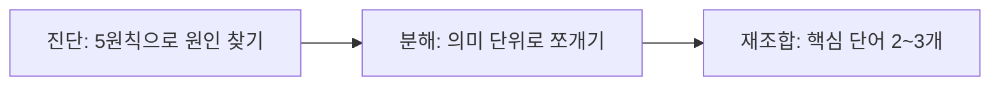

# UX 라이팅 원리 (광고 카피)

> 한 줄 정의
> 유저가 0.3초 안에 반응하도록 만드는 문구 설계 원리. 토스 UX 라이터가 100회 이상의 A/B 테스트로 검증한 카피 원칙으로, 광고 배너·CTA·전환 문구에 적용한다. 화면의 시각 표현은 [[UI 시각 체계]], 행동 설계는 [[UX 원리]].

> [!NOTE] 핵심 신호
> 동일 타겟·동일 예산에서 **문구만** 바꿨을 때 노출 최대 20배·CTR 최대 10배 차이가 관측됐다. 카피는 디자인의 부속이 아니라 전환의 1차 레버다.

## 검증된 5가지 카피 원칙

| 원칙 | 내용 | Loser → Winner 전환 예 |
|------|------|----------------------|
| **단일 메시지** | 한 소재에 메시지 하나만. 여러 혜택을 나열하면 아무것도 남지 않는다 | 혜택 3개 병렬 → 가장 강한 혜택 1개 집중 |
| **확실성** | '최대 혜택'(불확실)보다 '보장된 최소'(확실)가 강하다 | "최대 100만 원" → "최소 100원" |
| **가벼운 동사** | 심리적 부담이 낮은 동사가 클릭을 만든다 | "가입하기" → "준비하기" |
| **숫자 구체화** | 막연한 표현보다 구체적 숫자가 신뢰를 준다 | "많은 혜택" → "3만 원 즉시 지급" |
| **쉬운 단어** | 유저가 실제 쓰는 말. 내부 용어·전문어는 이탈 유발 | "리워드 적립" → "돈 받기" |

> [!TIP] 확실성 원칙이 왜 강한가
> '최대 100만 원'은 대부분에게 해당 안 되는 상한선이라 무의식적으로 할인된다. '최소 100원'은 **누구에게나 보장**되므로 신뢰 가능한 하한선이 된다. 크기가 아니라 확실성이 클릭을 만든다.

## 지면별 문구 전략

배너마다 유저의 **주의 집중 시간**과 **노출 맥락**이 다르므로, 같은 문구를 전 지면에 복붙하지 않고 지면 특성에 맞는 원칙을 우선 적용한다.

| 지면 | 노출 맥락 | 우선 원칙 |
|------|----------|----------|
| 보드 배너 | 시선 초입, 주의 짧음 | 단일 메시지 + 쉬운 단어 (0.3초 안에 읽힘) |
| 리스트 배너 | 스크롤 흐름 속 경쟁 | 숫자 구체화 (스캔 중 눈에 걸리게) |
| 페이지 배너 | 맥락 집중, 체류 김 | 확실성 + 가벼운 동사 (전환 클로징) |

## 저효율 소재 3단계 개선

이미 운영 중인 소재의 CTR이 낮을 때, 새로 만들지 말고 가장 낮은 소재 하나부터 다시 쓴다.

1. **진단** — 5원칙 체크리스트로 어느 원칙이 깨졌는지 점수화
2. **분해** — 복잡한 문구를 의미 단위로 쪼갠다
3. **재조합** — 핵심 단어 2~3개만 남겨 재조합하고, 막연한 표현은 '유저가 실제로 하는 행동'으로 구체화

## 발행 전 5원칙 체크리스트

- [ ] **단일 메시지** — 이 소재가 전하려는 메시지가 하나로 요약되는가?
- [ ] **확실성** — 상한선(최대)이 아니라 보장된 값(최소)을 말하는가?
- [ ] **가벼운 동사** — CTA 동사의 심리적 부담이 낮은가?
- [ ] **숫자 구체화** — 막연한 형용사 대신 구체적 숫자가 있는가?
- [ ] **쉬운 단어** — 유저가 실제 쓰는 말인가? 내부 용어는 없는가?

> [!SUCCESS] 적용 순서
> 5개를 한 번에 못 고치면 **가장 점수가 낮은 항목 하나부터** 바꾼다. 작은 교체 하나가 CTR을 2~10배까지 끌어올린다.

## 에이전트/자동화에 넣기

마케팅 카피 생성·검수 에이전트의 룰로 직결된다. [[가드레일]] 체크로 발행 전 게이트에 건다.

- 생성 프롬프트: 5원칙을 제약으로 명시 → 원칙 위반 시 재작성
- 검수 게이트: 위 체크리스트 5문항을 자동 스코어링, 최저 항목 리라이트 제안
- 인용 주의: 외부 카피를 그대로 복제하지 않고 원칙만 이식 ([[가드레일]])

## 관련 문서

- [[UX 원리]] — 행동 법칙(피크엔드·힉의 법칙)과 연결
- [[UI 시각 체계]] — 문구를 담는 시각 위계
- [[기획 원리]] — 메시지 우선순위 결정
