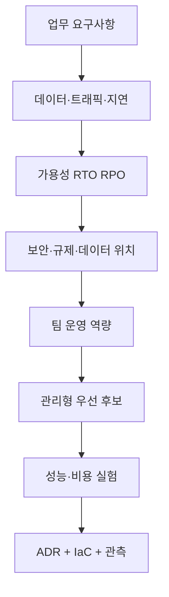

# AWS 지식 허브

> [!NOTE] 범위
> AWS의 모든 제품 기능을 복제하는 문서가 아니라, 실무에서 서비스를 **선택·설계·구현·운영·개선**하는 데 필요한 핵심 지식과 공식 문서 진입점을 한곳에 모은다. 가격·할당량·리전 지원·기능은 계속 바뀌므로 배포 직전 공식 문서를 다시 확인한다.

## 가장 먼저 기억할 원칙

1. 요구사항과 실패 모델을 먼저 정하고 서비스는 나중에 고른다.
2. 한 리전의 최소 2개 가용 영역(AZ)을 기본 고가용성 단위로 본다.
3. 사람은 연동 로그인과 임시 자격 증명, 워크로드는 IAM 역할을 쓴다.
4. 퍼블릭 접근은 예외이며 DB와 내부 서비스는 프라이빗 서브넷에 둔다.
5. 직접 운영보다 관리형 서비스를 우선하되, 잠금 효과와 비용을 함께 본다.
6. 모든 변경은 IaC와 배포 파이프라인으로 재현한다.
7. 로그·메트릭·트레이스·감사 로그·비용 태그를 첫 배포 전에 켠다.
8. 백업은 복원 시험까지 해야 백업이다. RTO와 RPO가 DR 비용을 결정한다.
9. 최소 권한, 저장·전송 암호화, 시크릿 중앙 관리가 기본값이다.
10. 비용 최적화는 할인 구매보다 삭제·권리 크기 조정·탄력성 적용이 먼저다.

## 학습·설계 지도

| 질문 | 문서 |
|---|---|
| AWS의 격리 단위와 설계 기준은? | [[01_글로벌 인프라와 Well-Architected]] |
| 계정과 권한을 어떻게 나누나? | [[02_멀티계정과 거버넌스]], [[03_IAM과 권한 설계]] |
| 네트워크와 엣지는 어떻게 설계하나? | [[04_VPC 네트워킹과 엣지]] |
| 어디서 코드를 실행하나? | [[05_컴퓨팅 컨테이너 서버리스]] |
| 데이터를 어디에 저장하나? | [[06_스토리지]], [[07_데이터베이스와 캐시]] |
| 비동기·이벤트 흐름은? | [[08_메시징과 애플리케이션 통합]] |
| 분석·AI 플랫폼은? | [[09_데이터 분석과 AI ML]] |
| 보안 통제는? | [[10_AWS 보안]] |
| 무엇을 관측하고 어떻게 운영하나? | [[11_관측성과 운영]] |
| 장애·재해에 어떻게 대비하나? | [[12_신뢰성과 재해 복구]] |
| 인프라와 배포를 자동화하려면? | [[13_IaC와 CI-CD]] |
| 비용을 어떻게 통제하나? | [[14_비용과 FinOps]] |
| 이전·하이브리드는? | [[15_마이그레이션과 하이브리드]] |
| 전형적인 시스템 조합은? | [[16_참조 아키텍처]] |
| 구축·운영 때 무엇을 점검하나? | [[17_실전 체크리스트와 런북]] |
| 서비스 이름을 빠르게 찾으려면? | [[18_서비스 카탈로그와 용어]] |
| 실제 명령과 IaC는 어떻게 시작하나? | [[19_AWS 구현 레시피]] |

## 서비스 선택 순서

> [!WARNING] 흔한 실패
> 콘솔에서 먼저 만들기, 루트 계정 일상 사용, 모든 권한에 `*`, 단일 AZ, NAT Gateway·데이터 전송 비용 누락, 무제한 로그 보존, 스냅샷만 만들고 복원 미시험, 프로덕션과 개발을 한 계정에 혼합하는 것은 초기에 바로잡는다.

## 최신성 계약

- 이 묶음의 검토 기준일은 **2026-07-12**다.
- 서비스별 세부 옵션, 지원 리전, 요금, 기본 할당량은 공식 문서와 Service Quotas에서 확인한다.
- 새 서비스 이름보다 안정적인 선택 기준과 운영 불변식을 우선한다.
- 폐기·이름 변경된 서비스는 새 설계에 채택하기 전 공식 상태를 확인한다.

## 공식 출발점

- [AWS Documentation](https://docs.aws.amazon.com/)
- [AWS Architecture Center](https://aws.amazon.com/architecture/)
- [AWS Well-Architected](https://docs.aws.amazon.com/wellarchitected/latest/framework/welcome.html)
- [AWS 서비스별 리전](https://aws.amazon.com/about-aws/global-infrastructure/regional-product-services/)
- [AWS What's New](https://aws.amazon.com/new/)
- [AWS Pricing Calculator](https://calculator.aws/)

## 관련 문서

- [[인프라 원리]] · [[배포 전략 실전]] · [[장애 대응 실전]] · [[보안 원리]]
- [[19_AWS 구현 레시피]] — CLI·IAM·Terraform·CDK·게임데이 시작점
