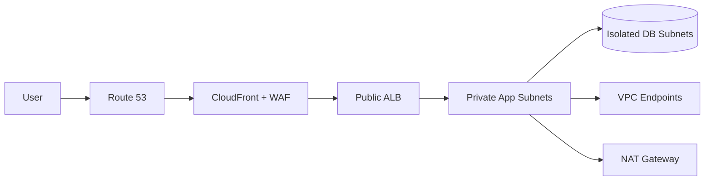

# VPC 네트워킹과 엣지

> 한 줄 정의
> VPC는 리전 범위의 논리 네트워크이고 서브넷은 AZ 범위다. 라우팅, 상태 저장 방화벽, DNS, 엣지 계층을 분리해 이해한다.

## 핵심 구성

| 구성요소 | 역할 | 주의 |
|---|---|---|
| VPC | IP 주소와 라우팅의 리전 경계 | 겹치지 않는 CIDR과 성장 여유 |
| Subnet | 한 AZ에 속한 IP 범위 | public/private는 라우팅 결과이지 이름이 아님 |
| Route Table | 목적지별 다음 홉 | 가장 구체적인 경로 우선 |
| Internet Gateway | VPC와 인터넷 연결 | 공인 IP와 경로가 모두 필요 |
| NAT Gateway | private subnet의 IPv4 아웃바운드 | AZ별 배치, 시간·처리량·교차 AZ 비용 |
| Security Group | ENI 단위 상태 저장 허용 규칙 | Deny 없음, 참조 가능한 SG 활용 |
| Network ACL | subnet 단위 상태 비저장 허용·거부 | 임시 포트와 양방향 규칙 필요 |
| VPC Endpoint | 인터넷/NAT 없이 AWS 서비스 연결 | Gateway(S3/DynamoDB), Interface(PrivateLink) |
| VPC Flow Logs | 네트워크 메타데이터 | 패킷 본문은 없음 |

## 기본 3계층

- ALB는 여러 AZ의 퍼블릭 서브넷, 앱은 여러 AZ의 프라이빗 서브넷, DB는 인터넷 경로 없는 격리 서브넷에 둔다.
- 앱 SG는 ALB SG에서만, DB SG는 앱 SG에서만 필요한 포트를 허용한다.
- 관리 접속은 공개 SSH보다 Systems Manager Session Manager를 우선한다.
- IPv6는 NAT가 아니라 egress-only internet gateway 등 IPv6 경로를 별도로 설계한다.

## 연결 방식 선택

| 요구 | 선택 |
|---|---|
| VPC 몇 개의 단순 연결 | VPC Peering |
| 다수 VPC·온프레미스 허브 | Transit Gateway |
| SaaS/서비스를 사설로 제공 | PrivateLink |
| 빠른 하이브리드 시작 | Site-to-Site VPN |
| 예측 가능한 전용 연결 | Direct Connect, VPN 백업 검토 |
| 글로벌 사용자 가속 | CloudFront 또는 Global Accelerator |
| DNS | Route 53 public/private hosted zone, Resolver |

Peering은 전이 라우팅을 제공하지 않는다. 중앙 집중형 egress·inspection은 편하지만 트래픽 비용과 장애 반경이 커질 수 있다.

## 엣지 서비스 구분

- Route 53: 권한 DNS, 상태 확인, 가중치·지연·장애 조치 라우팅.
- CloudFront: HTTP 콘텐츠 캐시, 오리진 보호, TLS, 엣지 함수.
- AWS WAF: L7 웹 요청 규칙, 관리형 룰, rate-based rule.
- Shield Standard/Advanced: DDoS 보호 수준.
- Global Accelerator: anycast 고정 IP와 AWS 백본을 통한 TCP/UDP 가속.

> [!WARNING] 비용 함정
> NAT Gateway, AZ 간 통신, 리전 간 복제, 인터넷 egress, Transit Gateway 처리량은 구조적으로 누적된다. 아키텍처 다이어그램에 데이터 흐름과 GB/월을 적어 계산한다.

## 공식 문서

- [VPC documentation](https://docs.aws.amazon.com/vpc/)
- [VPC security best practices](https://docs.aws.amazon.com/vpc/latest/userguide/vpc-security-best-practices.html)
- [Route 53](https://docs.aws.amazon.com/Route53/latest/DeveloperGuide/Welcome.html)
- [CloudFront](https://docs.aws.amazon.com/AmazonCloudFront/latest/DeveloperGuide/Introduction.html)

## 관련 문서

- [[10_AWS 보안]] · [[12_신뢰성과 재해 복구]] · [[14_비용과 FinOps]]

