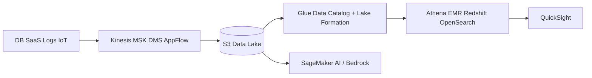

# 데이터 분석과 AI·ML

> 한 줄 정의
> S3 중심 데이터 레이크에 카탈로그·권한·품질을 붙이고, 분석과 AI는 사용 사례에 필요한 가장 작은 관리형 구성부터 시작한다.

## 데이터 흐름 지도

## 서비스 선택

| 영역 | 서비스 | 용도 |
|---|---|---|
| 수집 | Kinesis, MSK, Firehose | 스트림·Kafka·관리형 전달 |
| DB 변경 | DMS | 마이그레이션과 CDC |
| SaaS 연동 | AppFlow | 지원 SaaS 데이터 이동 |
| 변환·카탈로그 | Glue | ETL, crawler, Data Catalog |
| 레이크 권한 | Lake Formation | 세밀한 데이터 레이크 접근 |
| 대화형 SQL | Athena | S3 데이터를 서버리스 SQL로 질의 |
| 빅데이터 프레임워크 | EMR | Spark/Hadoop 등 |
| 데이터 웨어하우스 | Redshift | 대규모 분석·BI |
| 검색·로그·벡터 | OpenSearch Service | 검색과 분석 |
| BI | QuickSight | 대시보드·임베디드 분석 |
| ML 플랫폼 | SageMaker AI | 준비·학습·배포·MLOps |
| 생성형 AI | Amazon Bedrock | 기반 모델 API, Knowledge Bases, Agents, Guardrails |

## 데이터 레이크 원칙

- raw/curated/serving 영역을 구분하고 원본은 불변으로 보존한다.
- 파일 형식은 Parquet 등 컬럼형, 압축, 적절한 파일 크기와 partition을 사용한다.
- 너무 많은 작은 파일과 고카디널리티 partition은 쿼리·메타데이터 비용을 키운다.
- 스키마, 소유자, 민감도, 품질, lineage, 보존 정책을 카탈로그에 연결한다.
- IAM만으로 모든 데이터 권한을 풀기 어려우면 Lake Formation의 행·열·태그 기반 통제를 검토한다.
- 데이터 egress와 cross-region scan을 비용 모델에 포함한다.

## ML·생성형 AI 운영

- 먼저 기준선과 오프라인 평가 집합을 만든 뒤 모델을 선택한다.
- 학습·추론 데이터의 PII, 저작권, 사용 허가, 리전·보존 조건을 확인한다.
- SageMaker 엔드포인트는 실시간, 비동기, 서버리스, 배치 추론 특성을 비교한다.
- Bedrock 모델은 리전 지원, 컨텍스트, 지연, 처리량, 가격, 안전 요구로 고른다.
- RAG는 chunking, embedding, 검색, 재순위화, 인용, 권한 필터를 각각 평가한다.
- 프롬프트와 모델 버전도 배포 단위다. 품질·안전·지연·비용 회귀를 카나리한다.
- 에이전트 도구는 최소 권한, 입력 검증, 외부 콘텐츠 불신, 쓰기·발신 사람 승인을 적용한다.

## 관측 지표

| 계층 | 지표 |
|---|---|
| 데이터 | 신선도, 누락, 스키마 변화, 품질 실패, lineage |
| 배치·스트림 | 처리 지연, backlog, 실패·재처리, checkpoint |
| ML | 정확도·드리프트·편향, endpoint latency/error |
| 생성형 AI | task success, groundedness, 유해성, token·요청 비용 |

## 공식 문서

- [AWS Analytics](https://docs.aws.amazon.com/whitepapers/latest/aws-overview/analytics.html)
- [AWS Glue](https://docs.aws.amazon.com/glue/)
- [Amazon Redshift](https://docs.aws.amazon.com/redshift/)
- [Amazon SageMaker AI](https://docs.aws.amazon.com/sagemaker/)
- [Amazon Bedrock](https://docs.aws.amazon.com/bedrock/)

## 관련 문서

- [[06_스토리지]] · [[08_메시징과 애플리케이션 통합]] · [[10_AWS 보안]]

