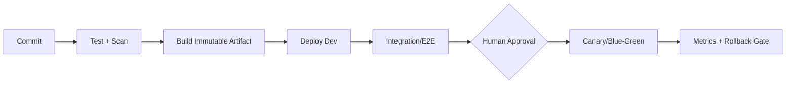

# IaC와 CI/CD

> 한 줄 정의
> 콘솔은 탐색과 관측에 쓰고, 지속되는 자원과 변경은 코드·검토·자동 검증·사람 승인으로 재현한다.

## IaC 선택

| 도구 | 강점 | 주의 |
|---|---|---|
| CloudFormation | AWS 네이티브, StackSets, drift | 템플릿 복잡성 |
| AWS CDK | 일반 언어로 CloudFormation 생성 | 추상화와 생성 결과를 함께 이해 |
| Terraform/OpenTofu | 멀티클라우드·큰 생태계 | state 보호, provider 변화 |
| AWS SAM | Lambda/API 중심 서버리스 | 범위가 서버리스에 집중 |
| AWS Copilot | ECS 앱의 의견 있는 워크플로 | 생성 구조와 한계 이해 |

한 조직에서 주 도구를 정하고 예외 기준을 둔다. 같은 리소스를 여러 도구나 콘솔이 공동 소유하지 않게 한다.

## IaC 불변식

- state와 배포 역할은 암호화·버전·잠금·최소 권한·감사를 적용한다.
- 계정·리전·환경 값은 구성으로 분리하고 비밀은 템플릿에 넣지 않는다.
- plan/change set을 PR에서 검토하고 destructive change를 별도 표시한다.
- lint, unit, policy-as-code, 보안 스캔, 비용 추정, 통합 테스트를 자동화한다.
- drift를 정기 탐지하고 콘솔 핫픽스는 즉시 코드에 반영하거나 원복한다.
- 모듈은 안정된 반복 패턴에서만 추출하고 버전을 고정한다.
- 삭제 보호와 retain 정책은 중요 데이터에 적용하되 폐기 절차도 만든다.

## 배포 파이프라인

- 소스는 CodeCommit 대안/외부 Git, 빌드는 CodeBuild, 오케스트레이션은 CodePipeline 또는 외부 CI를 쓸 수 있다.
- 외부 CI는 OIDC → 짧은 역할 세션을 사용한다.
- 이미지와 패키지는 한 번 빌드해 환경 간 승격하고 다시 빌드하지 않는다.
- CodeDeploy, ECS deployment, Lambda alias 등 대상에 맞는 카나리·블루그린을 쓴다.
- 프로덕션 배포 승인은 사람이 하고 롤백은 자동 또는 한 동작으로 실행 가능해야 한다.

## 안전한 변경

- 애플리케이션과 DB는 expand → migrate → contract 순서로 호환성을 유지한다.
- feature flag로 배포와 릴리즈를 분리하고 제거일을 둔다.
- 변경 전 백업보다 실제 롤백·복원 시간 검증이 중요하다.
- 배포 마커를 CloudWatch 대시보드와 로그에 남겨 회귀를 상관 분석한다.

## 공식 문서

- [AWS CloudFormation](https://docs.aws.amazon.com/cloudformation/)
- [AWS CDK](https://docs.aws.amazon.com/cdk/)
- [AWS SAM](https://docs.aws.amazon.com/serverless-application-model/)
- [AWS CodePipeline](https://docs.aws.amazon.com/codepipeline/)
- [AWS CodeDeploy](https://docs.aws.amazon.com/codedeploy/)

## 관련 문서

- [[배포 전략 실전]] · [[05_컴퓨팅 컨테이너 서버리스]] · [[10_AWS 보안]]

