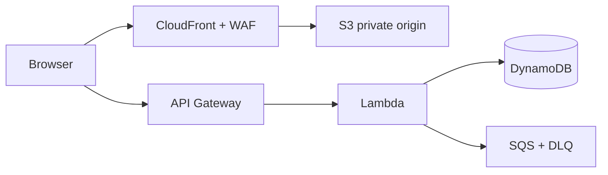
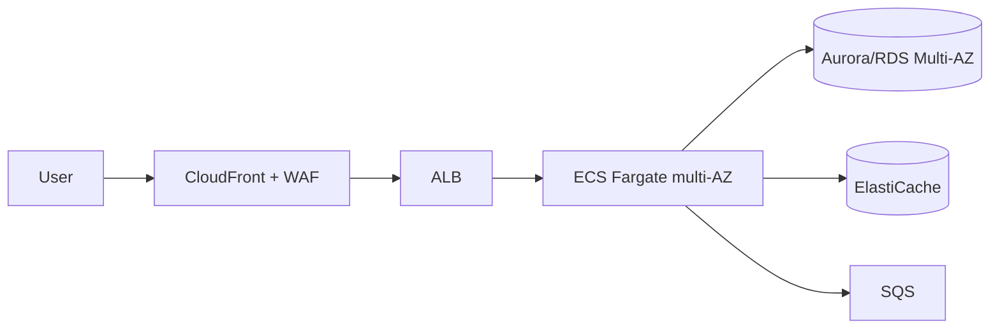
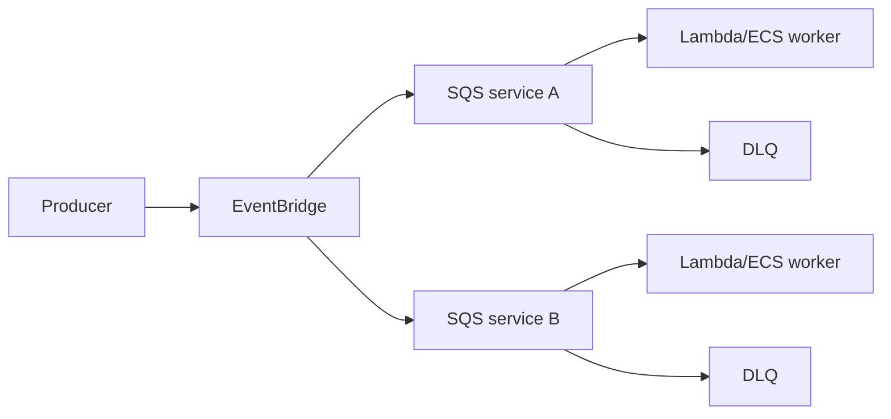
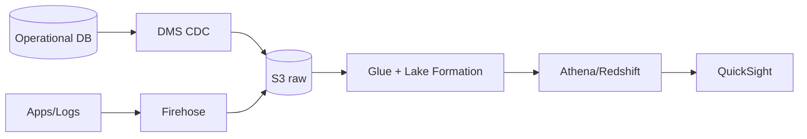
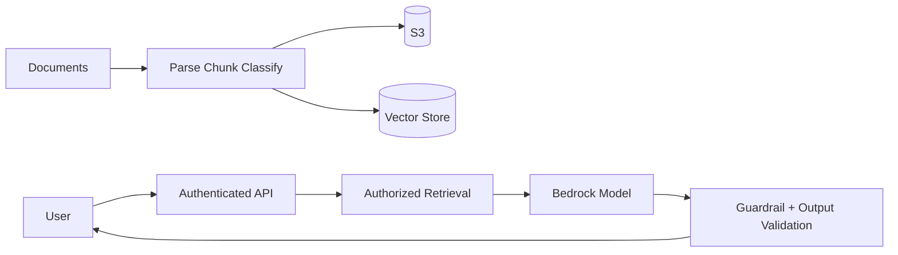

# 참조 아키텍처

> 한 줄 정의
> 아래 조합은 출발점이지 정답이 아니다. 트래픽·데이터·가용성·팀 역량·비용으로 단순화하거나 교체한다.

## 정적 웹 + API

맞는 경우: 급격한 변동, 이벤트 중심, 운영 인력 적음.  
주의: Lambda 동시성과 하류 제한, 멱등성, 로그 비용, API Gateway 요금.

## 컨테이너 웹 서비스

맞는 경우: 일반 웹/API, 지속 실행, 컨테이너 표준.  
주의: DB 연결, NAT·AZ 비용, 배포 호환성, 작업 자동 확장.

## 이벤트 기반 처리

이벤트 계약, 버전, 멱등성, DLQ redrive, 소비자별 관측을 설계한다.

## 데이터 레이크와 BI

raw 불변성, PII 권한, 작은 파일, partition, 품질, 비용 배부를 관리한다.

## 생성형 AI RAG

문서별 접근 권한을 검색 시점에 필터링하고, 출처 인용·prompt injection·PII·평가·비용·사람 승인을 설계한다.

## 멀티리전 API

- Route 53 또는 Global Accelerator로 트래픽을 제어한다.
- 상태 없는 앱을 각 리전에 배포하고 데이터 복제 방식이 일관성 요구를 만족하는지 확인한다.
- Secrets/KMS/인증서/IaC/관측/배포 artifact를 리전별 준비한다.
- failover와 failback을 모두 시험하고 제어 영역 의존을 줄인다.

> [!TIP] 단순화
> 사용자 수가 적고 RTO가 길다면 멀티리전·EKS·MSK를 제거하는 것이 더 좋은 아키텍처일 수 있다. 관리형 단일 리전 다중 AZ부터 증거에 따라 확장한다.

## 공식 문서

- [AWS Architecture Center](https://aws.amazon.com/architecture/)
- [AWS Solutions Library](https://aws.amazon.com/solutions/)
- [Serverless Land patterns](https://serverlessland.com/patterns)
- [AWS Well-Architected Labs](https://www.wellarchitectedlabs.com/)

## 관련 문서

- [[00_AWS 지식 허브]] · [[08_메시징과 애플리케이션 통합]] · [[12_신뢰성과 재해 복구]]

