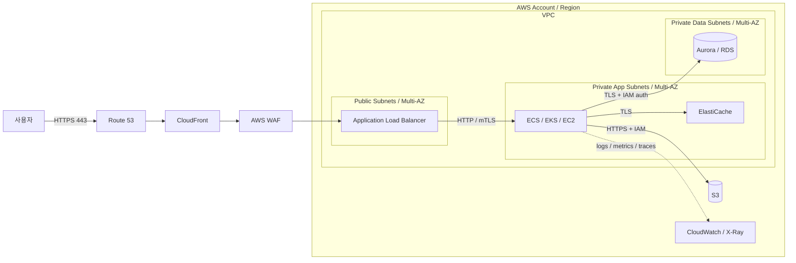

# AWS 3계층 기본

```mermaid
flowchart LR
    U[사용자] -->|HTTPS 443| R53[Route 53]
    R53 --> CF[CloudFront]
    CF --> WAF[AWS WAF]
    WAF --> ALB[Application Load Balancer]

    subgraph AWS[AWS Account / Region]
      subgraph VPC[VPC]
        subgraph PUB[Public Subnets / Multi-AZ]
          ALB
        end
        subgraph APP[Private App Subnets / Multi-AZ]
          ECS[ECS / EKS / EC2]
          CACHE[ElastiCache]
        end
        subgraph DATA[Private Data Subnets / Multi-AZ]
          RDS[(Aurora / RDS)]
        end
      end
      S3[(S3)]
      CW[CloudWatch / X-Ray]
    end

    ALB -->|HTTP / mTLS| ECS
    ECS -->|TLS| CACHE
    ECS -->|TLS + IAM auth| RDS
    ECS -->|HTTPS + IAM| S3
    ECS -. logs / metrics / traces .-> CW
```

수정 포인트: 계정, 리전, VPC CIDR, 서브넷 CIDR, 실제 런타임, 인증, RTO/RPO.
