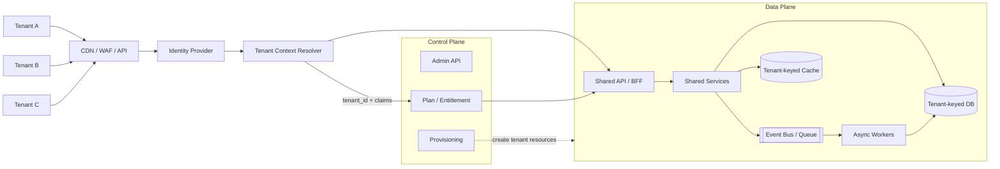

# 멀티테넌트 SaaS

```mermaid
flowchart LR
    T1[Tenant A] --> EDGE[CDN / WAF / API]
    T2[Tenant B] --> EDGE
    T3[Tenant C] --> EDGE
    EDGE --> AUTH[Identity Provider]
    AUTH --> ROUTER[Tenant Context Resolver]
    ROUTER --> API[Shared API / BFF]

    subgraph CONTROL[Control Plane]
      ADMIN[Admin API]
      PROVISION[Provisioning]
      POLICY[Plan / Entitlement]
    end

    subgraph DATA[Data Plane]
      API --> SVC[Shared Services]
      SVC --> QUEUE[[Event Bus / Queue]]
      SVC --> DB[(Tenant-keyed DB)]
      SVC --> CACHE[(Tenant-keyed Cache)]
      QUEUE --> WORKER[Async Workers]
      WORKER --> DB
    end

    ROUTER -->|tenant_id + claims| POLICY
    POLICY --> API
    PROVISION -. create tenant resources .-> DATA
```

결정할 것:

- 격리 모델: pool / bridge / silo
- 테넌트 컨텍스트의 신뢰 원천과 위변조 방지
- DB row key, schema, database, account 중 격리 단위
- noisy neighbor 제한, 테넌트별 quota와 비용 배분
- 테넌트별 암호화 키와 감사 로그 보존
