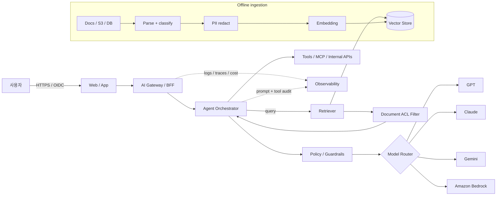

# AI RAG 파이프라인

```mermaid
flowchart LR
    U[사용자] -->|HTTPS / OIDC| APP[Web / App]
    APP --> API[AI Gateway / BFF]
    API --> ORCH[Agent Orchestrator]
    ORCH --> GUARD[Policy / Guardrails]
    GUARD --> MODEL{Model Router}
    MODEL --> GPT[GPT]
    MODEL --> CLAUDE[Claude]
    MODEL --> GEMINI[Gemini]
    MODEL --> BEDROCK[Amazon Bedrock]

    ORCH -->|query| RETRIEVE[Retriever]
    RETRIEVE --> VDB[(Vector Store)]
    RETRIEVE --> ACL[Document ACL Filter]
    ACL --> ORCH
    ORCH --> TOOLS[Tools / MCP / Internal APIs]

    subgraph INGEST[Offline ingestion]
      SRC[Docs / S3 / DB] --> PARSE[Parse + classify]
      PARSE --> REDACT[PII redact]
      REDACT --> EMBED[Embedding]
      EMBED --> VDB
    end

    API -. logs / traces / cost .-> OBS[Observability]
    ORCH -. prompt + tool audit .-> OBS
```

반드시 표기할 것: 모델 라우팅 기준, 프롬프트/응답 보존 정책, 문서 ACL, PII 처리, 캐시 키, 비용·지연 예산, human approval 지점.
