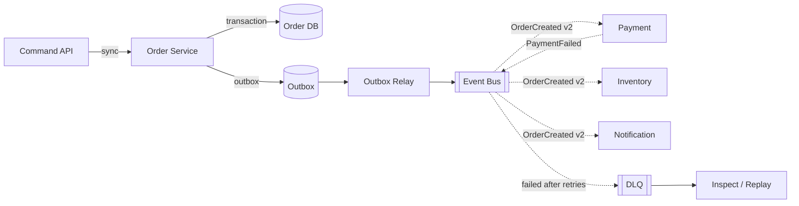

# 이벤트 기반 아키텍처

```mermaid
flowchart LR
    API[Command API] -->|sync| ORDER[Order Service]
    ORDER -->|transaction| DB[(Order DB)]
    ORDER -->|outbox| OUTBOX[(Outbox)]
    RELAY[Outbox Relay] --> BUS[[Event Bus]]
    OUTBOX --> RELAY
    BUS -. OrderCreated v2 .-> PAY[Payment]
    BUS -. OrderCreated v2 .-> STOCK[Inventory]
    BUS -. OrderCreated v2 .-> NOTIFY[Notification]
    PAY -. PaymentFailed .-> BUS
    BUS -. failed after retries .-> DLQ[[DLQ]]
    DLQ --> REPLAY[Inspect / Replay]
```

이벤트마다 owner, schema version, partition key, ordering, retention, retry/backoff, DLQ, idempotency key를 기록한다.
