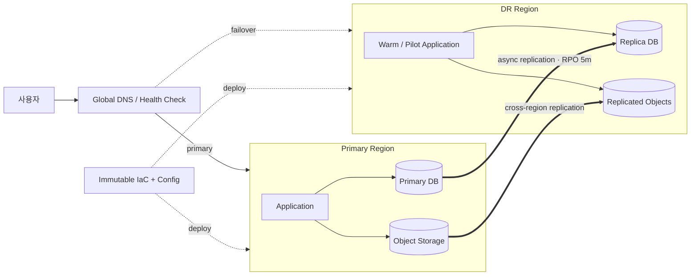

# 멀티리전 DR

```mermaid
flowchart LR
    U[사용자] --> DNS[Global DNS / Health Check]
    DNS -->|primary| R1
    DNS -. failover .-> R2

    subgraph R1[Primary Region]
      A1[Application] --> D1[(Primary DB)]
      A1 --> O1[(Object Storage)]
    end

    subgraph R2[DR Region]
      A2[Warm / Pilot Application] --> D2[(Replica DB)]
      A2 --> O2[(Replicated Objects)]
    end

    D1 ==>|async replication · RPO 5m| D2
    O1 ==>|cross-region replication| O2
    CFG[Immutable IaC + Config] -. deploy .-> R1
    CFG -. deploy .-> R2
```

표기할 것: 전략(backup/restore, pilot light, warm standby, active-active), RTO/RPO, 데이터 손실 승인자, DNS TTL, 승격·복귀(runback) 절차, 정기 훈련 주기.
