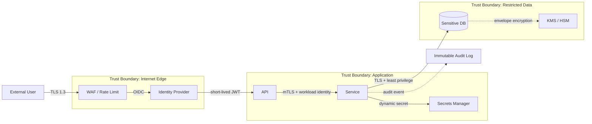

# 보안 데이터 흐름

```mermaid
flowchart LR
    U[External User]
    subgraph TB1[Trust Boundary: Internet Edge]
      WAF[WAF / Rate Limit]
      IDP[Identity Provider]
    end
    subgraph TB2[Trust Boundary: Application]
      API[API]
      SVC[Service]
      SEC[Secrets Manager]
    end
    subgraph TB3[Trust Boundary: Restricted Data]
      DB[(Sensitive DB)]
      KMS[KMS / HSM]
    end

    U -->|TLS 1.3| WAF
    WAF -->|OIDC| IDP
    IDP -->|short-lived JWT| API
    API -->|mTLS + workload identity| SVC
    SVC -->|dynamic secret| SEC
    SVC -->|TLS + least privilege| DB
    DB -. envelope encryption .-> KMS
    SVC -. audit event .-> AUDIT[Immutable Audit Log]
```

각 흐름에 데이터 등급, 인증 주체, 권한 범위, 암호화, 보존 기간을 추가하고 STRIDE 위협과 통제를 연결한다.
