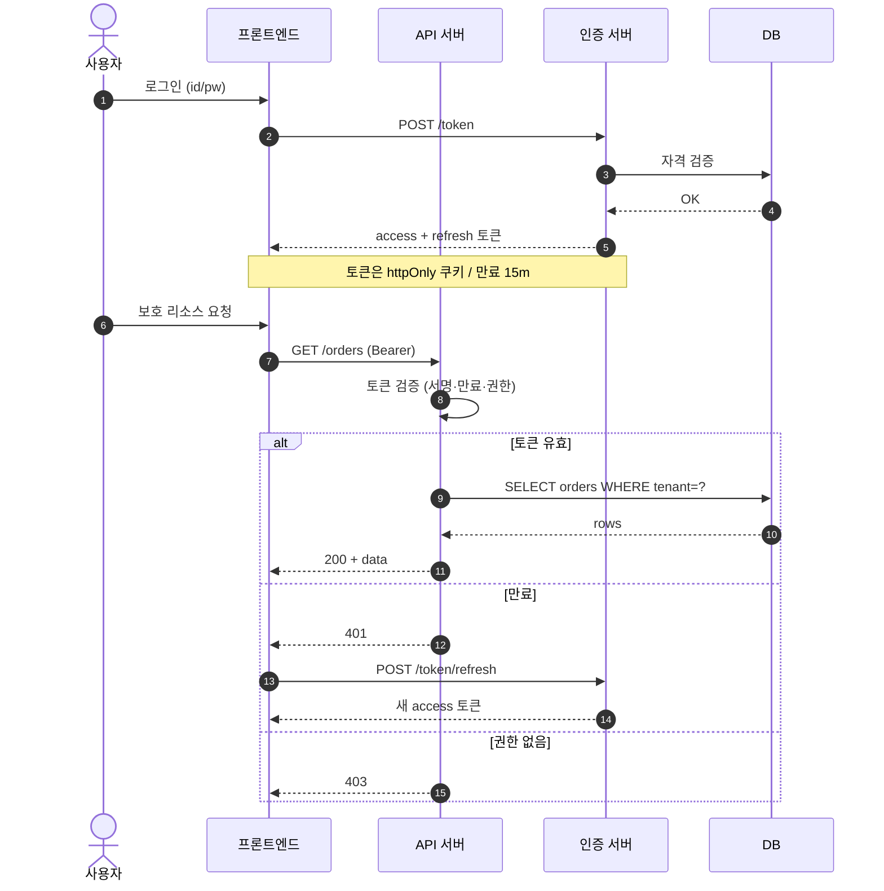

# 시퀀스 — API 인증·요청 흐름

시간 순서로 흐르는 컴포넌트 간 호출을 그린다. 인증 플로우·외부 연동·에러 경로 설명에 쓴다.

반드시 표기할 것: 토큰 저장 위치·만료, 검증 지점(서명/만료/권한/테넌트 격리), 실패 분기(401 재발급 vs 403 차단), 타임아웃·재시도. → 비가역 행동은 승인 게이트 뒤 ([[AI-DEVELOPMENT-RULES]] B-8).
