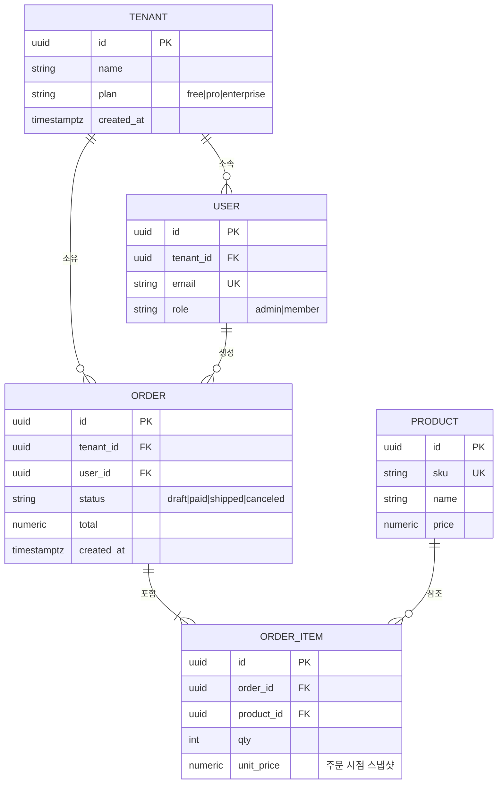

# ERD — 엔티티 관계 (데이터 모델)

테이블·관계·카디널리티를 그린다. 스키마 리뷰·마이그레이션 설명에 쓴다.

카디널리티: `||`=정확히 1, `o{`=0 이상, `|{`=1 이상. 반드시 표기할 것: PK/FK/UK, 테넌트 격리 컬럼(tenant_id), 스냅샷 값(주문 시점 가격), 상태 enum, 인덱스 대상. → SQL/NoSQL 선택 [[TECHNOLOGY-DECISION-GUIDE]] 7축.
