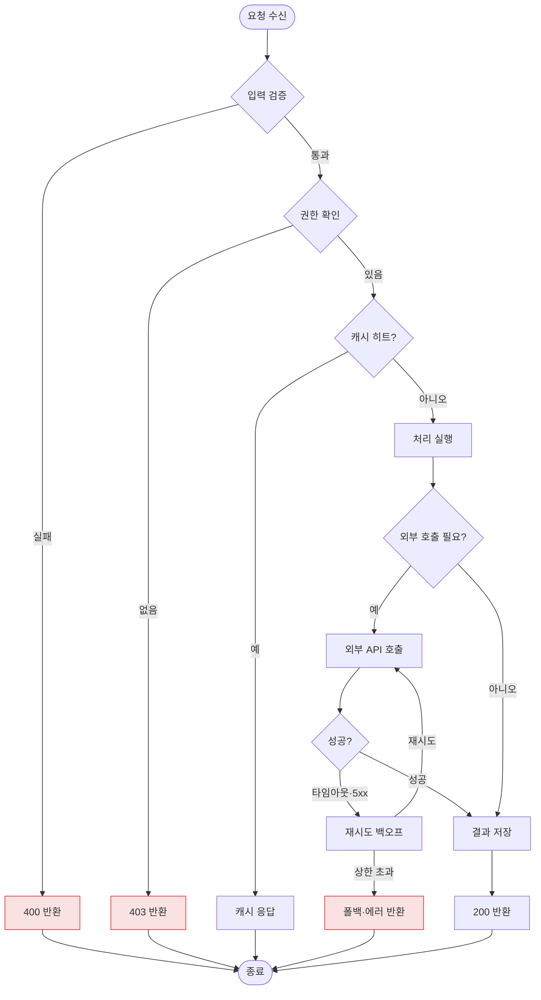

# 플로우차트 — 분기 로직

조건 분기가 있는 처리 로직을 그린다. 요청 처리·검증·라우팅 설명에 쓴다.

방향: `TD`=위→아래, `LR`=좌→우. 반드시 표기할 것: 입력 검증·권한 지점, 캐시 경로, 외부 호출의 타임아웃·재시도·폴백(성공 경로만 그리지 말 것), 에러 반환 코드. → 실패 처리 [[AI-DEVELOPMENT-RULES]] B-5, 색상 규칙 [[10_지식/08_인프라/_설계_키트/표기_규칙|표기 규칙]].
