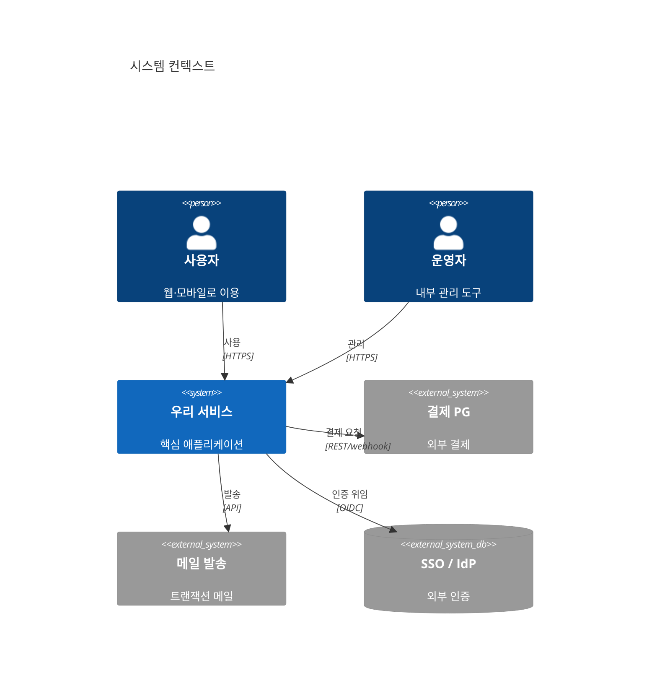
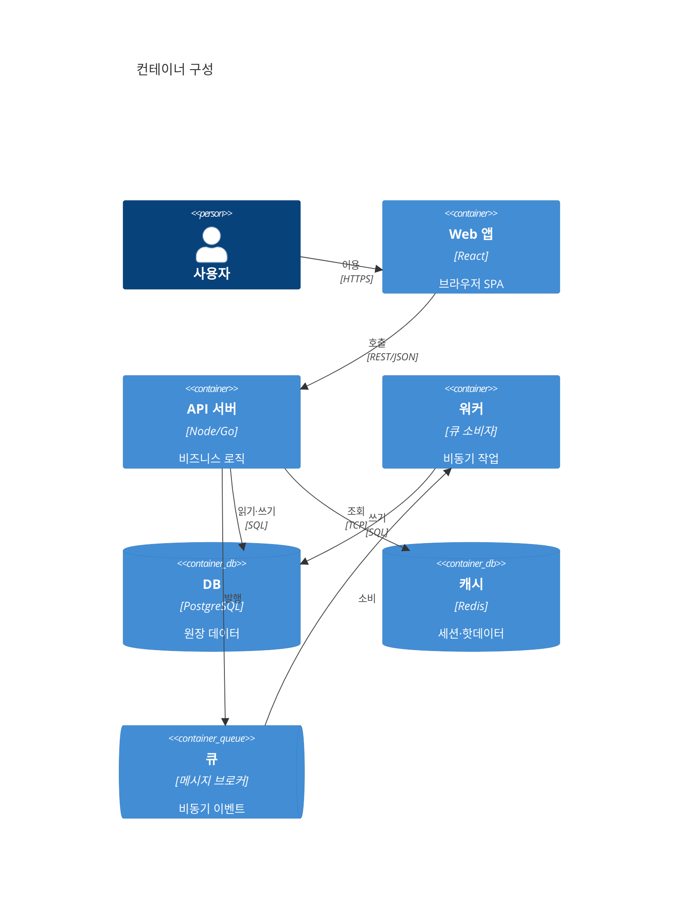

# C4 — 컨텍스트 · 컨테이너

시스템을 4계층(Context→Container→Component→Code)으로 그리는 표준. 발표에는 위 2계층(누가 쓰나 / 무엇으로 구성되나)이면 충분하다.

## Level 1 — System Context (누가·무엇과 연결되나)

## Level 2 — Container (무엇으로 구성되나)

반드시 표기할 것: 신뢰 경계(외부 시스템 vs 내부), 프로토콜, 원장 저장소와 캐시 구분, 동기(REST)·비동기(큐) 구분. 컨테이너 = 배포 단위이지 클래스가 아니다.
